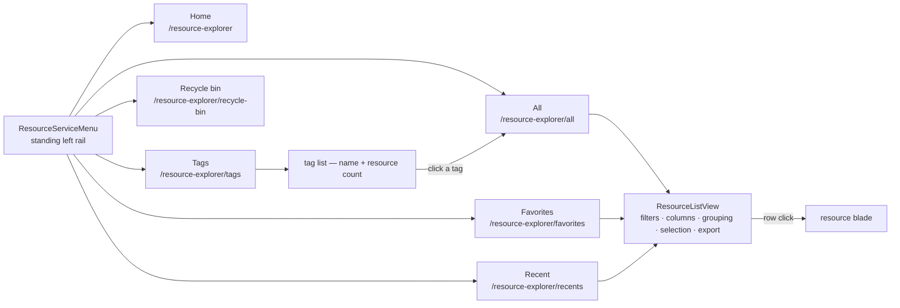

# Resource service menu

The portal this explorer follows does not put "everything you own" behind a single page. Resource Manager is a **service** with a standing left menu, and each entry opens the _same_ list surface pointed at a different set. Ours had one list page and surfaced the rest as cards on Home, which meant Recent and Favorites could never grow filters, columns, sorting or bulk selection without re-implementing what `/all` already had.

The menu makes each entry a view over the existing list, so a capability built once appears everywhere.

## One surface, three sets

`ResourceListView` takes a `source` prop, and `ResourceListSourceDefinitionMap` says what each source means: a filter preset merged into every read, a default sort, an empty state, an icon, and optionally the column the view is ordered by. Nothing else differs between the three list routes.

The filter preset is the whole mechanism. `resource.readResources` gained `isFavorite` and `isAccessed` booleans, both resolved as caller-scoped `EXISTS` subqueries inside the same `createResourcesWhere` every other filter goes through — so Favorites and Recent inherit the pill row, the URL-synced filter state, the row count and the summary cards for free, and none of them can disagree with `/all` about what a filter means.

| Source      | Filter             | Default sort          | Pinned column    |
| ----------- | ------------------ | --------------------- | ---------------- |
| `All`       | —                  | updated, newest first | —                |
| `Favorites` | `isFavorite: true` | updated, newest first | —                |
| `Recents`   | `isAccessed: true` | opened, newest first  | `lastAccessedAt` |

**Favorites deliberately does not sort starred-first.** The star's own timestamp is not a column any list shows, and a list ordered by a value the reader cannot see reads as arbitrary. Recent is the opposite case, so it pins the column it sorts by: `Last accessed` is always rendered there and is not offered to the column chooser, because a sort key the reader can hide is an order nobody can explain. Everywhere else the column exists but is hidden by default.

## Last accessed, and why recents went server-side

Recents used to be per-device ids in `localStorage`. Promoting Recent to a route with a visible `Last accessed` column is what forced the change: a card that quietly differed between two browsers was untidy, but a **column** that disagrees is indefensible.

`resourceAccesses` is one row per user per resource, rewritten on every open — so the table is bounded by what exists rather than growing with traffic. Every list read left-joins it, caller-scoped, which is what makes the column sortable rather than decorative: the joined selection is reused as the sort space, so a column the list can show is a column it can sort by.

It is deliberately **not** called a view. `ResourceViewEntity` counts anonymous hits on a _published_ resource ([published view analytics](/docs/platform/published-view-analytics)); this records the owner opening their own. Same word, two different facts.

## Tags

The one genuinely new read. Tag names live inside a single `jsonb` column rather than their own table, so `resource.countsByTag` expands the keys in a subquery and groups over that — a set-returning function cannot sit beside an aggregate in one select list. Values are not part of the grouping: the Tags entry answers "which tags do I use", and the `/all` Tag pill is where a value narrows it further.

## What we deliberately did not copy

**Resource groups have no analogue and were not invented.** A group in the portal is a containment relationship — a resource is _inside_ exactly one — and our resources have no container at all, the same fact that keeps the breadcrumb from deriving ancestry ([breadcrumb trail](/docs/platform/breadcrumb-trail)). Tags already carry the many-to-many grouping people actually want, so the menu has a Tags entry and no Groups entry. Subscriptions, locations and deployments are likewise portal concepts with nothing behind them here — copying the menu's shape must not mean copying its vocabulary.

## Where the menu renders

Everywhere in the area except the resource page. `/resource-explorer/[id]/[[blade]]` passes `is-service-menu-hidden` because the blade brings a rail of its own, and two rails on one screen spend width the blade itself uses better.

The rail is `StyledCollapsibleNav`, shared with the blade nav rather than reimplemented: a desktop column with a persisted collapse caret, folding into a `v-menu` dropdown on `smAndDown`. Active entries are matched **exactly** — Home is a path prefix of every other entry, so a prefix match would leave it lit on every page in the area.

Home keeps its Recent and Favorites card. The card and the routes are the same two sets at two sizes, so both read their icon and empty-state copy from `ResourceListSourceDefinitionMap` through `ResourceHomeTabSourceMap` — a set is described identically wherever it renders.

## Key files

Paths relative to `packages/app`.

| File                                                            | Role                                                             |
| --------------------------------------------------------------- | ---------------------------------------------------------------- |
| `app/components/Resource/ServiceMenu.vue`                       | the rail: entries, exact-path active matching                    |
| `app/components/Styled/CollapsibleNav.vue`                      | the shared rail shell, also behind the blade nav                 |
| `app/layouts/resource.vue`                                      | mounts the menu beside the page content                          |
| `app/components/Resource/List/View.vue`                         | the one list surface, parameterised by `source`                  |
| `app/services/resource/list/ResourceListSourceDefinitionMap.ts` | what each source filters, sorts and pins                         |
| `app/components/Resource/TagList.vue`                           | the Tags entry's list                                            |
| `packages/db-schema/src/schema/resourceAccesses.ts`             | one row per user per resource, holding the last open             |
| `server/trpc/routers/resource.ts`                               | `isFavorite`/`isAccessed` filters, `recordAccess`, `countsByTag` |
