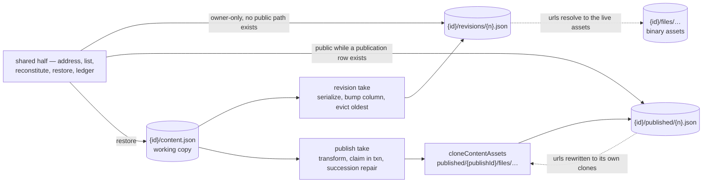
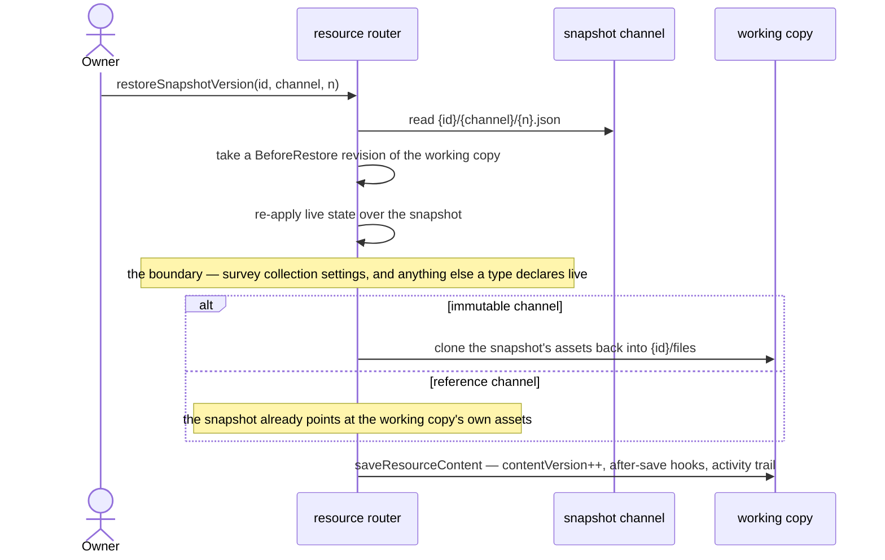

# Resource snapshots

Every resource type has restorable point-in-time versions of its working copy, whether or not it can be published. A snapshot is addressed by **channel**: `published` is the channel a publish writes, `revisions` is the channel the working copy's own recovery points live in, and everything between the two — the blob address, the history listing, the reconstitution of stored content, the restore and the ledger — is one mechanism rather than one per channel.

A rollback used to reach only a deliberate publish, on a publishable type, through a nav blade of its own. It now reaches any point in either channel, on any type, from a panel over the thing being restored.

## The mechanism: channels

A snapshot channel is a directory segment under the resource prefix plus a small definition of how snapshots on it behave:

```text
{id}/content.json                        working copy
{id}/revisions/{n}.json                  revision channel — reference kind, owner-only
{id}/published/{n}.json                  published channel — immutable kind, publicly served
{id}/published/{publishId}/files/…       the immutable channel's asset clones
{id}/files/…                             binary assets, FileAssets types only
```

`SnapshotChannelDefinitionMap` is the one place a channel says what it is: its kind, its retention, and the title its rows wear.

**A channel is an address space, not a workflow**, and that distinction is the whole of what this mechanism generalizes. The two channels differ on six axes — kind, counter, retention, visibility, whether an unpublish sweep takes them, and whether taking one is an outward act with a public url, a view count, a notification and an activity entry. A `createSnapshot(id, channel)` driving all of that from a map would be a branch with indirection between it and its reader, which is the over-generalization the [capability admission rule](/docs/architecture/resources) forbids one level up. So the split is drawn where the operations are genuinely the same one:

| Shared by both channels                                                            | Owned by each caller                                     |
| ---------------------------------------------------------------------------------- | -------------------------------------------------------- |
| the blob address `{id}/{segment}/{n}.json`                                         | **taking** a snapshot                                    |
| counter in Postgres, existence in the listing, and the rule that they may disagree | publish's transform, version claim, succession check and repair |
| the history listing                                                                | the revision's ring-buffer eviction                      |
| **reconstitution** — read, re-apply live state, hand back                          | publish's activity entry, notification and view counting |
| restore — reconstitute, then `saveResourceContent`                                 |                                                          |
| the ledger charge on write and release on evict                                    |                                                          |

Reconstitution is the row that matters most, because sharing it **fixed a defect rather than saving lines** — see the boundary below.

The version counter lives in Postgres and is never derived from the listing. The listing answers _which snapshots exist_, the row answers _what the next version is and which one is live_, and the two are allowed to disagree: an unpublish sweep is best-effort, so retired blobs outlive the row that numbered them. Revisions take a `revisionVersion` column on `resources` rather than a table of their own — a revision's reason, its owner-typed label and its one-line summary ride as blob metadata, which the listing returns, so even the row a named revision looks like it needs turns out not to exist.

### Two snapshot kinds

The clone is the expensive half of a snapshot, and making it a declared property of the channel is what makes a second channel affordable:

| Kind          | What is written                                                           | Cost                                            | Survives                                             | Used by       |
| ------------- | ------------------------------------------------------------------------- | ----------------------------------------------- | ---------------------------------------------------- | ------------- |
| **Immutable** | content + a clone of every referenced asset, urls rewritten to the clones | one storage round trip **per referenced asset** | the working copy deleting or replacing an asset      | `published`   |
| **Reference** | content only, urls untouched, resolving to live `{id}/files/…`            | one blob                                        | nothing — an asset the owner deletes is gone from it | `revisions`   |

Revisions take the reference kind, and the trade is honest rather than reluctant: `{id}/files/` is only emptied by purge, which destroys the revisions in the same sweep, so the window in which a revision can rot is exactly "the owner deleted an asset and then rolled back past the deletion". A rolled-back revision with one broken image is strictly better than no rollback, and a per-asset clone on every revision would mean no revisions at all.

The reference kind has a second consequence: **the revision channel holds no assets**, only JSON. `parseResourceAssetPath` needs no new segment, and the rule that `{id}/published/…` assets serve anonymously while a publication row exists cannot accidentally extend to revisions — there is nothing under the revision prefix for it to serve.



## The snapshot boundary

Survey draws a line through its content blob that no other part of the system knows about: `model` is snapshot state, `settings` is live state, re-read on every public read so that closing a survey takes effect without re-publishing every participant link already sent.

That line used to be declared in one direction only, and **restore got it wrong**: it copied the snapshot's content wholesale into the working copy, `settings` included, silently reopening a closed survey or flipping the response mode between Anonymous and Identified — a setting the write boundary makes authorization decisions on ([survey response modes](/docs/platform/survey-response-modes)).

So the boundary is a **two-way declaration the snapshot mechanism owns**: `ResourceLiveContentMap` says which parts of a type's content are live rather than frozen, and `reapplyLiveResourceContent` applies it on every path that reconstitutes content from a snapshot — the public read, the owner's version preview, and the restore. Writing the two apart is what produced the defect; one shared reconstitution makes it impossible.



Note the revision taken before the write, because it is what makes the whole mechanism **append-only**: a rollback is not a rewind, it is an append whose content happens to equal an earlier state. The draft being replaced becomes a revision first, the restore lands as an ordinary save with its own `contentVersion`, and undoing the restore is simply the next append. That revision is taken once the snapshot is known to exist — so a restore that was never going to land does not spend a ring-buffer slot on its way to failing — and it is allowed to throw: a restore whose undo silently did not happen is the defect the mechanism exists to close.

Two things sit outside the invariant. The **ring buffer** evicts the oldest revision, so append-only holds over recent history rather than all history. The **unpublish sweep** deletes `{id}/published/` outright, because unpublishing exists to make an artifact unreachable — the revision channel survives an unpublish untouched, so nothing _recoverable_ is lost with it.

## When a snapshot is taken

**Saving is not one of them.** `saveResourceContent` is the autosave path — it fires on every coalesced keystroke batch, not on a deliberate act; Sheet and Dashboard put real data in the content blob, so a per-save revision copies the whole artifact on every batch; every snapshot charges the ledger, so per-save revisions burn the owner's quota while they type; and a history listing that grows per save is unbounded.

| Trigger                                 | Channel     | Rationale                                                                          |
| --------------------------------------- | ----------- | ---------------------------------------------------------------------------------- |
| Publish command                         | `published` | the outward act, unchanged                                                         |
| Before a restore                        | `revisions` | the undo, taken by the restore itself                                              |
| Before a Sheet import                   | `revisions` | the other write that replaces a draft wholesale; the import is refused if it fails |
| **Save version** command                | `revisions` | the deliberate milestone, taken and optionally named by the owner                  |
| First save after an idle window elapses | `revisions` | at most one per window, so a working session leaves a handful of recovery points   |
| Every autosave                          | —           | never                                                                              |

The idle-window trigger is what makes this a recovery feature rather than a manual discipline, and coalescing is the whole of its cost control: the window is a constant, and one revision per window per resource is the ceiling. It is also the one trigger that swallows its own failure — a save must never fail because a revision could not be taken.

A blueprint deploy takes none: it creates resources rather than overwriting one, so there is no draft to hand back.

## Retention

The published channel keeps everything and prunes nothing — publishes are deliberate and rare, and a retired public artifact is something an owner may need to point at.

Revisions are a **ring buffer**: a fixed cap in the tens, oldest evicted when a new one lands. Eviction goes through the blob deletion event like every other delete, so the evicted revision's ledger entry is released with it — a bare delete would make the ring buffer a slow quota leak that nothing ever reconciles ([storage quotas](/docs/platform/storage-quotas)).

## Versions the owner sees

`contentVersion` is **not** a version anyone is shown. It is an optimistic-concurrency token that increments once per autosave; surfacing it means telling an owner their document is at v437 because they typed 437 times.

The two counters that reach the UI are different axes and are never collapsed into one: **`publishVersion` is what the public sees**, **`revisionVersion` is what you can return to**. Overview's Status row shows each only where it carries information:

| Type            | State                            | Status row                                                             |
| --------------- | -------------------------------- | ---------------------------------------------------------------------- |
| Not publishable | —                                | that a restore point exists, once one does                             |
| Publishable     | never published                  | `Draft` chip, plus that a restore point exists once one does           |
| Publishable     | published, draft unchanged since | `Published` chip, `v{publishVersion}`, up to date                      |
| Publishable     | published, draft moved since     | `Published` chip, `v{publishVersion}`, and that changes are unpublished |

The last row is a comparison rather than a guess: `resource_publications.publishedContentVersion` records the `contentVersion` the publish was taken from, so "the draft has moved since" is one column rather than something an owner infers from two dates — `updatedAt` moves for a rename and a tag edit too.

`revisionVersion` itself is never rendered. An owner picks a version by its time, its reason and its label, never by its ordinal; the column remains what the mechanism counts with.

## The rollback surface

Version history is a **panel over whichever blade is open**, not a nav blade. Rollback is wanted where the damage happened, and every product that does this well opens version history from the overflow menu on the thing being edited, as a panel over it, with the selected version rendered read-only in place.

- **It opens from `Resource/Blade/Actions`**, because Sheet and TodoList are blade-only types with no Editor blade at all — the action bar is the one surface every type has, and this repo's equivalent of the overflow menu. `Save version`, with its own label field, sits beside it.
- **It is deep-linkable by route.** `?versions` says the panel is open and `?version={channel}|{n}` names the version being previewed, so the back button, a refresh and a shared link all land on the same panel over the same version.
- **One list, two address spaces.** Publishes and revisions go into one time-ordered timeline — the owner has one question, and the channels are an address space rather than two things to make them choose between. `Current` is always the first row, so the list is never empty on a resource that has just been created. A `Published only` filter chip appears on publishable types.
- **A row is choosable.** Each carries its channel and version as a label rather than a bare ordinal (the channels number independently, so `v1` alone names two different snapshots), a relative time with the absolute one on hover, its reason from `SnapshotReasonTitleMap`, the owner's label, and a one-line per-type summary from `SnapshotSummaryMap` — `12 items`, `3 columns · 40 rows`. The summary is computed where the snapshot is taken and carried in its blob metadata, so the listing stays one round trip for the whole history; a type that declares no summary simply has none.
- **Preview in place** renders a published version through the type's own public renderer where the blade was, under a banner carrying `Restore this version` and `Back to current`. A revision has no rendered form of its own — reconstituting one into a read-only render for every type, publishable or not, is a renderer per type that does not exist yet — so its row restores rather than previews.
- **Restore notifies with an Undo**, which restores the `BeforeRestore` revision the restore had just taken. It costs nothing given that revision already exists, and it is what makes the one destructive operation in the feature safe to try. The action is single-use: a second fire would restore a draft the first fire already replaced.

A restore never re-points the publication — it produces a draft to review and re-publish, mirroring the [recycle bin](/docs/platform/recycle-bin) restore-returns-a-Draft rule — and it lands through `saveResourceContent` like any other content write, so the type's after-save hook re-derives what the restored content declares and the [activity](/docs/platform/activity-log) trail records a `Restored` entry.

Because a restore replaces content underneath a blade that is already open, the content stores re-read themselves through `ResourceContentHookMap.Reload` rather than the blade being keyed on a counter something bumps: which store holds the content is the type's business. The editor-owned types (GrapesJS, SurveyJS) register nothing — their editor owns the live document once it has loaded, so a tab left open on one of those keeps the pre-restore draft until it reloads.

## Why not Azure Blob versioning

**A resource version is not a blob version.** A version of a resource is `content.json` _plus the assets it references_ under `{id}/files/`. Azure versions each blob on its own timeline with no cross-blob consistency point, so "restore this resource as of Tuesday" resolves to Tuesday's JSON pointing at asset urls whose blobs have since been replaced or deleted. There is no version of the _set_. The publish path solved exactly this by cloning assets alongside the content and rewriting the urls to the clones — a thing the application does and the storage account cannot.

Three lesser reasons, each independently sufficient:

- Versioning is a **blob-service property**, not a container one. Enabling it for `resource-assets` enables it for every other container on the account, and scoping retention back down means enumerating those containers in a lifecycle rule, because `prefixMatch` has no exclusion.
- Non-current versions are **billed but invisible to the ledger**. `chargeAndEmitStorageLedgerEntry` charges the current blob and the reconciler works off `BlobCreated`; a version is neither, so every user's quota would understate what they cost ([storage quotas](/docs/platform/storage-quotas)).
- A version is addressed by an opaque version id, which nothing in the app stores, lists, or hands to a restore.

Blob versioning stays off.

## Procedures

| Procedure                            | Auth                | Input                      | Purpose                                                 |
| ------------------------------------ | ------------------- | -------------------------- | ------------------------------------------------------- |
| `resource.readSnapshotHistory`       | `getOwnerProcedure` | `{ id }`                   | both channels merged, newest-first by time              |
| `resource.restoreSnapshotVersion`    | `getOwnerProcedure` | `{ channel, id, version }` | reconstitute a snapshot into the working copy           |
| `resource.saveResourceRevision`      | `getOwnerProcedure` | `{ id, label?, reason? }`  | the deliberate milestone, and the pre-import safety net |
| `{type}.readPublishedVersionContent` | `getOwnerProcedure` | `{ id, version }`          | owner-only read of one published snapshot, for preview  |

The channel rides with the version on every command, because the channels number independently: a version alone names one snapshot per channel, and a command keyed on the number alone acts on whichever of them the caller did not mean. A label is accepted only on a `Manual` revision — a labelled `BeforeImport` row would read in the history as a milestone somebody chose.

## Key files

| File                                                                                 | Role                                                          |
| ------------------------------------------------------------------------------------ | ------------------------------------------------------------- |
| `packages/app/shared/services/resource/SnapshotChannelDefinitionMap.ts`               | what a channel is — kind, retention, title                    |
| `packages/app/shared/services/resource/SnapshotSummaryMap.ts`                         | the per-type one line a history row carries                   |
| `packages/app/server/services/resource/snapshot/takeResourceRevision.ts`              | the revision take, its ring buffer and its ledger charge      |
| `packages/app/server/services/resource/snapshot/readSnapshotHistory.ts`               | a channel's prefix listing as history rows                    |
| `packages/app/server/services/resource/ResourceLiveContentMap.ts`                     | the snapshot boundary — what a type declares live             |
| `packages/app/server/services/resource/reapplyLiveResourceContent.ts`                 | the reconstitution every snapshot read goes through           |
| `packages/app/server/trpc/routers/resource.ts`                                        | history, restore and save-version procedures                  |
| `packages/app/server/trpc/procedure/resource/createResourceProcedures.ts`             | the publish take, its version claim and its succession repair |
| `packages/app/app/components/Resource/VersionHistory/`                                | the panel, its rows, the preview banner and the two dialogs   |
| `packages/app/app/composables/resource/useVersionHistoryRoute.ts`                     | the panel's place in the route                                |
| `packages/app/app/store/resource/versionHistory.ts`                                   | the timeline, the restore and its Undo                        |
| `packages/db-schema/src/schema/resources.ts`                                          | `revisionVersion`                                             |
| `packages/db-schema/src/schema/resourcePublications.ts`                               | `publishedContentVersion`                                     |

## Notes

- After an unpublish the publish numbering restarts at 1, because unpublish deletes the publication row and publishes the snapshot prefix for deletion. That sweep is best-effort and asynchronous, so a republish can land while the old snapshots are still present — which is exactly why the live version is read from the publication row rather than inferred from which snapshots exist.
- Purge and soft delete need no step of their own: purge takes `{id}/` wholesale, which is already every channel.
- [Named checkpoints](/docs/sheet-editor/rejected/named-checkpoints) was rejected for the Sheet editor on the grounds that undo/redo already traverses prior states. That rejection stands and does not conflict: it is about the in-session history stack, and every trigger here is about recovery _across_ sessions, where no undo stack exists. `Save version` is a resource-level command rather than an editor-level one, so the label it carries names a point in a resource's history rather than a step in an editor's undo stack.
