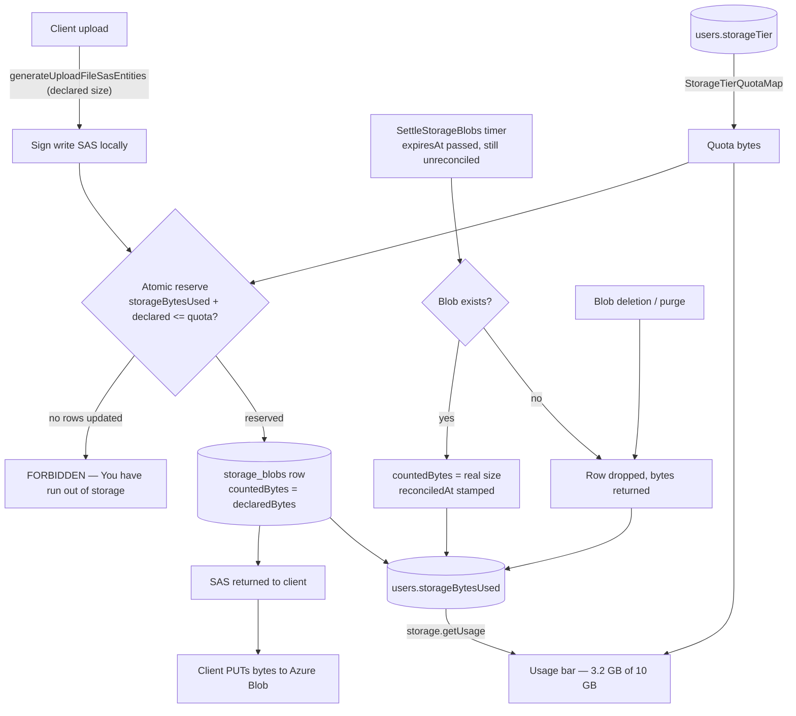

# Storage quotas

Every user has a bounded, tier-derived blob-storage allowance — Free = 10 GiB — that they genuinely cannot exceed by hammering uploads, shown back to them as a Gmail-style "X of Y used" bar on `/user/settings`. The bar and the limit shipped together: a usage number nobody can act on was the reason the display was deferred on its own.

## Why a plain pre-flight check is not enough

The obvious design — "read `storageBytesUsed`, if under quota issue the SAS" — does not stop abuse, for two structural reasons:

1. **It races.** Read-then-check is not atomic. A client firing many upload requests concurrently has them all read the same low counter, all pass, and all upload — overshooting by an unbounded amount.
2. **The SAS carries no byte cap.** Uploads are a two-step flow ([file uploads](/docs/architecture/file-uploads)): the server mints a scoped write SAS, the client PUTs bytes **directly to Azure Blob**. The server is never in the data path, so it cannot stop a client that declares 1 MB and PUTs 1 GB, and it cannot abort a transfer mid-stream.

This is the difference from Gmail and Drive: their uploads flow **through Google's servers**, so the server counts bytes as they stream and hard-aborts the instant you cross the line. We structurally cannot abort a direct-to-blob upload — so the check is made **part of the write**, and the client's declaration is settled against reality afterwards.

## How it works — reserve, then settle

**Reserve.** The SAS is signed first — signing is local and touches nothing in Azure — and the reserve runs before the response is returned, so a rejection is a write target the client never receives. In one transaction it runs a conditional `UPDATE users SET storageBytesUsed = storageBytesUsed + :declared WHERE id = :id AND storageBytesUsed + :declared <= :quota` and inserts one `storage_blobs` row per write target. Zero rows updated means over quota, and the whole transaction rolls back. The `WHERE` makes it a compare-and-swap, so concurrent requests serialize on the user row and cannot collectively overshoot; the ledger rows landing in the same transaction is what guarantees no increment can outlive the thing that would give it back.

**Settle.** Past `expiresAt` — the SAS's own TTL — the write target is dead, so whatever is in blob storage is final. The `SettleStorageBlobs` timer probes each expired unreconciled row: if the blob exists its real size replaces the declaration (`countedBytes = actual`, `reconciledAt` stamped), and if it does not, the row is dropped and its bytes returned. Existence is asked as `exists()` rather than inferred from a `getProperties` rejection, because a 404 and a transient failure arrive the same way and releasing on the second would hand back bytes that are still stored.

**Release.** Deleting a blob drops its ledger row and decrements its owner by whatever that row was holding. The row is what carries both the amount and the owner, which makes a redelivered deletion event a no-op and is also the **only** way a blob can be attributed to an owner at all — a message asset is keyed by room, not by uploader.

The quota itself is **resolved from the tier at read time**, never copied onto the user row, so moving a user to a new tier changes their limit instantly with nothing to backfill. Only the _usage_ is stored, because recomputing it means enumerating every `{resourceId}/` directory and message-attachment blob — exactly what got the display deferred in the first place.

## Why one sweep instead of confirm-plus-reconcile

A design where persistence "confirms" the hold and an Event Grid `BlobCreated` event reconciles it to the real size was rejected in favour of the single sweep, on three grounds:

- **There is no confirmation point for half the uploads.** A message attachment is persisted as a `FileEntity` and could confirm there; a resource file asset has no persistence record at all — the client builds a stable url and embeds it in content. A confirm step would leave every resource asset either uncounted or wrongly released.
- **An abandoned upload emits no event.** Confirm and reconcile both need something to arrive; only the sweep works from the absence of a signal, which is precisely the case that has to release.
- **It removes an ordering race rather than handling it.** `BlobCreated` delivery is at-least-once and unordered, so an event for an upload that landed just before its TTL can arrive after a release already gave the bytes back — a whole state machine of conditional transitions exists only to survive that. The sweep reads the blob at the moment it settles, so there is no second signal to be out of order with.

The cost is one or two blob requests per expired row on a background timer, and no new Azure resource — the Event Grid design would have added a subscription and a handler.

## The residual gap, and why it is acceptable

Because a single in-flight direct-to-blob upload cannot be aborted, a client that under-declares overshoots by the gap between the declared and actual bytes, until the sweep corrects the counter and the next reserve is rejected. This is **not** bounded to one file: many SAS uploads can be in flight at once, each declaring a small size but PUTting up to `MAX_FILE_REQUEST_SIZE` (10 MB). It is bounded by capping how many unreconciled holds one user may have (`MAX_UNRECONCILED_STORAGE_BLOBS`), so the ceiling is that cap times the per-file limit. Even at the ceiling the abuser only ever exhausts **their own** allowance — never another user's, never the account globally.

True Gmail-style hard enforcement would require **proxying uploads through our own server** so it can count bytes and abort mid-stream. That is rejected: it puts our compute in the data path for every upload — cost, latency, and re-architecting the entire SAS flow — to close a self-inflicted gap that only harms its own author.

## Data model

- `StorageTier` — pg enum, `Free` only for now. The enum exists so a paid tier is a value add rather than a schema change.
- `StorageTierQuotaMap` — `{ [StorageTier.Free]: 10 * GIBIBYTE }`, `as const satisfies Record<StorageTier, number>`. A tier with no arm resolves to `NULL` in the reserve's `CASE`, and `<= NULL` is never true, so an unmapped tier rejects rather than passes.
- `users.storageTier` + `users.storageBytesUsed` — the tier and the running total. `bigint` in `number` mode: 10 GiB is ~1e10, far under the 2^53 safe-integer ceiling.
- `storage_blobs` — the per-blob ledger, keyed `(containerName, blobName)`. Holds `declaredBytes`, `countedBytes` (what the counter is carrying for it right now), `expiresAt`, and `reconciledAt`.

Existing users start at `storageBytesUsed = 0`, so for them the gate is **advisory until their real usage accumulates** — a user already over 10 GiB keeps uploading until enough of their blobs are ledgered. Under-counting only ever _under_-rejects, so the advisory window never wrongly rejects a legitimate upload. New users are accurate from their first upload.

## What is not counted

Three kinds of blob exist outside the ledger and are deliberately uncounted for now:

- **Publish and duplicate clones** (`cloneContentAssets`) — copies written server-side, never through a reserve.
- **Blobs uploaded before this shipped** — nothing backfills them ([persisted data — latest shape only](/docs/architecture/persisted-data-latest-shape-only)).
- **Everything outside the two upload chokepoints** — avatars and room images go through their own SAS paths.

Closing these needs a recompute sweep that lists real object sizes per user, which is the natural follow-on and is worth doing once the counter has drifted enough to matter.

## Failure and retry semantics

- **Client under-declares:** the counter is low until the sweep reads the real size; the next reserve then rejects. Bounded as above.
- **SAS issued, upload abandoned:** the row expires and the sweep releases it; the orphan blob, if any, is swept by the existing dangling-asset cleanup.
- **Sweep cannot reach a blob:** the row stays unreconciled and is re-driven next tick. One unreachable blob never stops the rest of the batch.
- **A release is missed:** the counter stays high, which only _under_-serves that user (rejects slightly early) — the safe direction.

## Key files

| File                                                                 | Role                                            |
| -------------------------------------------------------------------- | ----------------------------------------------- |
| `packages/db-schema/src/models/user/StorageTier.ts`                  | tier enum                                       |
| `packages/db-schema/src/schema/users.ts`                             | `storageTier` + `storageBytesUsed`              |
| `packages/db-schema/src/schema/storageBlobs.ts`                      | the per-blob ledger                             |
| `packages/app/shared/services/storage/StorageTierQuotaMap.ts`        | tier → quota bytes                              |
| `packages/app/shared/services/storage/constants.ts`                  | outstanding-hold cap + usage-bar thresholds     |
| `packages/app/server/services/storage/reserveStorageBytes.ts`        | atomic reserve + ledger insert, one transaction |
| `packages/app/server/services/storage/getStorageQuotaBytesSql.ts`    | the tier → quota map expressed in SQL           |
| `packages/app/server/services/storage/getStorageBlobReservations.ts` | SAS batch → the holds it needs                  |
| `packages/db/src/services/storage/releaseStorageBlobsWhere.ts`       | the one place bytes leave the counter           |
| `packages/db/src/services/storage/reconcileStorageBlob.ts`           | declaration → stored size                       |
| `packages/azure-functions/src/handlers/settleStorageBlobsHandler.ts` | the 15-minute settle sweep                      |
| `packages/app/server/trpc/routers/storage.ts`                        | `getUsage`                                      |
| `packages/app/app/components/User/StorageCard.vue`                   | the usage bar                                   |

## Notes

- The resource upload input gained a `size` per file, matching the message path. It is bounded at the Zod boundary (`z.int().positive().max(MAX_FILE_REQUEST_SIZE)`) because a negative or non-finite declaration would _decrement_ the counter and bypass the quota entirely.
- Thumbnails are ledgered with a **zero** declaration. The client downscales them itself, so their size is declared nowhere and cannot be reserved — but a row means the sweep adds their real size and a deletion gives it back, instead of bytes stored under a user's name that nothing ever counts.
- `purgeResource` releases its directory **by prefix**. The purge never enumerates blob names, and the `resources` row it deletes has no foreign key into the ledger, so without this the rows would be dropped by no one and their bytes held forever.
- The reserve is a service called from both chokepoints, not a tRPC middleware. A middleware runs before the handler, and the ledger rows are keyed by blob names the handler is what mints — so a middleware would have had to either pre-mint the names or split the atomic transaction in two.
- Resolving the tier's quota in JS and then updating would not be a compare-and-swap: a check that is not part of the write is exactly the race this feature exists to close. Hence `getStorageQuotaBytesSql`.
