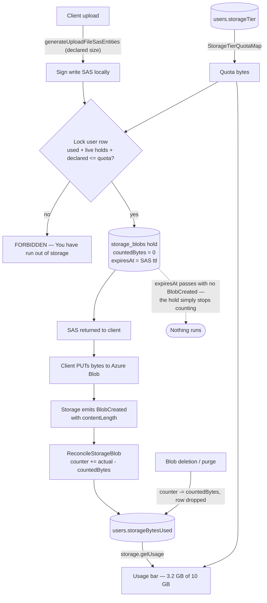

# Storage quotas

Every user has a bounded, tier-derived blob-storage allowance — Free = 10 GiB — that they genuinely cannot exceed by hammering uploads, shown back to them as a "X of Y used" bar on the [Resource Explorer](/docs/platform/resource-explorer) home. The bar and the limit shipped together: a usage number nobody can act on was the reason the display was deferred on its own.

Nothing is scheduled. The counter moves only when Azure tells us a blob landed or one of our own deletions removes it, and an abandoned upload needs no cleanup at all because its hold expires as a **predicate** rather than as a state some job flips.

## Why a plain pre-flight check is not enough

The obvious design — "read `storageBytesUsed`, if under quota issue the SAS" — does not stop abuse, for two structural reasons:

1. **It races.** Read-then-check is not atomic. A client firing many upload requests concurrently has them all read the same low counter, all pass, and all upload — overshooting by an unbounded amount.
2. **The SAS carries no byte cap.** Uploads are a two-step flow ([file uploads](/docs/architecture/file-uploads)): the server mints a scoped write SAS, the client PUTs bytes **directly to Azure Blob**. The server is never in the data path, so it cannot stop a client that declares 1 MB and PUTs 1 GB, and it cannot abort a transfer mid-stream.

This is the difference from Gmail and Drive: their uploads flow **through Google's servers**, so the server counts bytes as they stream and hard-aborts the instant you cross the line. We structurally cannot abort a direct-to-blob upload — so the check is made **part of the write**, and what the client declared is never what it is ultimately charged.

## How it works

**The counter holds stored bytes and nothing else.** `users.storageBytesUsed` is the sum of what is actually in blob storage for that user. A declaration the client has not yet made good on is not in it — that lives in the ledger and is summed at reserve time.

**Reserve.** The SAS is signed first — signing is local and touches nothing in Azure — and the reserve runs before the response is returned, so a rejection is a write target the client never receives. In one transaction: the user row is taken `FOR UPDATE`, which is what makes concurrent reserves serialize instead of race; this user's expired holds are deleted (pure garbage collection — they never entered the counter); the live holds are summed; and `storageBytesUsed + pending + declared <= quota` decides. Then one `storage_blobs` row per write target, with `countedBytes = 0`.

**Charge.** Storage's own `Microsoft.Storage.BlobCreated` event carries the stored object's `contentLength`, and arrives seconds after the PUT. The handler moves the counter by `actual − countedBytes` and sets `countedBytes = actual`. That one expression is correct in all three cases at once: the first event adds the whole object, a redelivery computes a **zero** delta instead of double-counting, and a second upload to the same still-valid write target corrects the counter rather than stranding the old size on it.

**Release.** Deleting a blob drops its ledger row and decrements its owner by whatever that row was holding — zero if the blob never landed. The row is what carries both the amount and the owner, which makes a redelivered deletion event a no-op and is also the **only** way a blob can be attributed to an owner at all: a message asset is keyed by room, not by uploader.

**Expiry.** Past `expiresAt` — the SAS's own TTL — the write target is dead, so the hold cannot become real and stops being counted the moment the predicate turns false. No release, no job, no compensating write. The rows are dropped opportunistically by the next reserve that user makes, which already holds their rows under lock.

The quota itself is **resolved from the tier at read time**, never copied onto the user row, so moving a user to a new tier changes their limit instantly with nothing to backfill. Only the _usage_ is stored, because recomputing it means enumerating every `{resourceId}/` directory and message-attachment blob — exactly what got the display deferred in the first place.

## Why there is no scheduled sweep

The first cut of this feature settled holds with a timer that woke every 15 minutes, listed expired rows, and probed each blob to decide whether to charge or release it. That was replaced, and the reasoning generalises:

- **The event already exists.** Storage emits `BlobCreated` with the exact byte count on a system topic that is already provisioned (the dead-letter replay subscribes to the same event type). Polling for a fact the platform will push is standing compute spent to learn something late.
- **The other half was never an event.** "This hold expired" is not something that happens — it is something that becomes true. Written as a `WHERE` clause it needs nothing to run; written as a job it needs a schedule, a batch cap, a retry policy, and an ordering story against the arrival of `BlobCreated`.
- **The race disappears rather than being handled.** With two signals (a persistence-time confirm and an unordered, at-least-once reconcile) a whole state machine of conditional transitions exists purely to survive them arriving out of order. With one signal and a predicate there is no second thing to be out of order with.

The cost of the swap is one Event Grid subscription per environment on a system topic that already exists — no new Azure resource, one event per upload, and reconciliation latency in seconds rather than up to an hour. What it removes is a timer function, a batch cap, and two blob requests per expired row.

A lost `BlobCreated` would leave a blob stored but uncharged. The subscription therefore dead-letters like the others, and the existing [dead-letter replay](/docs/infra) machinery re-drives it — the handler is idempotent by construction, so a replay is free.

## The residual gap, and why it is acceptable

Between the PUT and the `BlobCreated` event, a client that under-declared is holding less space than it is about to use. The size of that gap is **not** bounded: Azure blob SAS has no upload-length option, and the PUT never passes back through Nitro, so `MAX_FILE_REQUEST_SIZE` constrains the declaration the client sends us and nothing about the bytes it sends Azure.

What is bounded is the gap's **shape**. `MAX_UNRECONCILED_STORAGE_BLOBS` caps how many under-declared uploads one user can have in flight at once, and `BlobCreated` charges each one's real size within seconds of its PUT completing — after which the counter is truthful and every further reserve is rejected. So abuse is a single burst, not a sustained drain, and it only ever exhausts **their own** allowance — never another user's.

True Gmail-style hard enforcement would require **proxying uploads through our own server** so it can count bytes and abort mid-stream. That is rejected: it puts our compute in the data path for every upload — cost, latency, and re-architecting the entire SAS flow — to close a self-inflicted gap that only harms its own author.

## Data model

- `StorageTier` — pg enum, `Free` only for now. The enum exists so a paid tier is a value add rather than a schema change.
- `StorageTierQuotaMap` — `{ [StorageTier.Free]: 10 * GIBIBYTE }`, `as const satisfies Record<StorageTier, number>`.
- `users.storageTier` + `users.storageBytesUsed` — the tier and the stored-bytes total. `bigint` in `number` mode: 10 GiB is ~1e10, far under the 2^53 safe-integer ceiling.
- `storage_blobs` — the ledger, keyed `(containerName, blobName)`. `declaredBytes` is the hold, `countedBytes` is what the counter is carrying for this blob right now (zero until the first `BlobCreated`), `expiresAt` is the SAS TTL, `reconciledAt` records that it landed at least once.

Existing users start at `storageBytesUsed = 0`, so for them the gate is **advisory until their real usage accumulates** — a user already over 10 GiB keeps uploading until enough of their blobs are ledgered. Under-counting only ever _under_-rejects, so the advisory window never wrongly rejects a legitimate upload. New users are accurate from their first upload.

## What is not counted

Three kinds of blob exist outside the ledger and are deliberately uncounted:

- **Publish and duplicate clones** (`cloneContentAssets`) — copies written server-side, never through a reserve. Their `BlobCreated` arrives and finds no ledger row, which is a no-op by design.
- **Blobs uploaded before this shipped** — nothing backfills them ([persisted data — latest shape only](/docs/architecture/persisted-data-latest-shape-only)).
- **Everything outside the two upload chokepoints** — avatars and room images go through their own SAS paths, and the subscription filter does not even deliver their events.

Closing these needs a recompute that lists real object sizes per user. Worth doing once the counter has drifted enough to matter, and it is a one-shot backfill rather than a recurring sweep.

## Failure and retry semantics

- **Client under-declares:** the counter is low for the seconds until `BlobCreated` lands; the next reserve then rejects. Bounded as above.
- **SAS issued, upload abandoned:** the hold stops counting at `expiresAt` and is dropped by that user's next reserve. Any orphan blob is swept by the existing dangling-asset cleanup.
- **`BlobCreated` redelivered:** the delta is zero.
- **`BlobCreated` dead-lettered:** replayed by the existing dead-letter machinery; the handler is idempotent.
- **A release is missed:** the counter stays high, which only _under_-serves that user (rejects slightly early) — the safe direction.

## Key files

| File                                                                      | Role                                             |
| ------------------------------------------------------------------------- | ------------------------------------------------ |
| `packages/db-schema/src/models/user/StorageTier.ts`                       | tier enum                                        |
| `packages/db-schema/src/schema/users.ts`                                  | `storageTier` + `storageBytesUsed`               |
| `packages/db-schema/src/schema/storageBlobs.ts`                           | the ledger                                       |
| `packages/db-schema/src/services/azure/container/getBlobSubjectPrefix.ts` | storage's event subject shape, read by both ends |
| `packages/db-schema/src/services/azure/container/parseBlobSubject.ts`     | subject → (container, blob name)                 |
| `packages/app/shared/services/storage/StorageTierQuotaMap.ts`             | tier → quota bytes                               |
| `packages/app/server/services/storage/reserveStorageBytes.ts`             | lock, GC expired holds, gate, write holds        |
| `packages/app/server/services/storage/getStorageBlobReservations.ts`      | SAS batch → the holds it needs                   |
| `packages/db/src/services/storage/reconcileStorageBlob.ts`                | declared hold → charged bytes                    |
| `packages/db/src/services/storage/releaseStorageBlobsWhere.ts`            | the one place bytes leave the counter            |
| `packages/azure-functions/src/handlers/reconcileStorageBlobHandler.ts`    | the `BlobCreated` handler                        |
| `packages/infra/.../eventSubscriptions/prodEvgsEsposterAe007.ts`          | the subscription, filtered to the two containers |
| `packages/app/server/trpc/routers/storage.ts`                             | `getUsage`                                       |
| `packages/app/app/components/Resource/Home/StorageCard.vue`               | the usage bar                                    |

## Notes

- The bar lives on the explorer home, not on user settings. Storage is a property of the things you have made, so it belongs beside the create and resources cards rather than next to your display name — even though the number also covers room attachments, which the card says.
- The resource upload input gained a `size` per file, matching the message path. It is bounded at the Zod boundary (`z.int().positive().max(MAX_FILE_REQUEST_SIZE)`) because a negative or non-finite declaration would shrink the pending sum and weaken the gate.
- Thumbnails are held with a **zero** declaration. The client downscales them itself, so their size is declared nowhere and cannot be reserved — but a ledger row means `BlobCreated` charges their real size and a deletion gives it back, instead of bytes stored under a user's name that nothing ever counts.
- `purgeResource` releases its directory **by prefix**. The purge never enumerates blob names, and the `resources` row it deletes has no foreign key into the ledger, so without this the rows would be dropped by no one and their bytes held forever.
- The subscription filters on two container prefixes through an `advancedFilters` `StringBeginsWith`, because `subjectBeginsWith` takes a single string. The handler agrees with that filter rather than trusting it, so a filter that drifts wider delivers events the handler drops.
- A blob name reaches the handler through a url path and storage's encoding of it depends on the characters in it. Rather than guess, the raw name is looked up first and the decoded form only if that found no row.
- The reserve is a service called from both chokepoints, not a tRPC middleware. A middleware runs before the handler, and the ledger rows are keyed by blob names the handler is what mints — so a middleware would have had to either pre-mint the names or split the atomic transaction in two.
