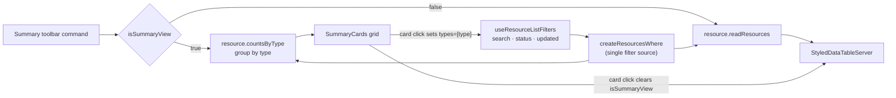

# Summary View

The `/resources/all` workbench ([list filters & views](/docs/platform/list-filters-and-views)) has two lenses on the same filtered query. **List** is the table. **Summary** replaces it with one card per resource type — icon, count, and title — and clicking a card drops you back into the list, filtered to that type. It is the Azure portal's List/Summary toggle, built as frontend plus a single procedure: no schema, no route, no new Azure services.

The point is the question the table answers badly: _what do I actually have?_ A hundred rows sorted by date do not say "eleven surveys and two dashboards"; four cards do, and each card is the affordance for narrowing to what it counts.

## How it works

Summary is a **lens, not a route**. The toggle is a toolbar command (`isSummaryView`, collapsing into the `…` overflow on narrow viewports like every other command), so the filter state, the URL, and the back button are untouched by switching lenses. The cards read the same filters the list does, through the same `createResourcesWhere`, so a card's count is exactly the number of rows the list shows once that card sets its type.

- **The read follows the lens, not the keystroke.** The cards mount only in summary mode, so `countsByType` fires when the mode turns on and on any filter change while it is on — never behind the list.
- **`types` is the one filter the cards do not consume.** Grouping by a type the user already narrowed to would render exactly one card, so the summary reads every filter except that one. The cards are what _sets_ `types`; it is their output, not their input.
- **A card click sets `types` (URL-synced) and turns the lens back off**, landing in the pre-filtered list. No separate route, no second source of truth.
- **The grouped count returns only types that matched.** A card reading `0` that opens an empty list is not worth its pixels, so an empty result renders an empty state rather than a grid of zeroes. Cards order by count descending — the busiest type leads.

## Procedures

| Procedure               | Auth   | Input                         | Purpose                                           |
| ----------------------- | ------ | ----------------------------- | ------------------------------------------------- |
| `resource.countsByType` | authed | filter schema without `types` | `select type, count(*) … group by type` for cards |

## Key files

| File                                                    | Role                                                |
| ------------------------------------------------------- | --------------------------------------------------- |
| `app/components/Resource/ListView.vue`                  | the toggle command and the lens switch              |
| `app/components/Resource/List/SummaryCards.vue`         | the card grid, its empty/loading/error states       |
| `app/composables/resource/useReadResourceTypeCounts.ts` | the grouped-count read over the shared filter input |
| `server/trpc/routers/resource.ts`                       | `countsByType` behind `createResourcesWhere`        |
| `shared/models/resource/ResourceTypeCount.ts`           | one card's worth of the grouped count               |

## Notes

- The toggle is deliberately **not** URL-synced, unlike the filters. A filter is a question about your data and deserves a shareable link; a lens is a preference about how you are looking at it right now, and a card click is a one-way trip back into the list anyway.
- Refresh dispatches on the active lens, so the toolbar's Refresh means "re-read what I am looking at" in both modes.
- The blade page's compact list box (`:is-searchable="false"`) renders no toolbar, so it never reaches summary mode.
