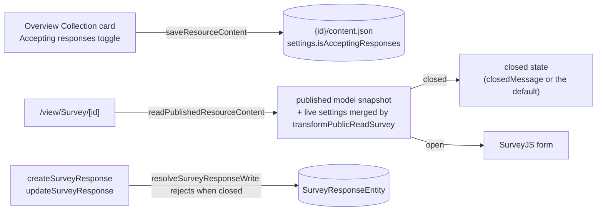

# Survey Response Controls

A published survey can **stop collecting** without being torn down. Unpublishing 404s the public URL, which turns every invite link already sent into a dead page; the **Accepting responses** toggle closes the survey instead, leaving the URL alive and answering visitors with a message rather than an error.

## How it works

The flag is **live state, not snapshot state**: closing takes effect without re-publishing, so it cannot live in the published content blob. It lives in the survey's **working** content blob — `surveyResourceSchema` carries a `settings` section holding `isAcceptingResponses` (default open) and `closedMessage` (default `""`) — and is read at the two points that enforce it.

- **Public read** — `readPublishedResourceContent` merges the live settings into its response through `transformPublicReadContent`, a per-type hook on `createResourceProcedures` alongside the existing publish/read hooks. The published model snapshot itself stays immutable; only the settings beside it are live.
- **Server enforcement** — both response mutations call `resolveSurveyResponseWrite`, which rejects with a conflict error when the survey is closed. Client state can never bypass it. This costs one blob read per submission; submissions are rate-limited and low-volume, so there is no caching until it is measured.
- **Owner UX** — the toggle lives on the Survey Overview's Collection card next to publish status; the closed message is an inline field (normalized, capped by `MAX_CLOSED_MESSAGE_LENGTH`) shown only while closed.
- **Respondent UX** — a closed survey renders a `StyledEmptyState` card carrying the owner's message, or a default when none is set.

## Key files

| File                                                                | Role                                               |
| ------------------------------------------------------------------- | -------------------------------------------------- |
| `packages/app/shared/models/resource/survey/SurveySettings.ts`      | the `settings` section — the toggle + message      |
| `packages/app/server/services/survey/readSurveySettings.ts`         | the live settings read                             |
| `packages/app/server/services/survey/resolveSurveyResponseWrite.ts` | the one write boundary both mutations pass through |
| `packages/app/server/services/survey/transformPublicReadSurvey.ts`  | merges live settings onto the public read          |
| `packages/app/app/components/Resource/Survey/Collection.vue`        | the toggle + closed message field                  |
| `packages/app/app/components/Resource/Survey/View.vue`              | the closed state                                   |

## Notes

- Settings live in the content blob per the resource standard ([resources](/docs/architecture/resources)) — one artifact, one write path, one `contentVersion`. The Overview toggle saves through the same `saveResourceContent` as the editor, so a concurrent edit surfaces through the existing stale-version path.
- In-flight respondents — form open when the survey closes — get the server rejection on submit rather than a silent failure.
- Response modes ([survey response modes](/docs/platform/survey-response-modes)) extend this same `settings` object. There is one settings section, not one per feature.
- Close-at-date scheduling is deliberately absent: it is [publish scheduling](/docs/platform/deferred/publish-scheduling)'s shape — one timer subsystem, not two. Un-deferring it later is additive, since the timer would flip this same flag.
