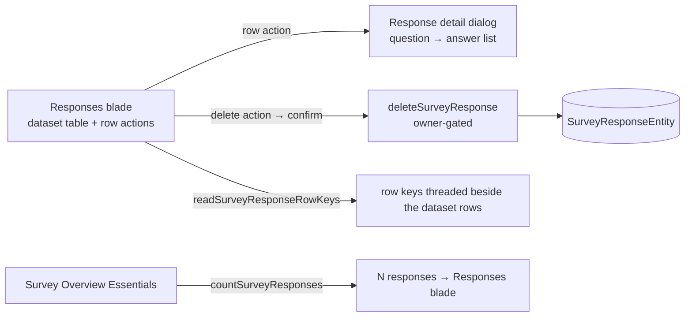

# Survey Response Management

Real collection runs accumulate test submissions before launch and junk after. The Responses blade carries the minimum owner-side operations over that data: a detail view of one respondent's full answers, a per-response delete, and a response count on the Overview so the number is visible without opening the blade. All of it sits on the existing Azure Table data — no new services, no schema change.

## How it works

- **Detail dialog** — a per-row action opening the response as a question → answer list, the dataset row rendered vertically. Answers already arrive flattened through the dataset, so there is no new read path. One singleton dialog serves the whole table, driven by the target row key.
- **Delete** — `deleteSurveyResponse({ id, rowKey })`. The partition key is the survey id **derived server-side from the owner-checked `id`**, never accepted from the caller, so one owner's survey id can never reach another survey's rows. Existence is proven before deleting, so a second delete of the same key errors rather than silently passing. The confirm follows the [resource page parity](/docs/platform/resource-page-parity) guard patterns.
- **Count** — `countSurveyResponses({ id })`, owner-gated, surfaced on the Survey Overview Essentials grid as an "N responses" link to the Responses blade. Azure Table has no cheap server-side count, so this counts keys-only pages up to one past `AZURE_MAX_PAGE_SIZE` and returns the count plus an `isCapped` flag — that extra key is what distinguishes exactly-cap from beyond-cap, and only `isCapped` renders the `1000+` form.

## Procedures

| Procedure                   | Auth  | Input            | Purpose                            |
| --------------------------- | ----- | ---------------- | ---------------------------------- |
| `countSurveyResponses`      | owner | `{ id }`         | capped response count + `isCapped` |
| `deleteSurveyResponse`      | owner | `{ id, rowKey }` | remove one response entity         |
| `readSurveyResponseRowKeys` | owner | `{ id }`         | row keys aligned with dataset rows |

## Key files

| File                                                                   | Role                               |
| ---------------------------------------------------------------------- | ---------------------------------- |
| `packages/app/server/services/survey/countSurveyResponses.ts`          | the capped count                   |
| `packages/app/server/services/survey/readSurveyResponseEntities.ts`    | the one capped read both paths use |
| `packages/app/app/components/Resource/Survey/Responses.vue`            | row actions                        |
| `packages/app/app/components/Resource/Survey/ResponseDetailDialog.vue` | the detail dialog                  |
| `packages/app/app/components/Resource/Survey/ResponseDeleteDialog.vue` | the destructive confirm            |
| `packages/app/app/components/Resource/Survey/Overview.vue`             | count + blade link                 |

## Notes

- The dataset contract stays untouched — delete and count are survey-specific owner tooling, not dataset capabilities (single consumer; the admission rule is in [/docs/architecture/resources](/docs/architecture/resources)).
- Deleting a response needs its `rowKey`, which dataset rows don't carry. The blade reads the keys alongside its rows and matches them by index; both reads go through `readSurveyResponseEntities`, the single capped read the dataset provider also uses, so the two lists cannot drift out of alignment.
- Bulk delete-all ("reset before launch") is one confirmation away from the same procedure in a loop; it stays out until single delete proves insufficient.
- Editing a respondent's answers is deliberately out — owners moderate, they don't rewrite answers.
