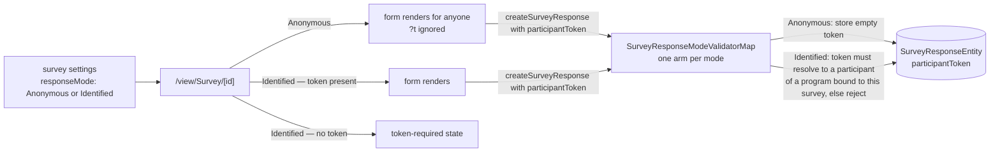

# Survey Response Modes

Response identity is an explicit, server-enforced survey setting rather than an implicit "everything is anonymous". A survey declares its **response mode**: **Anonymous** (anyone with the link, no identity carried) or **Identified** (responses must present an opaque participant token issued by a [Program](/docs/platform/program-resource), so every answer joins back to a participant server-side). The mode is an enum and the enforcement is one validation arm per mode — that is the whole extensibility mechanism, and it is deliberately boring.

**No identifying value ever appears client-side.** The URL carries an opaque UUID token or nothing; what a token means is resolvable only by the owner, server-side.

## How it works

- **Setting** — `responseMode` joins the survey content `settings` section alongside the [response controls](/docs/platform/survey-response-controls) toggle. One settings object, one write path, one `contentVersion`. Default `Anonymous`.
- **Entity** — `SurveyResponseEntity` carries `participantToken` (an opaque UUID string, default `""`). It is deliberately **not** a SurveyResponses dataset column: raw tokens mean nothing to a human, and the joined view is the Program's status dataset. Client code never interprets tokens.
- **Respondent page** — reads `?t=` once on load and threads it through create and update. In Identified mode with no token it renders a token-required state.
- **Validation** — in `resolveSurveyResponseWrite`, the mode selects one arm of `SurveyResponseModeValidatorMap`. Anonymous strips the token to `""`, so a stale participant link into a now-anonymous survey still works and just carries nothing. Identified resolves the token against the participant table of a program **bound to this survey** — which makes a missing token, a forged token, and another survey's token all fail identically, so the response is never an oracle for probing valid tokens. Mode changes take effect live, because they live in working settings rather than the publish snapshot.
- **Resume** — an Identified update must carry the token it started with; swapping tokens mid-response is a forgery and is rejected. The resolved token is what gets written, never the caller's, so a stale token cannot ride an Anonymous write.

**Extending later is one enum value plus one validation arm.** An `Authenticated` mode (logged-in users, one response per user) would add a session check and store the user id in the same identity slot. The foundation is the explicit mode plus the per-mode boundary check, not any particular mode.

## Key files

| File                                                                    | Role                                      |
| ----------------------------------------------------------------------- | ----------------------------------------- |
| `packages/db-schema/src/models/survey/SurveyResponseMode.ts`            | the mode values                           |
| `packages/db-schema/src/models/survey/SurveyResponseEntity.ts`          | the `participantToken` field              |
| `packages/app/shared/models/resource/survey/SurveySettings.ts`          | `responseMode` on the settings section    |
| `packages/app/server/services/survey/SurveyResponseModeValidatorMap.ts` | one validation arm per mode               |
| `packages/app/server/services/survey/resolveIdentifiedToken.ts`         | the Identified arm — token must bind here |
| `packages/app/app/components/Resource/Survey/View.vue`                  | `?t=` passthrough + token-required state  |

## Notes

- Anonymous and Identified are collection-time postures, not privacy promises about the answers. An Identified survey's owner sees who said what — that is its purpose; an Anonymous survey's owner structurally cannot. The Collection card says this where the mode is picked.
- The program is the issuer and the survey is the gate: token validation lives here, issuance lives in the [Program resource](/docs/platform/program-resource).
- Switching a survey with existing responses between modes never mutates stored responses; the mode governs the write boundary from then on. The Responses blade is unaffected either way.
- Rejected shape: attributing via a raw `?ref={{column}}` value substituted from the audience dataset. It puts participant data — potentially an email address — into a shareable URL and trusts the client with identity. Opaque server-issued tokens keep identity resolution owner-side only.
