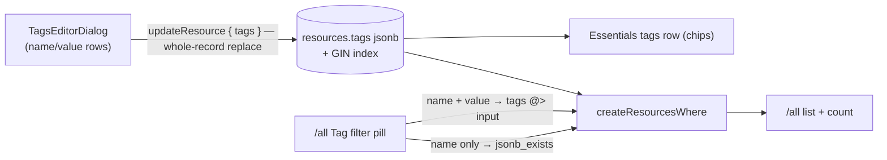

# Resource Tags

Every resource carries a flat `Record<string, string>` of tags: shown in Essentials, edited in place, and filterable on `/resources/all`. Tags are the lightweight organization layer that keeps [resource groups deferred](/docs/platform/deferred/resource-groups) — cross-cutting labels without a grouping entity to model, migrate, and navigate.

## How it works

Tags live on the resource row itself as a `jsonb` column defaulting to `{}`, not in a join table. They are read on every list query and written as a whole record, so normalizing them into rows would buy nothing but joins.

Editing replaces the whole record rather than merging, which is Azure's own tag update semantics and the reason the editor can express "remove this tag" at all: the dialog always sends every tag it knows about, and whatever it omits is gone. It edits an ordered list of name/value rows rather than the record directly — a record cannot hold a half-typed duplicate or a blank name mid-edit, and rows keep their position while the user types. Rows with a blank name are dropped at save, which is what lets an empty row sit on screen as somewhere to type without ever being written.

Filtering splits in two, because the pill's value is optional and one operator cannot cover both cases. A name _and_ value is containment (`tags @> {"env":"prod"}`); a name alone is key-existence (`jsonb_exists(tags, 'env')`) — "tagged with this at all", which is the common case. Both go through `createResourcesWhere`, so `count` and `readResources` can never disagree about what matches, and both are served by the same GIN index.

## Data model

`resources.tags` is `jsonb`, `notNull().default({})`, with a GIN index backing both containment and key-existence. `resourceTagsSchema` bounds it at `MAX_TAGS_COUNT` entries with `MAX_TAG_NAME_LENGTH` / `MAX_TAG_VALUE_LENGTH` per pair.

Names are non-empty through the `normalizeString` pipe; values are not. An empty value is a meaningful Azure tag — `environment:` with nothing after it marks a resource as needing one — so only the name is required to exist.

## Procedures

| Procedure                          | Auth   | Input                  | Purpose                                |
| ---------------------------------- | ------ | ---------------------- | -------------------------------------- |
| `<type>.updateResource` (factory)  | owner  | + `tags?`              | Whole-record replace (Azure semantics) |
| `resource.readResources` / `count` | authed | + `tags?` / `tagName?` | Containment or key-existence filter    |

## Key files

| File                                                     | Role                      |
| -------------------------------------------------------- | ------------------------- |
| `packages/db-schema/src/models/resource/ResourceTags.ts` | Schema + the three limits |
| `packages/db-schema/src/schema/resources.ts`             | `tags` column + GIN index |
| `app/components/Resource/TagsEditorDialog.vue`           | Name/value row editor     |
| `app/components/Resource/List/TagFilterPill.vue`         | The `/all` Tag pill       |
| `app/components/Resource/Overview.vue`                   | Essentials tags row       |

## Notes

- Flat name:value only, faithful to Azure — no hierarchies, no typed values.
- A tags-only update leaves no `Renamed` entry in the [activity log](/docs/platform/activity-log): changing a label is not renaming a resource.
- Free-text tag search inside [global search](/docs/platform/global-search) is not wired up; the `/all` filter pill is the retrieval path.
- If tag usage grows into "give me a folder", that is the [resource groups](/docs/platform/deferred/resource-groups) revisit trigger, not more tag features.
