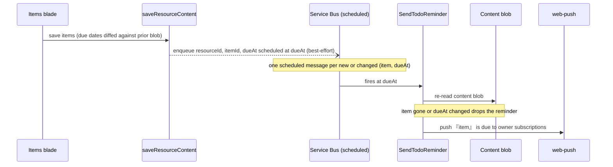

# TodoList due reminders

A TodoList item with a due date pushes a web-push reminder to its owner when it comes due — the first platform feature to reuse the notification infrastructure esbabbler already runs, and the thing that turns the TodoList type from a table into an actual todo product.

## How it works

Reminder delivery adds no new Azure services: the Service Bus scheduled-message pattern (already used for [scheduled messages](/docs/esbabbler/scheduled-messages)) carries the timer, and the existing [push-notification pipeline](/docs/esbabbler/push-notifications) carries the notification.

- **Scheduling** — after a TodoList `saveResourceContent` persists, the server reads the prior content blob and diffs due dates, enqueueing one scheduled Service Bus message per item whose `(itemId, dueAt)` is new or changed and still in the future. The diff is fire-and-forget and best-effort: a failed enqueue logs and never fails the user's save, and an unreadable prior blob degrades to "no previous content" rather than blocking the save. Diffing keeps repeated saves from piling up duplicate reminders for an unchanged due date.
- **Fire-time verification is the consistency model** — the reminder carries only `{ resourceId, itemId, dueAt }`; there is no Postgres row backing it, so the scheduled message _is_ the state. When it fires, `SendTodoReminder` re-reads the live content blob and drops the reminder if the item was deleted or re-dated (a re-dated item enqueued its own fresh message at save time). This makes stale messages harmless, so saves never have to cancel previously enqueued ones.
- **Delivery** — the reminder pushes `『{item}』 is due` to the owner's push subscriptions through the same `sendWebPushNotifications` path every other notification uses. Clicking the notification opens the resource's Items blade (`/resources/{id}/items`). TodoLists are single-owner resources, so the recipient set is just the owner's subscriptions — no fan-out.

## Data model

None in Postgres. The TodoList item already carries `dueAt` (the Items and Calendar blades render it), and the reminder is stateless — the scheduled Service Bus message holds the whole payload and the blob re-read is the truth check. The `todo-reminders` Service Bus queue is provisioned alongside the existing `scheduled-message-jobs` queue in `packages/infra`.

## Key files

| File                                                                      | Role                                                           |
| ------------------------------------------------------------------------- | -------------------------------------------------------------- |
| `packages/app/server/services/resource/todoList/scheduleTodoReminders.ts` | Post-save due-date diff and per-item enqueue                   |
| `packages/app/server/trpc/routers/todoList.ts`                            | Wires the diff in as the `afterSaveResourceContent` hook       |
| `packages/app/server/trpc/procedure/resource/createResourceProcedures.ts` | The generic `afterSaveResourceContent` hook on the save path   |
| `packages/db/src/services/azure/serviceBus/enqueueTodoReminder.ts`        | Schedules the Service Bus message at `dueAt`                   |
| `packages/db-schema/src/models/azure/queue/TodoReminderQueueMessage.ts`   | The `{ resourceId, itemId, dueAt }` message schema             |
| `packages/azure-functions/src/functions/sendTodoReminder.ts`              | Queue-trigger registration for `SendTodoReminder`              |
| `packages/azure-functions/src/handlers/sendTodoReminderHandler.ts`        | Re-reads the blob, verifies the item, and pushes               |
| `packages/azure-functions/src/services/sendTodoReminderNotification.ts`   | Builds the push payload and sends to the owner's subscriptions |

## Notes

- At-least-once delivery: a duplicate fire re-verifies against the blob and pushes twice in the worst case — acceptable for reminders, and cheaper than a dedup table.
- A due date toggled away and back across saves re-enqueues a reminder for the same timestamp that fire-time verification cannot distinguish from the original — an accepted duplicate (one extra push). Service Bus duplicate detection would collapse it via a deterministic message id, but requires the Standard tier; the namespaces run Basic.
- Reminder timing is exactly `dueAt` in this first cut. Lead-time offsets ("remind me 1h before") are a follow-up `dueAt`-relative field, not a reason to build preference UI now.
- TodoList items have no completion state yet (`TodoListItemType` is `Todo`-only), so the fire-time check verifies existence and due-date match; a completion state, once it exists, becomes a third drop condition.
