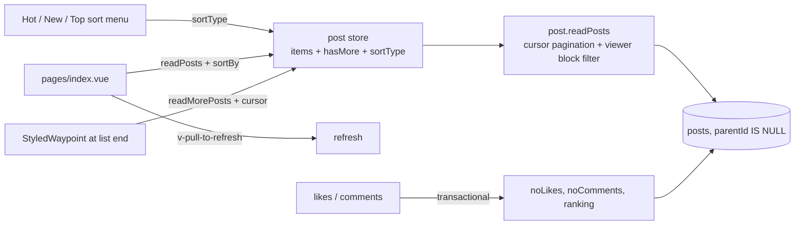

# Feed and Ranking

The home page renders top-level posts with pull-to-refresh, infinite scroll, and a Reddit-style Hot / New / Top sort menu, backed by cursor pagination over a stored ranking score.

## How it works



**Pagination** — `readPosts` takes cursor pagination params (default sort: `ranking` desc with the unique `id` as tiebreaker), fetches `limit + 1` rows to detect `hasMore`, and returns a cursor for the next page — the app-standard cursor pattern (`getCursorWhere` / `getCursorPaginationData`). Compound sort keys compare lexicographically — `(k1 < v1) OR (k1 = v1 AND k2 < v2)` — so pages of tied values (every new post has `noLikes = 0`) never skip rows. The same procedure serves comment lists via the `parentId` filter.

**Sort options** — a Reddit-style sort menu above the feed (`PostSortMenu`: a pill button showing the current sort's icon + label, opening a "Sort by" dropdown whose per-sort icons come from `PostSortTypeIconMap`) switches between Hot (`ranking` desc), New (`createdAt` desc), and Top (`noLikes` desc, all-time), each mapped to a `sortBy` by `PostSortTypeSortByMap` with `id` as second key. The chosen sort lives in the post store; switching clears the list and refetches page one, and the waypoint continues from the new cursor. Comments keep their fixed sort.

**Block filtering** — authenticated feed reads exclude posts and comments authored by users the viewer has blocked — see [feed block filtering](/docs/posts/feed-block-filtering).

**Ranking** — the hot score is computed at write time, never re-read:

```text
sign(likes) × log10(max(|likes|, 1)) + max(0, createdAtMs − 1.5e12) / 45e6
```

The log term means early likes matter most; the time term gives newer posts a constant head start (each ~12.5 hours of age is worth one order of magnitude of likes). Because age is baked in as an absolute offset, scores never need recomputation — newer posts simply start higher. Every like create/update/delete and comment create recomputes the score in the same transaction that updates the counters.

**Feed UI** — `v-pull-to-refresh` wraps the list for mobile-style refresh; a `StyledWaypoint` sentinel at the bottom triggers `readMorePosts` while `hasMore` holds. The left drawer shows the product list navigation.

## Procedures

| Procedure        | Auth         | Input                               | Purpose                      |
| ---------------- | ------------ | ----------------------------------- | ---------------------------- |
| `post.readPosts` | rate-limited | cursor params + optional `parentId` | one feed/comment page        |
| `post.readPost`  | rate-limited | post id                             | single post for `/post/[id]` |

## Key files

Paths relative to `packages/app`.

| File                                         | Role                               |
| -------------------------------------------- | ---------------------------------- |
| `app/pages/index.vue`                        | the feed page + sort menu          |
| `app/components/Post/SortMenu.vue`           | Reddit-style sort dropdown         |
| `app/composables/post/useReadPosts.ts`       | initial read + read-more, `sortBy` |
| `app/store/post/index.ts`                    | feed items store + `sortType`      |
| `app/services/post/PostSortTypeSortByMap.ts` | sort menu → `sortBy` mapping       |
| `app/services/post/PostSortTypeIconMap.ts`   | sort → menu icon mapping           |
| `server/trpc/routers/post.ts`                | `readPosts` / `readPost`           |
| `server/services/post/getPostRanking.ts`     | the hot score                      |
| `server/services/pagination/cursor/`         | shared cursor pagination helpers   |

## Notes

- Top is all-time (no time windows) — casual scale doesn't need "top this week" partitioning yet; revisit if the feed ages badly.
- Every post ships at most the viewer's own like row (`viewerLike`) — see [likes](/docs/posts/likes) for the viewer-scoped read contract.
