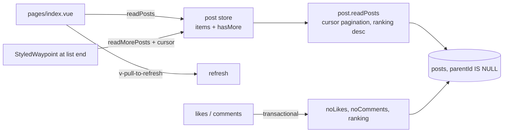

# Feed and Ranking

The home page renders top-level posts hottest-first with pull-to-refresh and infinite scroll, backed by cursor pagination over a stored ranking score.

## How it works



**Pagination** — `readPosts` takes cursor pagination params (default sort: `ranking` desc), fetches `limit + 1` rows to detect `hasMore`, and returns a cursor for the next page — the app-standard cursor pattern (`getCursorWhere` / `getCursorPaginationData`). The same procedure serves comment lists via the `parentId` filter.

**Ranking** — the hot score is computed at write time, never re-read:

```
sign(likes) × log10(max(|likes|, 1)) + (createdAtMs − 1.5e12) / 45e6
```

The log term means early likes matter most; the time term gives newer posts a constant head start (each ~12.5 hours of age is worth one order of magnitude of likes). Because age is baked in as an absolute offset, scores never need recomputation — newer posts simply start higher. Every like create/update/delete and comment create recomputes the score in the same transaction that updates the counters.

**Feed UI** — `v-pull-to-refresh` wraps the list for mobile-style refresh; a `StyledWaypoint` sentinel at the bottom triggers `readMorePosts` while `hasMore` holds. The left drawer shows the product list navigation.

## Procedures

| Procedure        | Auth         | Input                               | Purpose                      |
| ---------------- | ------------ | ----------------------------------- | ---------------------------- |
| `post.readPosts` | rate-limited | cursor params + optional `parentId` | one feed/comment page        |
| `post.readPost`  | rate-limited | post id                             | single post for `/post/[id]` |

## Key files

Paths relative to `packages/app`.

| File                                   | Role                             |
| -------------------------------------- | -------------------------------- |
| `app/pages/index.vue`                  | the feed page                    |
| `app/composables/post/useReadPosts.ts` | initial read + read-more         |
| `app/store/post/index.ts`              | feed items store                 |
| `server/trpc/routers/post.ts`          | `readPosts` / `readPost`         |
| `server/services/post/ranking.ts`      | the hot score                    |
| `server/services/pagination/cursor/`   | shared cursor pagination helpers |

## Notes

- `readPosts` accepts arbitrary `sortBy` already; the UI only ever asks for the default hot sort — exposing New/Top is proposed in [feed sort options](/docs/proposals/posts/feed-sort-options).
- Every post row ships **all** of its like rows to the client (`PostRelations = { likes, user }`) just to color the viewer's arrows — see [viewer-scoped likes](/docs/proposals/posts/viewer-scoped-likes).
- The feed does not exclude posts from users the viewer has blocked — see [feed block filtering](/docs/proposals/posts/feed-block-filtering).
