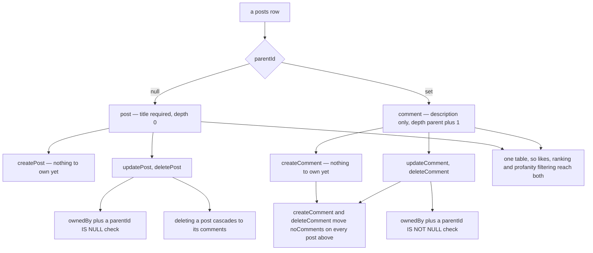
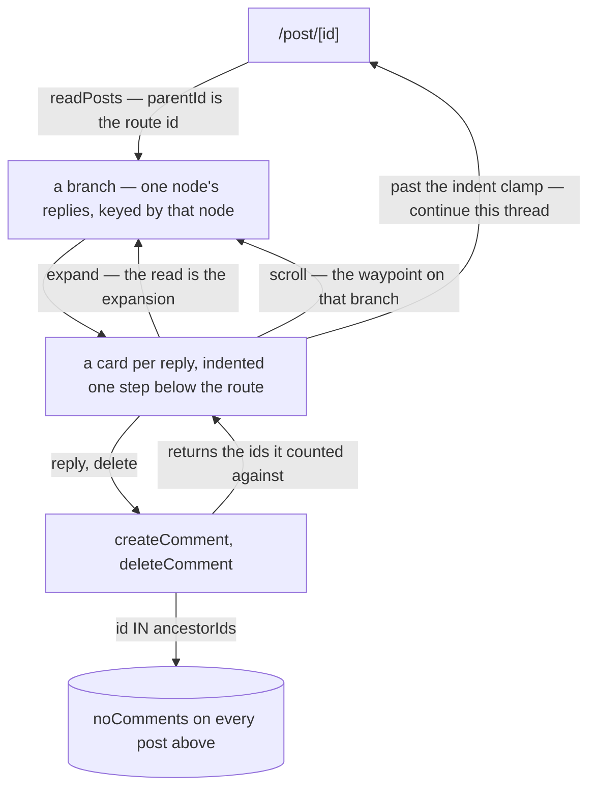

# Posts and Comments

One `posts` table carries both: a post is a root row (required title, `parentId = null`), a comment is a child row (`parentId` set, `depth = parent + 1`, no title). Deleting a post cascades to its comments.

`parentId` is the whole distinction — every rule on this page follows from which side of it a row falls on:

The two guards are why a post procedure cannot touch a comment and vice versa, even though both address the same table by id.

## How it works

**Model** — `posts(id, userId, title, description, parentId, ancestorIds, depth, noComments, noLikes, ranking)` with DB-level length checks (`title ≤ 300`, `description ≤ 1000`); `selectPostSchema` vs `selectCommentSchema` differ only in which text field is required. Rows relate to their author via `PostRelations` and carry the viewer's own like as `viewerLike` (see [likes](/docs/posts/likes)).

**Creating** — `/post/create` hosts the post form (`PostUpsertForm`); descriptions are Tiptap rich text (`DescriptionRichTextEditor`). Comments are created inline on the post page (`Comment/CreateRichTextEditor`). Both mutations run through the profanity-filter procedure, which censors the configured text fields in middleware, and compute the initial [ranking](/docs/posts/feed-and-ranking) from zero likes.

**Comment bookkeeping** — `createComment`/`deleteComment` run in a transaction that also moves `noComments` on **every post above** the one written, not just its parent. Once replies nest, a counter that stopped at direct children makes a feed card under-report its own thread — thirty comments showing as three. Neither write walks the chain to find it: every row carries its own `ancestorIds`, so a create inherits its parent's list plus the parent, and both mutations move counters with a plain `id IN (...)`. A delete decrements by the size of the subtree the cascade takes with it, counted before the delete — by containment against that same column, since afterwards nothing could say what it was. Both mutations return the ids they counted against, so the client adjusts exactly the rows on screen instead of rediscovering the chain by scanning what it has loaded.

**Ownership** — update/delete are guarded by `ownedBy(posts, id, userId)` plus a `parentId IS (NOT) NULL` check, so post procedures can't touch comments and vice versa; there is no moderator override (moderation is an esbabbler concept, not a posts one).

**Reading** — the post page loads the post by route param, then pages its comments through the same `readPosts` procedure with `parentId`; an empty banner shows for zero comments, and the comment editor only renders for a signed-in session.

**The tree** — every node is a branch that pages independently, keyed in the store by the comment whose replies it holds. The route's own post is simply the branch keyed by its id, so the page and a reply ten levels down mount the same component and run the same read. A branch is collapsed until asked for: expanding one is what reads it, and re-expanding costs nothing because the rows outlive the component that read them. Indentation is one step per level below the comment the **route** names rather than the stored `depth`, so a rerooted thread opens at zero rather than already clamped. Past the indent clamp a node offers to continue the thread on its own page, which needs no route of its own: a comment is a post, so `/post/[id]` on its id renders it as a root with one level of context instead of ten.

**Indexes** — `(parentId, ranking DESC, id DESC)` serves the question every read asks: one parent's children, best first. The tree asks it once per open branch and the feed asks it with a null parent, and a foreign key gets no index of its own in Postgres. A GIN index over `ancestorIds` serves the only question that is about a whole subtree rather than one level — how many rows a delete is about to take.

## Procedures

| Procedure            | Auth                    | Input                 | Purpose                    |
| -------------------- | ----------------------- | --------------------- | -------------------------- |
| `post.createPost`    | authed + profanity      | title, description    | create a root post         |
| `post.updatePost`    | authed + profanity, own | id + fields           | edit own post              |
| `post.deletePost`    | authed, own             | id                    | delete own post (cascades) |
| `post.createComment` | authed + profanity      | parentId, description | comment + the ids counted  |
| `post.updateComment` | authed + profanity, own | id + description      | edit own comment           |
| `post.deleteComment` | authed, own             | id                    | ids counted + subtree size |

## Key files

Paths relative to `packages/app`, except those starting with `packages/`, which are relative to the repo root.

| File                                                   | Role                                   |
| ------------------------------------------------------ | -------------------------------------- |
| `packages/db-schema/src/schema/posts.ts`               | table + length checks + select schemas |
| `server/trpc/routers/post.ts`                          | all CRUD procedures                    |
| `server/trpc/procedure/getProfanityFilterProcedure.ts` | text censoring middleware              |
| `app/pages/post/create.vue`, `app/pages/post/[id].vue` | create + detail pages                  |
| `app/components/Post/`                                 | card, forms, comment components        |
| `app/components/Post/Comment/Branch.vue`               | one node's replies — the recursion     |
| `app/store/post/comment/index.ts`                      | the branch-keyed comment map           |

## Notes

- Comments have no title by design; the shared table means any future post feature (likes, achievements, profanity filtering) applies to comments for free.
