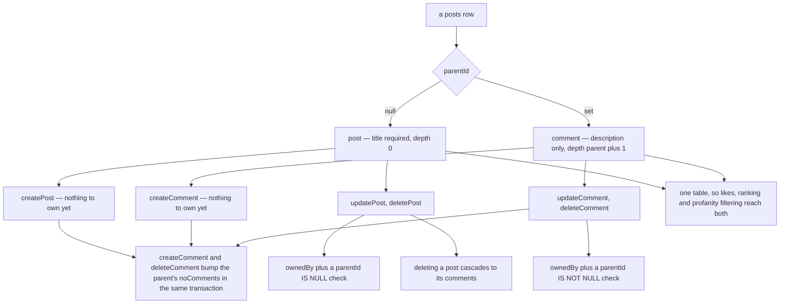

# Posts and Comments

One `posts` table carries both: a post is a root row (required title, `parentId = null`), a comment is a child row (`parentId` set, `depth = parent + 1`, no title). Deleting a post cascades to its comments.

`parentId` is the whole distinction — every rule on this page follows from which side of it a row falls on:

The two guards are why a post procedure cannot touch a comment and vice versa, even though both address the same table by id.

## How it works

**Model** — `posts(id, userId, title, description, parentId, depth, noComments, noLikes, ranking)` with DB-level length checks (`title ≤ 300`, `description ≤ 1000`); `selectPostSchema` vs `selectCommentSchema` differ only in which text field is required. Rows relate to their author via `PostRelations` and carry the viewer's own like as `viewerLike` (see [likes](/docs/posts/likes)).

**Creating** — `/post/create` hosts the post form (`PostUpsertForm`); descriptions are Tiptap rich text (`DescriptionRichTextEditor`). Comments are created inline on the post page (`Comment/CreateRichTextEditor`). Both mutations run through the profanity-filter procedure, which censors the configured text fields in middleware, and compute the initial [ranking](/docs/posts/feed-and-ranking) from zero likes.

**Comment bookkeeping** — `createComment`/`deleteComment` run in a transaction that also increments/decrements the parent's `noComments`, so counts never drift from the rows.

**Ownership** — update/delete are guarded by `ownedBy(posts, id, userId)` plus a `parentId IS (NOT) NULL` check, so post procedures can't touch comments and vice versa; there is no moderator override (moderation is an esbabbler concept, not a posts one).

**Reading** — the post page loads the post by route param, then pages its comments through the same `readPosts` procedure with `parentId`; an empty banner shows for zero comments, and the comment editor only renders for a signed-in session.

## Procedures

| Procedure            | Auth                    | Input                 | Purpose                     |
| -------------------- | ----------------------- | --------------------- | --------------------------- |
| `post.createPost`    | authed + profanity      | title, description    | create a root post          |
| `post.updatePost`    | authed + profanity, own | id + fields           | edit own post               |
| `post.deletePost`    | authed, own             | id                    | delete own post (cascades)  |
| `post.createComment` | authed + profanity      | parentId, description | comment (+`noComments`)     |
| `post.updateComment` | authed + profanity, own | id + description      | edit own comment            |
| `post.deleteComment` | authed, own             | id                    | delete own comment (−count) |

## Key files

Paths relative to `packages/app`, except those starting with `packages/`, which are relative to the repo root.

| File                                                   | Role                                   |
| ------------------------------------------------------ | -------------------------------------- |
| `packages/db-schema/src/schema/posts.ts`               | table + length checks + select schemas |
| `server/trpc/routers/post.ts`                          | all CRUD procedures                    |
| `server/trpc/procedure/getProfanityFilterProcedure.ts` | text censoring middleware              |
| `app/pages/post/create.vue`, `app/pages/post/[id].vue` | create + detail pages                  |
| `app/components/Post/`                                 | card, forms, comment components        |
| `app/store/post/comment/index.ts`                      | comment list store                     |

## Notes

- `depth` is tracked on every comment but the UI renders a single flat level — the reply tree over it is designed in [nested comment threads](/docs/proposals/posts/nested-comment-threads).
- Comments have no title by design; the shared table means any future post feature (likes, achievements, profanity filtering) applies to comments for free.
