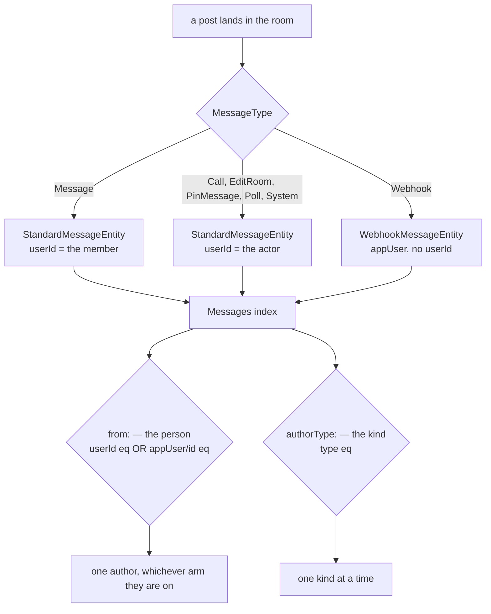

# Author Search Filters

[Message search](/docs/esbabbler/message-search) can narrow by room, media, date and pin state, but the author dimension has exactly one filter — `from:` — and it answers a narrower question than it appears to. `from:` compiles to `userId eq <id>` against the search index, and `userId` is a field only one of the two message entities carries. Two things follow from that single mapping, and both are visible to anyone in a room with a webhook in it.

**A webhook post cannot be searched for.** `WebhookMessageEntity` declares `userId?: undefined` — its author is an `appUser` row, which is the whole point of [webhooks](/docs/esbabbler/webhooks) ("the identity is a row a message can point at, so rendering does not have to special-case 'no user'"). Those posts are indexed like any other and come back in free-text results, but no combination of filters selects them or excludes them. A room whose deploy bot posts all day has no way to read the results underneath it.

**`from:` conflates what a member said with what the room recorded them doing.** Every `MessageType` except `Webhook` maps to `StandardMessageEntity`, so a pin, a room edit, a call and a poll all carry the acting member's `userId`. `from: alice` therefore returns "Alice pinned a message" beside the message Alice wrote. The filter reads as "messages by Alice" and behaves as "rows attributed to Alice".

## The rule

**A message has two kinds of author, and every author-shaped filter has to know that.** The model already says so — `MessageEntity` is a union, and the arm a message lands on decides whether its author is a `userId` or an `appUser`. `from:` was written against one arm, so it silently answers for half the union.

**Naming the person and naming the kind are different filters.** `from:` names the person and keeps that meaning; the kind gets its own keyword rather than a second sense bolted onto the first, which is why this is `authorType:` and not a widened `author:` — the two would read as synonyms and neither would say which one narrows what. The keyword falls out of the existing helper: `getFilterKeyword` is `uncapitalize(filterType)`, so `FilterType.AuthorType` renders `authorType:` with no special casing.

Today only the `userId` half of the left gate exists, and the right gate does not exist at all.

## What it adds

### `authorType:` — the kind

A new `FilterType.AuthorType` whose picker offers three values grouping the seven message types:

| Value    | Compiles to                                          | Reads as                            |
| -------- | ---------------------------------------------------- | ----------------------------------- |
| `Member` | `type eq Message`                                    | what people actually wrote          |
| `App`    | `type eq Webhook`                                    | what a webhook posted               |
| `System` | `type in (Call, EditRoom, PinMessage, Poll, System)` | what the room recorded about itself |

`Member` is the value that earns the feature on its own: it is the "hide the noise" filter, and there is no way to express it today.

This needs no new field, no schema change and no reindex. `type` is already a field on every document, because `MessageEntity` is the index document and its `type` is what discriminates the union.

The grouping lives in one map beside `FilterTypeHas`'s, because the same shape is already there — a filter type whose values are an enum of its own, with a map from each value to the clause it builds. `FilterTypeHasMimeCategoryMap` in `filtersToClauses` is the precedent, and `System` is the only row needing a set rather than a scalar, which `SearchOperator` already expresses for `has:`.

A future bot integration distinct from webhooks needs no fourth value: it would add a `MessageType`, and a `MessageType` added without a row here is a type error at the map, which is the point of declaring it exhaustively.

### `from:` — the person, on either arm of the union

`from:` keeps its meaning and gains the other author column. Its picker already lists room members; it gains the room's app users, and the clause it builds depends on which kind was picked — `userId eq <id>` for a member, `appUser/id eq <id>` for an app user. One filter, two fields, because a message carries exactly one of them.

**This is the half that closes the model's actual hole**, and it is worth building independently of how many webhooks a room may hold. The cap is a product decision that moves in a one-line change; the union is the shape of the data. A filter that can only name one arm of it is incomplete whether the other arm currently holds one row or fifty, and scoping around today's cap would leave the hole in place and call it done.

`authorType: App` is not a substitute for it either, even at one webhook per room. The two answer different questions — "posts from this author" against "posts of this kind" — and a reader who wants the first should not have to know that the room's configuration currently makes the second coincide with it.

## What it does not add

**Not a `bot:` boolean, and not a value on `has:`.** `has:` enumerates what a message _contains_; author kind is what a message _is_, and folding it in would make one picker answer two questions — the same conflation this proposal exists to undo.

**Not a change to what is indexed.** Both filters read fields that are already document fields.

## Consequences

**`from:` stops being the noise filter people use it as.** Anyone filtering on themselves today to find their own messages is currently getting their pins and room edits too; after this they get their messages, and `authorType: system` is where the rest went. That is a behaviour change to an existing filter's results and it is the intended one — but it is the reason this is a proposal rather than an additive filter that could ship unannounced.

**Search history rows survive.** A stored search records the filters it ran with ([message search](/docs/esbabbler/message-search)), and a row written before this ships carries no `authorType:` chip — it replays as it always did.

**The `from:` picker is the only real UI work.** `SearchFilterComponentMap` already shares one picker across several filter types, so `authorType:` takes the same list picker `has:` uses; `from:` is the one that has to offer two kinds of row and report which kind was chosen.

## Key Files

| Path                                                                            | Role                                                                 |
| ------------------------------------------------------------------------------- | -------------------------------------------------------------------- |
| `packages/db-schema/src/models/message/filter/FilterType.ts`                    | the filter enum a keyword is parsed into                             |
| `packages/db-schema/src/models/message/MessageType.ts`                          | the seven kinds the `authorType:` values group                       |
| `packages/db-schema/src/models/message/MessageTypeEntityMap.ts`                 | which entity each kind instantiates — the union `type` discriminates |
| `packages/db-schema/src/schema/appUsersInMessage.ts`                            | the app-user identity `from:` learns to name                         |
| `packages/db/src/services/azure/search/filtersToClauses.ts`                     | where a filter becomes a search clause                               |
| `packages/app/app/services/message/filter/SearchFilterComponentMap.ts`          | which picker a filter type opens                                     |
| `packages/app/app/services/message/filter/FilterTypePlaceholderMap.ts`          | the picker's prompt text                                             |
| `packages/app/app/components/Message/RightSideBar/Search/Filter/UserPicker.vue` | the `from:` picker that gains app users                              |
