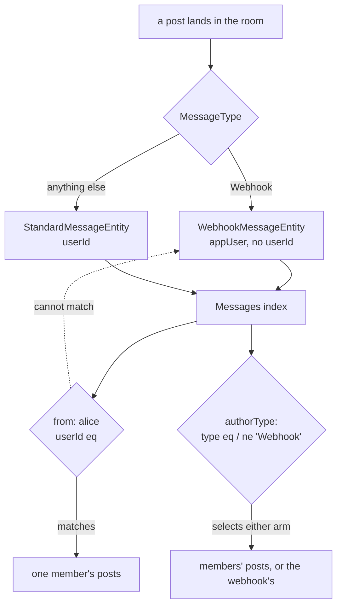

# Author Type Search Filter

[Message search](/docs/esbabbler/message-search) can narrow by room, media, date and pin state, but the author dimension has exactly one filter — `from:` — and it can only ever name a person. That is the right scope for `from:`, and it is what Discord's own `from:` does; the gap is that nothing else covers the rest of the author model.

**A webhook post cannot be searched for.** `MessageEntity` is a union, and the arm a message lands on decides what carries its author. `WebhookMessageEntity` declares `userId?: undefined` — its author is an `appUser` row, which is the whole point of [webhooks](/docs/esbabbler/webhooks) ("the identity is a row a message can point at, so rendering does not have to special-case 'no user'"). `from:` compiles to `userId eq <id>`, so it answers for one arm of the union and silently returns nothing for the other. Webhook posts are indexed like any other and come back in free-text results, but no combination of filters selects them or excludes them. A room whose deploy bot posts all day has no way to read the results underneath it.

## The rule

**Naming a person and naming a kind of author are different filters.** `from:` names the person and keeps that meaning unchanged. The kind gets its own keyword rather than a second sense bolted onto the first — which is why this is `authorType:` and not a widened `author:`: the two would read as synonyms, and neither keyword would say which one narrows what.

The keyword falls out of the existing helper. `getFilterKeyword` is `uncapitalize(filterType)`, so `FilterType.AuthorType` renders `authorType:` with no special casing.

The dotted edge is the gap, and `from:` is not where it gets closed — a filter that names a person has nothing to say about an author that is not one.

## What it adds

A new `FilterType.AuthorType` whose picker offers two values:

| Value     | Serializes to       | Reads as              |
| --------- | ------------------- | --------------------- |
| `User`    | `type ne 'Webhook'` | what members posted   |
| `Webhook` | `type eq 'Webhook'` | what a webhook posted |

Discord's equivalent offers user, bot and webhook. There is no `Bot` value here because there is no bot: `appUsersInMessage` **is** the webhook's identity — the webhooks page calls it "the bot identity" — so an app user and a webhook are one thing wearing two names, and offering both would be one concept in two rows of the same picker.

This needs no new field, no schema change and no reindex. `type` is already a field on every document, because `MessageEntity` is the index document and its `type` is what discriminates the union.

The values live in an enum of their own with a map from each value to the clause it builds, beside `FilterTypeHas`'s. `FilterTypeHasMimeCategoryMap` in `filtersToClauses` is the precedent, and the picker is the same list picker `has:` already uses.

**A real bot integration would add a third value**, and it would earn it by being a distinct author — its own identity row and its own `MessageType`, not a flag on a webhook. A `MessageType` added without a row in the map is a type error there, which is the point of declaring it exhaustively.

## What it does not add

**Not a widened `from:`.** `from:` names a person, and that is the whole of its job. Discord scopes it the same way and this proposal leaves it alone.

**Not a filter for system messages.** `from: alice` today also returns the pins, room edits, calls and polls recorded against Alice, because every `MessageType` except `Webhook` maps to `StandardMessageEntity` and carries the acting member's `userId`. That is a real annoyance, but it is **not** an author-type question: the author of "Alice pinned a message" genuinely is Alice, so `authorType: User` correctly includes it. Separating what a member _said_ from what the room _recorded them doing_ is a filter over the message kind, and folding it in here would make one picker answer two questions — the same conflation that keeps it out of `has:`.

**Not a change to what is indexed.** Every field this reads is already a document field.

## Consequences

**`from:` behaves exactly as it does today.** This is purely additive to existing results, which is what makes it cheap to ship.

**Search history rows survive.** A stored search records the filters it ran with ([message search](/docs/esbabbler/message-search)), and a row written before this ships carries no `authorType:` chip — it replays as it always did.

**The picker is not new work.** `SearchFilterComponentMap` already shares one picker across several filter types, and `authorType:` takes the list picker `has:` uses.

## Key Files

| Path                                                                   | Role                                                                 |
| ---------------------------------------------------------------------- | -------------------------------------------------------------------- |
| `packages/db-schema/src/models/message/filter/FilterType.ts`           | the filter enum a keyword is parsed into                             |
| `packages/db-schema/src/models/message/MessageType.ts`                 | the kind `authorType:` reads, and where a real bot would add one     |
| `packages/db-schema/src/models/message/MessageTypeEntityMap.ts`        | which entity each kind instantiates — the union `type` discriminates |
| `packages/db-schema/src/schema/appUsersInMessage.ts`                   | the webhook's identity, which is why there is no separate bot value  |
| `packages/db/src/services/azure/search/filtersToClauses.ts`            | where a filter becomes a search clause                               |
| `packages/app/app/services/message/filter/SearchFilterComponentMap.ts` | which picker a filter type opens                                     |
| `packages/app/app/services/message/filter/FilterTypePlaceholderMap.ts` | the picker's prompt text                                             |
