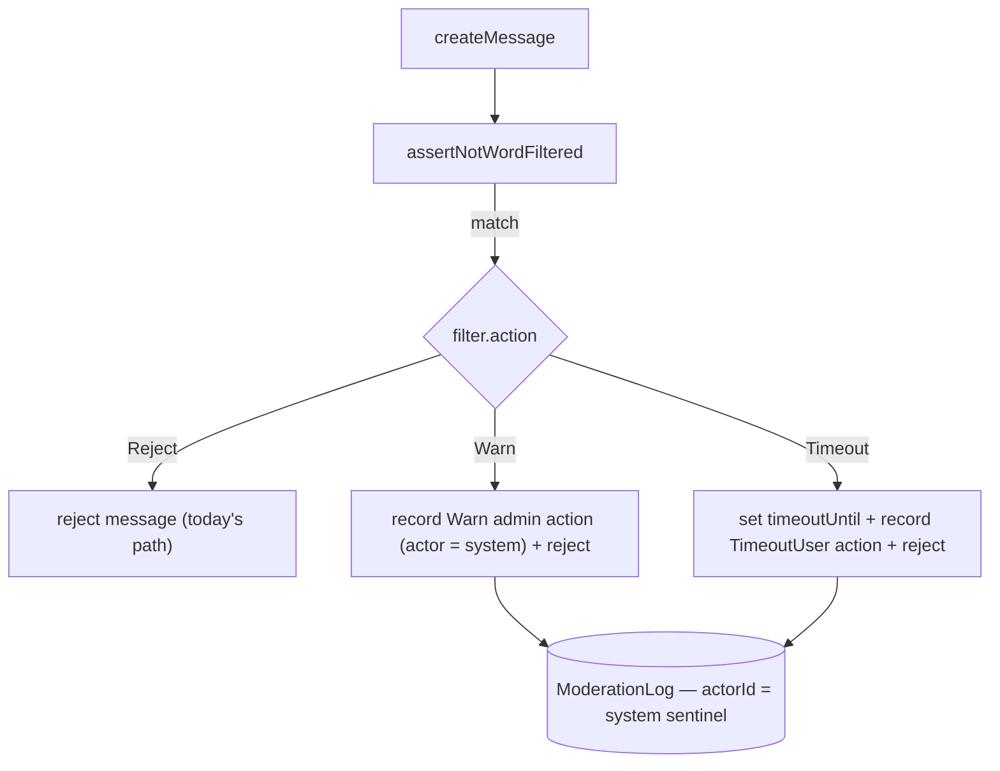

# Automod Actions

Let the word filter do more than block: per-filter configurable automatic action — reject (today's behaviour), warn, or timeout — turning the shipped filter into Discord-style AutoMod-lite.

## Scope

**Today:** `assertNotWordFiltered` rejects a matching message with an error; nothing is recorded and no moderation follows ([/docs/esbabbler/moderation](/docs/esbabbler/moderation)).

**This adds:** an `action` per filter row and server-side execution of that action through the existing admin-action machinery. No new moderation primitives — automod is a _caller_ of `executeAdminAction`'s internals.

## Data model

`roomFiltersInMessage` gains `action` (pg enum `word_filter_action`: `Reject` default | `Warn` | `Timeout`) and `timeoutDurationMs` (nullable integer; required when `Timeout`).

## How it works

- All actions still reject the message (Discord blocks + acts); the difference is what happens after.
- The moderation log rows use a reserved system actor id so the audit log renders "AutoMod" as the actor — the log schema already has `actorId`, no change needed.
- The targeted user gets the same `onAdminAction` delivery as a manual warn/timeout.

## Configuration UI

The word-filter settings panel (under **Moderation** — see [room settings](/docs/esbabbler/room-settings)) gains an action select + duration field per filter row. Gate stays `ManageRoom`.

## Key files

| File                                                                       | Change                                       |
| :------------------------------------------------------------------------- | :------------------------------------------- |
| `packages/db-schema/src/schema/roomFiltersInMessage.ts`                    | `action` + `timeoutDurationMs` (+ migration) |
| `packages/app/server/services/message/moderation/assertNotWordFiltered.ts` | dispatch on `action`                         |
| `packages/app/server/trpc/routers/room/filter.ts`                          | accept the new fields                        |
| `packages/app/app/components/Message/Model/Room/Settings/` (filter panel)  | action select                                |

## Notes

Raid-mode (bulk-join throttling) is intentionally **not** part of this — see [deferred](/docs/esbabbler/deferred/raid-mode).
