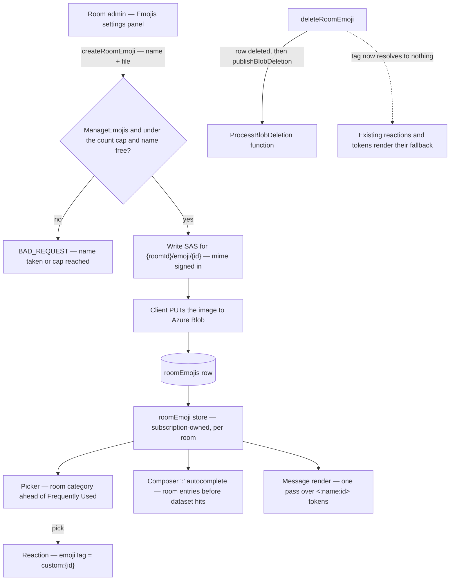

# Custom Emoji

A room uploads its own emoji, and from then on they behave like any other emoji: they appear in the picker under a category of the room's own, `:` autocomplete completes them, they can be reacted with, and they render inline in message content. This is the room-identity feature Discord's servers are built around, and it is the one thing our emoji surface cannot express — every glyph it offers is a glyph every other room already has.

Stickers are **not** in scope. A sticker is a message, not a glyph — it has no reaction path, no autocomplete, and no inline render — so it is a message-type change and belongs to its own design ([stickers](/docs/esbabbler/deferred/stickers)).

## Scope

**Today** ([emoji](/docs/esbabbler/emoji)) every emoji surface resolves through one index built from one dataset. `getEmojiIndex` holds three maps over the `Emoji` record; `getEmojiCategories` returns the rail as **data** (Frequently Used, then the CLDR groups), so a category can come from somewhere other than the dataset; `searchEmojis` is a MiniSearch index shared by the picker and the composer's suggestions. A reaction stores the **character itself** in `emojiTag`, so its identity is plain string equality with no vocabulary to keep two ends agreeing on.

That last point is what the earlier deferral got wrong: there is no slug in the storage path for a custom name to slot into. The tag namespace is the design work, and it is settled below.

Uploads and their teardown are also already standard: a two-step write SAS with the mime category signed in as the blob's content type ([file uploads](/docs/architecture/file-uploads)), room-scoped blobs under `{roomId}/…` in the message-assets container, and deletion by `ProcessBlobDeletion` Event Grid event rather than inline ([file & media](/docs/esbabbler/file-media)).

**This adds** four things: a table, a permission, a settings panel, and one shared way to render a glyph.

### Data model

One Postgres table registered in the db-schema package's schema object — `roomEmojisInMessage`, keyed by `id`, carrying `roomId` (cascade), `name`, and `userId` for the uploader. The blob is derived from the id (`{roomId}/emoji/{id}` in the message-assets container), so there is no url column to keep in step with storage and no second source of truth for where the file is.

Two constraints carry the whole shortcode contract:

- **A unique index on `(roomId, name)`**, so a room cannot hold two emoji answering to one shortcode.
- **A name check constraint** restricting the name to the slug shape the Unicode dataset already uses (lowercase, digits, underscores, a small length cap). That is what keeps `:name:` unambiguous — a custom name is drawn from the same closed charset as a Unicode slug, so a query resolves against the room's emoji first and the dataset second, and both answers are the same kind of token.

**A collision with a Unicode slug is rejected at upload**, not shadowed at read. Shadowing means the same `:fire:` renders differently per room, and a room that later loses the custom entry silently changes every message that used it.

### The cost question, and why there is no accounting

Room emoji are **room-owned**, exactly like attachments, so they are outside the personal storage quota for the same stated reason — a room's files belong to the room, not to whoever dropped them ([storage quotas](/docs/platform/storage-quotas)). What bounds them instead is a **per-room count cap** plus the per-file size and mime caps the write SAS already enforces, which is also Discord's model. The cap is the whole accounting story: it makes the worst case a room can cost a fixed number rather than an open-ended one, with nothing to meter, no ledger row per emoji, and no usage number for a room owner to act on.

This deliberately does not use the quota ledger. That mechanism exists to bound what one **user** keeps in their own resources, and charging a room's branding to whichever admin uploaded it makes the room's cost follow a person around. Room-scoped storage accounting, if it is ever wanted, is its own decision ([room attachment quota](/docs/esbabbler/deferred/room-attachment-quota)).

### Reaction identity

A custom reaction stores `custom:{id}` in `emojiTag`. Unicode tags are code-point sequences and never contain a colon, so the two namespaces cannot overlap, and the tag stays a single opaque string compared by equality — nothing about `useSelectEmoji`, the metadata row, or the subscription path changes shape.

**Keyed by id, not by name**, which is the one place worth diverging from Discord: renaming an emoji leaves every existing reaction intact, and a deleted emoji leaves a tag that resolves to nothing, which renders as a fallback rather than as another room's emoji.

### Message content

The composer inserts `<:name:id>` and the renderer resolves it. Both halves follow [content token rewriting](/docs/architecture/content-token-rewriting): the token is self-delimiting by construction (its own `<:` opener, `>` terminator, and a closed charset in between), tokens are collected once and replaced in one pass keyed by a `Map`, and a token that resolves to nothing is **left exactly as authored** — a deleted emoji degrades to the literal text, and never fails the render of the message around it.

The name travels in the token purely so that fallback reads as something. Resolution is by id.

The composer shows the token text while typing; an inline Tiptap node view that previews the image is a later nicety and changes nothing about storage, because storage is the token either way.

### Rendering one glyph in one place

Today four surfaces render `emoji.character` directly — the picker grid, the composer's suggestion list, the reaction chip, and the reaction hover card. A custom entry carries an image instead, so rather than branching in four places, the branch moves into one presentational component that takes an `Emoji` and renders either the character or the image. Every surface then renders a glyph without knowing which kind it has, and the index gains a discriminant rather than an optional url that every reader has to remember to check.

### The flow

### Permission and panel

`RoomPermission` gains `ManageEmojis`. Bit order is the wire format ([RBAC](/docs/esbabbler/rbac)), so the bit is **appended** after `Administrator` rather than inserted next to the other Manage bits — every stored bitfield keeps its meaning.

The settings dialog gains an `Emojis` panel in the General category, after Profile, which is where Discord puts it, gated through the settings permission map on the new bit ([room settings](/docs/esbabbler/room-settings)). The panel is a grid of the room's emoji with an upload button, inline rename, and delete — no new dialog shell, no new list primitive.

### Search

The room's set is smaller than the search-result cap by construction, so it is matched directly and its hits are concatenated **ahead** of the dataset's, rather than being merged into the global MiniSearch index. That keeps the global index build room-independent — it is built once for the whole app and must stay that way — and gives room emoji the ranking priority Discord gives them for free.

## Failure and teardown

Nothing here needs a new recovery path. A rejected create means no SAS was ever handed out. An abandoned upload leaves a blob no row names, under a room prefix that is swept when the room is deleted, and it is invisible until then because every read goes through the row. A delete removes the row first and then publishes the blob-deletion event, best-effort exactly as every other attachment delete is ([persist then notify](/docs/architecture/persist-then-notify)).

## Key files

| File                                                            | Change                                                     |
| :-------------------------------------------------------------- | :--------------------------------------------------------- |
| `packages/db-schema/src/schema/`                                | the room-emoji table, registered in the schema object      |
| `packages/db-schema/src/schema/roomRolesInMessage.ts`           | the appended `ManageEmojis` bit                            |
| `packages/app/app/models/message/emoji/Emoji.ts`                | the discriminant separating a dataset entry from an upload |
| `packages/app/app/services/message/emoji/getEmojiCategories.ts` | the room category, pinned ahead of Frequently Used         |
| `packages/app/app/services/message/emoji/EmojiSuggestion.ts`    | room entries ahead of dataset hits in `:` autocomplete     |
| `packages/app/app/components/Styled/EmojiPicker/`               | grid and rail rendering a glyph rather than a character    |
| `packages/app/app/composables/message/emoji/useSelectEmoji.ts`  | the `custom:{id}` tag alongside the character tag          |
| `packages/app/app/services/message/settings/`                   | the Emojis panel's category and permission entries         |
| `packages/app/server/trpc/routers/message/`                     | the room-emoji router — create with SAS, rename, delete    |

## Notes

The reaction hover card names an emoji through its slug, so a custom entry resolves its name from the room's set the same way — with the deleted case reading as the fallback rather than as an empty sentence.

Animated emoji are out of scope and stay so until a still image is not enough: an animated upload is a different content type, a different size cap, and a per-render cost on a list that already has a per-item weight budget ([message list rendering](/docs/esbabbler/message-list-rendering)).
