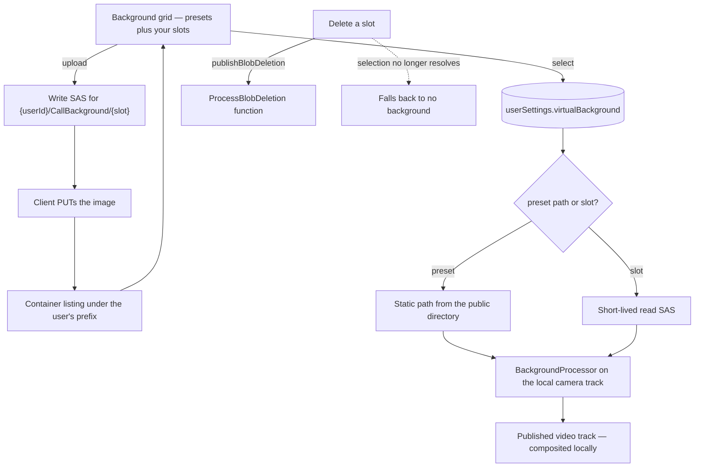

# Custom Video Backgrounds

Upload your own image and use it as your call background, instead of choosing from the handful of presets the repo ships. This is the virtual-background feature every call product has — Discord ships blur plus a preset set to everyone and puts custom images behind Nitro, and Zoom and Teams have had it for years — and it is the last piece of our call surface where the answer is "pick one of ours".

It is **not** profile imagery: the profile image is already user-editable ([users](/docs/users)). This is the camera background the local media pipeline composites behind you.

## Scope

**Today** the call applies a background through `@livekit/track-processors`: `CallVirtualBackgroundDefinitions` lists the presets as static SVGs served from the app's public directory, the picker grid selects one by its image path, and the LiveKit store swaps the processor on the local camera track. The selection lives in a plain ref in the call media store, so it is client-only and resets with the page — and support is feature-detected, because a browser without background processors gets a warning rather than a broken track.

**This adds** two things: somewhere to put an uploaded image, and somewhere to remember which background you chose.

### Uploads into fixed slots — no table, no metering

An upload writes to `{userId}/CallBackground/{slot}` in the private user-assets container, where the slot is an index below a small cap. That is the same trick the profile image already uses: the blob name is **derived, not allocated**, so the number of blobs a user can hold is bounded by construction. No table, no id, no ledger row, and nothing to reconcile — the cost of the feature is a fixed number of images per user, and re-uploading a slot overwrites it.

The container is the **private** one, because the only consumer of a background is the uploader's own browser: the image is composited locally before the track is published, so nobody else ever needs to fetch it. Reads are therefore a short-lived read SAS, the same shape the resource-asset reads sign ([file uploads](/docs/architecture/file-uploads)), rather than a permanently public url.

The list is the container listing under that prefix. There is nothing to keep in step with it, which is the point of deriving the name.

### Remembering the choice

`userSettingsInMessage` gains a `virtualBackground` text column defaulting to the empty sentinel, alongside the voice settings it already carries ([user settings](/docs/esbabbler/settings)). It holds either a preset's path or a slot name; the client resolves a slot to a freshly signed read SAS and a preset to its static path, and the empty value means no background — which is what the media store's ref already means today.

Persisting it is the smaller half of the value: today choosing a background is a per-tab act, so anyone who wants one has to re-pick it every session.

### The flow

## Failure and teardown

A slot whose blob is gone resolves to nothing and falls back to no background, which is the same state the picker's None entry selects — a missing image must never leave a call with a broken video track. Deleting a slot removes the blob through the standard blob-deletion event rather than inline ([file & media](/docs/esbabbler/file-media)), and the settings row keeps pointing at a slot that resolves to nothing until the user picks something else, which costs nothing and needs no cleanup pass.

A browser without background processor support keeps today's behaviour: the picker's uploads are still stored, and applying one warns rather than failing.

## Key files

| File                                                                              | Change                                              |
| :-------------------------------------------------------------------------------- | :-------------------------------------------------- |
| `packages/db-schema/src/schema/userSettingsInMessage.ts`                          | the persisted background selection                  |
| `packages/app/app/services/message/room/call/CallVirtualBackgroundDefinitions.ts` | presets as one source among two                     |
| `packages/app/app/components/Message/Content/Call/VirtualBackground/Grid.vue`     | upload tile, per-slot delete, resolved image urls   |
| `packages/app/app/store/message/room/call/media.ts`                               | selection read from settings rather than a bare ref |
| `packages/app/app/store/message/room/liveKit.ts`                                  | processor applied from a resolved url               |
| `packages/app/server/trpc/routers/user.ts`                                        | slot upload SAS, slot listing, slot delete          |

## Notes

Cropping and aspect ratio are the processor's problem, not ours — it already composites a preset SVG behind an arbitrary camera aspect, and an uploaded image goes through the same path with no new fitting logic.

The mime category is signed into the write SAS as the blob's content type, so a slot cannot hold anything but an image regardless of what the client declares — the same guarantee room attachments get, and the reason this needs no separate validation of what was uploaded.
