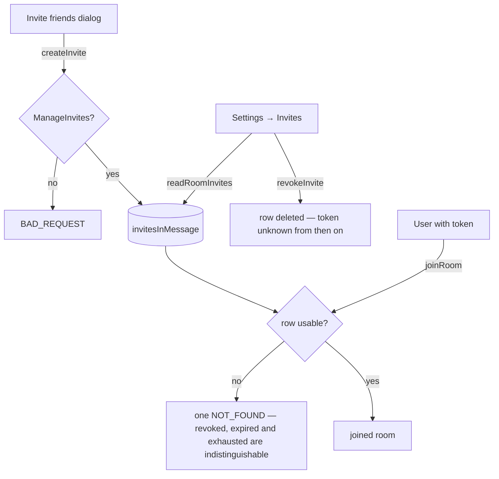

# Invite Management

A room's invite links are almost write-only today — a member sees and revokes their own, and [pausing](/docs/esbabbler/invites) closes all of them at once. But nobody — the owner included — can see anyone else's: how many exist, who made them, how many joins they have taken, or kill one without closing the room. The only way an invite stops working is expiry, its use cap, or the member who owns it replacing it with another.

That is also why `ManageInvites` reads as a permission and behaves as nothing: it is defined, described in the roles panel as "Create and revoke invite links", granted by the default role, and read by no procedure. `createInvite` is a plain member procedure. A room cannot restrict inviting, so the bit is a promise the server never keeps.

Both halves are the same missing surface. Discord's **Invites** settings panel is the management side of a link the invite dialog creates: a list of every active link, with the revoke that makes a leak recoverable and a pause that closes the room without touching the links.

## What it adds

### Reading a room's invites

`readRoomInvites({ roomId })` — a `ManageInvites` procedure returning the room's usable rows, each joined to its creator so the panel can name who minted it. Cursor-paginated on `createdAt` like every other room-scoped list; expired and exhausted rows are already inert and stay out of the read, which `checkIsInviteUsable` decides today.

### Revoking anyone's

`revokeInvite` already exists and deletes the caller's own row ([invites](/docs/esbabbler/invites)). What is missing is the `ManageInvites` widening: the same procedure dropping the `userId` predicate for a caller who holds the permission, so a moderator can kill a link they did not mint.

### Gating creation

`createInvite` becomes a `ManageInvites` procedure. The default role carries the bit, so every existing room keeps behaving exactly as it does now; what changes is that a room that takes the bit away gets what the roles panel already told it it would get.

### The panel

The existing **User Management → Invites** panel stops being the reader's own link and becomes the room's: gated on `ManageInvites`, one row per link, each holding the code, its creator, uses against its cap, its expiry as a `NuxtTime`, a copy button and a revoke button. The pause button it already holds stays where it is. The empty state and the `create one` link stay as they are — creating stays in the dialog, where the want is.

## Failure and teardown

A revoke racing a join is decided by the join's own conditional `UPDATE … RETURNING`: the row is either there when it runs or it is not, and a joiner who loses gets the same error as an unknown token. Deleting a room cascades its invites, as it does today.

Revoking is a delete rather than a flag deliberately — a revoked link nobody can tell apart from a live one is worse than a missing one, and the room-wide pause already covers the case where the links have to come back.
