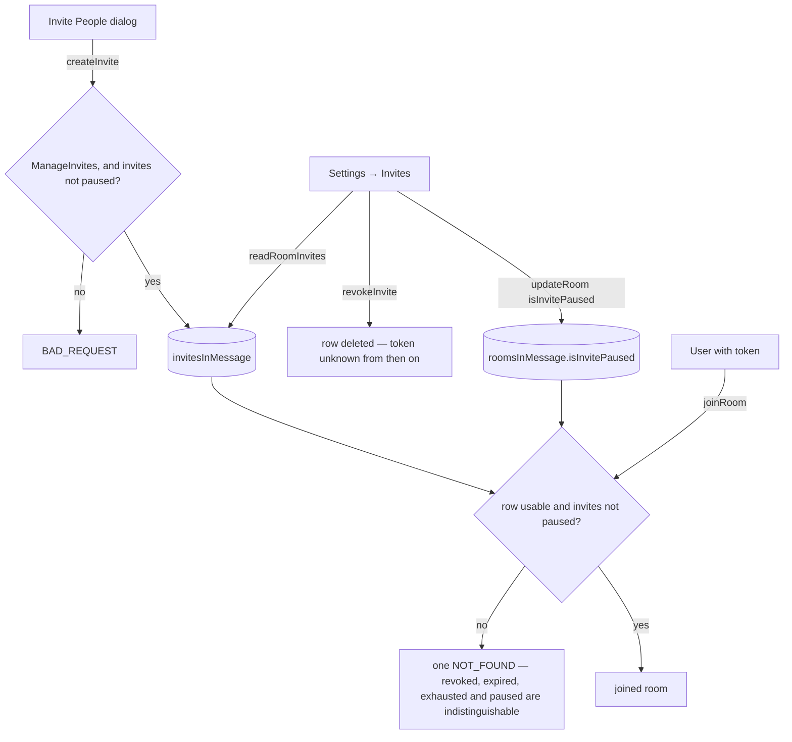

# Invite Management

A room's invite links are write-only today. Any member can mint one from the room header's Invite People dialog ([invites](/docs/esbabbler/invites)), and from that moment nobody — the owner included — can see how many exist, who made them, how many joins they have taken, or stop any of them. The only way an invite stops working is expiry, its use cap, or the member who owns it replacing it with another.

That is also why `ManageInvites` reads as a permission and behaves as nothing: it is defined, described in the roles panel as "Create and revoke invite links", granted by the default role, and read by no procedure. `createInvite` is a plain member procedure. A room cannot restrict inviting, so the bit is a promise the server never keeps.

Both halves are the same missing surface. Discord's **Invites** settings panel is the management side of a link the invite dialog creates: a list of every active link, with the revoke that makes a leak recoverable and a pause that closes the room without touching the links.

## What it adds

### Reading a room's invites

`readRoomInvites({ roomId })` — a `ManageInvites` procedure returning the room's usable rows, each joined to its creator so the panel can name who minted it. Cursor-paginated on `createdAt` like every other room-scoped list; expired and exhausted rows are already inert and stay out of the read, which `checkIsInviteUsable` decides today.

### Revoking one

`revokeInvite({ id, roomId })` — `ManageInvites`, a delete of the row. Revoking is not a soft state: the token is the credential, and the row's absence is what makes it unusable, which `readInvite` already treats as "unknown". A member's own link is revocable by them without the permission, because replacing it already deletes it.

### Pausing all of them

`roomsInMessage.isInvitePaused`, a `boolean().notNull().default(false)` written by the existing `updateRoom` under `ManageRoom`. `joinRoom` refuses while it is set, with the same `NOT_FOUND` every other unusable token produces — an outsider learns nothing about why. Pausing leaves the rows alone, which is the whole point: it is the control for a raid in progress, and the links have to survive it.

`createInvite` refuses while paused too, otherwise the room keeps minting credentials that cannot be used.

### Gating creation

`createInvite` becomes a `ManageInvites` procedure. The default role carries the bit, so every existing room keeps behaving exactly as it does now; what changes is that a room that takes the bit away gets what the roles panel already told it it would get.

### The panel

A new `SettingsType.Invites` under User Management, gated on `ManageInvites` — so it is a management panel from the start, unlike the create-only one this replaces. Each row: the invite code, its creator, uses against its cap, its expiry as a `NuxtTime`, a copy button and a revoke button. Above the list, the pause switch. The empty state says where a link is made — the room header's Invite People dialog — because that is the one thing only this surface can say — creating stays where the want is.

## Failure and teardown

A revoke racing a join is decided by the join's own conditional `UPDATE … RETURNING`: the row is either there when it runs or it is not, and a joiner who loses gets the same error as an unknown token. Deleting a room cascades its invites, as it does today.

Pausing is a room field rather than a per-invite one deliberately — a per-link pause is a revoke with extra state, and a paused link nobody can tell apart from a live one is worse than a missing one.
