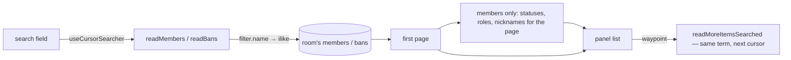

# Member And Ban Search

Both panels paginate a whole room and neither can be searched. Discord searches both, and the cost of not doing so scales with the room: finding one member in a room of five hundred means scrolling five hundred rows, and finding one ban means scrolling every ban ever placed. The rows are already there — what is missing is the way to ask for one.

The two halves are not symmetric, which is the whole point of specifying them together:

- **`readMembers` already takes the predicate.** Its input carries `filter: { name }` and the query applies `ilike(users.name, '%' || escapeLike(name) || '%')`. No caller has ever passed it, so the server half of member search shipped and has been dead ever since.
- **`readBans` takes no predicate.** Its input is a room id and a cursor and nothing else, and the query filters on room and `deletedAt` alone — although it already `innerJoin`s `users`, so the predicate has the column it needs in scope.

## What it adds

### The ban predicate

`readBansInputSchema` gains the same optional `filter` shape members use, and the query pushes an `ilike` over the joined `users.name`. Same `escapeLike`, same `%`-wrapping, so a name containing `%` or `_` searches for itself rather than for a wildcard.

The ban reason is deliberately **not** searched. It is free text a moderator wrote, matching it makes the field feel like a log search, and the want the panel serves is "is this person banned" — which is a name.

### Wiring the field

Search-as-you-type is not hand-rolled here — `useCursorSearcher` is the one place that stack lives (`pagination` skill), and both panels' results are cursor-paginated, so both wrap it. Both of its flags are set: the second turns the field into auto-search, and the third is what makes an emptied field list the room again instead of leaving the last term's results on screen — a panel whose default state is the whole list needs the empty query to be a query.

```ts
useCursorSearcher(
  (searchQuery, cursor, opts) => {
    const normalizedSearchQuery = normalizeString(searchQuery);
    return $trpc.message.moderation.readBans.query(
      { cursor, filter: normalizedSearchQuery ? { name: normalizedSearchQuery } : undefined, roomId },
      opts,
    );
  },
  true,
  true,
);
```

Bans is the straightforward one: the panel reads one list and renders it.

**Members is not, and this is the part to get right.** A member row is not a user row — `useReadMembers` fans out to statuses, member roles and nicknames for every id a page returns, and the store keys all of it per room. A searcher that issues its own read has to run the same `readMetadata` fan-out over its results or the rows come back without the things that make them member rows. So the search reuses `useReadMembers`' own metadata step rather than restating it, and the searched slice stays keyed by room like everything else in that store.

### The panels

A `v-text-field` with a `mdi-magnify` prepend at the top of each list, above the scroll region — where Discord puts it, and where `StyledDialog`'s `header` slot already puts a filter row for the dialogs that have one. An empty query lists everyone, which is the behaviour both panels have today, so nothing changes for a room small enough not to need this.



## Failure and teardown

A term that matches nothing renders the panel's existing empty state; there is no separate "no results" surface to build, because a room with no members and a search with no hits are the same screen from the reader's side.

Paging a searched list carries the term with the cursor, so a member who joins mid-scroll cannot appear in a later page of a search they do not match — the predicate is applied per page, server-side, not to a page already read.
