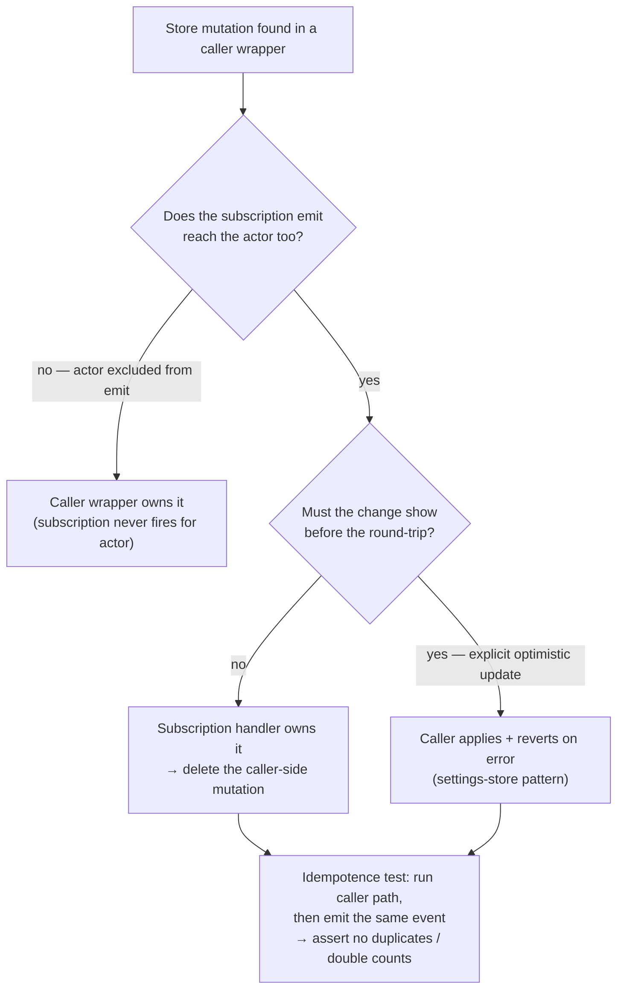

# Subscription / Store Cleanup Pass

Tech-debt pass: several Pinia stores mutate state both in the calling wrapper (optimistically after a mutation resolves) **and** in the subscription handler when the event echoes back — double-apply bugs waiting to happen.

## Scope

**Today:** the pattern is inconsistent — some flows are subscription-only (correct), some optimistic-only, some both.

**This does:**

1. **Audit** every store touched by a tRPC subscription (`message`, `room`, `userToRoom`, `emoji`, `pin`, `call/participant`, `scheduledMessageJob`, …): list each mutation path and whether the same state also changes in a caller wrapper.
2. **Pick one owner per state transition** — default rule: the **subscription handler owns remote-visible state**; the caller may only apply changes the subscription cannot deliver to the actor (e.g. the actor is excluded from the emit) or must show before the round-trip (explicit optimistic updates with revert, like the settings store).
3. **Tests** around every store that mutates in both places: emit the event after the caller path and assert idempotence (no duplicate items, no double counts).

The single-owner decision per store mutation, and the test that locks it in:

## Deliverable

A short as-built note per store (which owner rule it follows) folded into the relevant feature pages' Notes sections, plus the test files. Any real double-apply found is fixed in the same pass.

## Key files

| File                                                    | Role                  |
| :------------------------------------------------------ | :-------------------- |
| `packages/app/app/store/message/**`                     | audited stores        |
| `packages/app/app/composables/message/subscribables/**` | subscription handlers |

## Notes

This is the prerequisite hygiene for any future cross-process bridge ([deferred](/docs/esbabbler/deferred/cross-process-event-bridge)) — idempotent handlers are exactly what a WebPubSub mirror would need.
