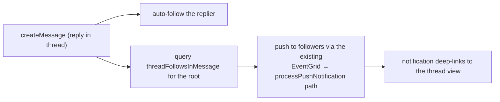

# Thread Follows

Follow/unfollow a thread and receive notifications on new replies; a **Threads** drawer lists open / followed / participated threads — Discord's thread-following model scoped to the shipped thread view.

## Scope

**Today:** threads exist as a view (`readThread` walks a reply chain); replying or being mentioned in a thread gives no special notification.

**This adds:** an explicit follow relationship, notify-on-reply for followers, and a drawer to find threads again. Multi-area: schema + notify path + UI.

## Data model

New Postgres table `threadFollowsInMessage`: `userId` FK, `roomId` FK, `threadRootRowKey` (text — the root message's rowKey), composite PK `(userId, roomId, threadRootRowKey)`, `createdAt`. Following is implicit on reply (auto-follow, Discord behaviour) and explicit via a follow button on the thread header.

## How it works

- The reply path knows the thread root (the reply chain's root rowKey) — one indexed lookup for followers, excluding the sender and users whose `notificationType = Never`.
- Reuses the push pipeline unchanged ([/docs/esbabbler/push-notifications](/docs/esbabbler/push-notifications)); the payload's URL targets the thread.
- **Threads drawer**: a right-drawer tab listing the room's recent thread roots (from `MessagesMetadata`), filterable by open / followed / participated. Followed = rows in the new table; participated = sender of any reply (resolved from the ascending index).

## Procedures

| Procedure                                      | Auth   | Purpose                    |
| ---------------------------------------------- | ------ | -------------------------- |
| `followThread({ roomId, threadRootRowKey })`   | member | explicit follow            |
| `unfollowThread({ roomId, threadRootRowKey })` | member | unfollow (also stops auto) |
| `readFollowedThreads({ roomId })`              | member | drawer filter source       |

## Key files

| File                                                      | Change                                |
| :-------------------------------------------------------- | :------------------------------------ |
| `packages/db-schema/src/schema/threadFollowsInMessage.ts` | new table (+ migration)               |
| `packages/app/server/trpc/routers/message/index.ts`       | follow procedures + reply notify hook |
| `packages/app/app/components/Message/Content/Thread/`     | follow button + Threads drawer        |

## Notes

Failure semantics: follower notification is post-persist best-effort (same rule as message push — never fail the reply because a push failed). Auto-follow insert is `onConflictDoNothing`.
