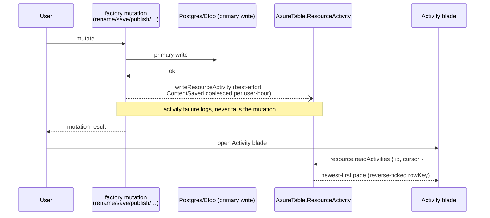

# Activity Log

Azure Activity-log parity: a per-resource audit trail (created, renamed, saved, published, imported) rendered as a built-in blade on every resource type.

## Scope

**Today**: a publish or rename leaves no trace — there is no answer to "what happened to this resource and when". **This proposal adds** the trail. Events are message-shaped (high write volume, time-ordered, no joins), so they belong in Azure Table Storage per the storage split — no Postgres migration, no new Azure service.

## Data model

- `AzureTable.ResourceActivity`: `partitionKey = resourceId`, `rowKey = reverseTickedTimestamp` (newest-first, the existing convention). Entity: `activityType` (`ResourceActivityType` enum: `Created | Renamed | ContentSaved | Published | Unpublished | Imported | Duplicated | Restored`), `userId`, plus per-type payload fields (`oldName`/`newName`, `publishVersion`, `format`).

## Write path

Events are emitted inside `createResourceProcedures` mutations (and `resource.duplicateResource` / recycle-bin restore), **after** the primary write, best-effort per the error-handling conventions — a failed activity write logs and never fails the user's mutation. `ContentSaved` is coalesced: skip the write when the newest existing entry is a `ContentSaved` by the same user within the last hour (autosave would otherwise flood the partition).

Cleanup: Azure Table Storage has no partition-drop operation, so activity deletion enumerates the `resourceId` partition and batch-deletes entities in transactions of up to 100 (the existing batch convention). Soft delete ([recycle bin](/docs/proposals/platform/recycle-bin)) leaves the partition intact — history survives the bin window and restore appends `Restored` — and the sweep runs at purge time (`purgeResource` and the timer purge), before the resource row is deleted so a failed sweep is re-driven by the surviving row on the next pass.

## Flow

## Procedures

| Procedure                 | Auth                | Input             | Purpose                                       |
| ------------------------- | ------------------- | ----------------- | --------------------------------------------- |
| `resource.readActivities` | `getOwnerProcedure` | `{ id, cursor? }` | cursor-paginated partition read, newest first |

## Components

- `ResourceBladeType.Activity` — new built-in blade slug (after Editor in enum order), rendered for every type
- `components/Resource/ActivityLog.vue` — timeline list (severity-neutral icon per `ResourceActivityType`, actor, relative time, detail line), cursor pagination via the existing `useRead*` + `StyledWaypoint` pattern

## Key files

| File                                                | Role                                        |
| --------------------------------------------------- | ------------------------------------------- |
| `packages/db-schema/src/models/azure/AzureTable.ts` | `ResourceActivity` table key                |
| `server/services/resource/writeResourceActivity.ts` | best-effort emit helper used by the factory |
| `app/components/Resource/ActivityLog.vue`           | blade timeline                              |

## Notes

- Activity is the durable trail; the [notifications bell](/docs/platform/notifications) is the ephemeral session feedback — they share event sources but never storage.
- No cross-resource activity feed (portal subscription-level log) — per-resource only until something needs more.
- Retention: rows live until resource purge; if partitions ever grow uncomfortable, add a timer-function sweep (same pattern as message retention) rather than capping writes.
