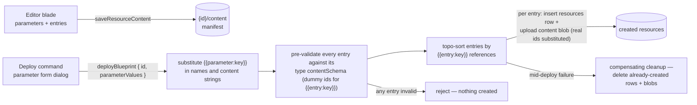

# Blueprint Resource

A **Blueprint** is a resource whose content is a **manifest**: a list of resource entries (each with a type, a name, and full content) plus a list of parameters. **Deploying** a blueprint substitutes the parameter values, creates every entry as a real resource through the standard write paths, and rewires the cross-resource references between them — turning N manual create → configure → bind steps into one parameterized action. It is the platform's answer to "set this whole thing up again, but for the next client": build once, capture, redeploy forever.

The shape is the industry-standard declarative template (ARM/Bicep templates, CloudFormation, Backstage software templates) reduced to its minimum: a manifest, string parameters, and local aliases for cross-entry references. No expression language, no conditions, no deployment engine — substitution plus topological create order, synchronous, in one procedure call.

## Scope

**Today**: every multi-resource setup is manual. The [survey funnel](/docs/platform/program-resource) — audience Sheet + Survey + invite Email + Program + results Dashboard — is five creates, five content edits, and four cross-resource bindings, repeated per wave or per client. Duplicate copies one resource; nothing copies a wired _set_.

**This proposal adds** one `ResourceType` with a deploy procedure. Zero new Azure services, zero background work, one pg enum migration. Its twin, [blueprint capture](/docs/proposals/platform/blueprint-capture), makes authoring effortless (select existing resources → "Save as blueprint"); this page stands alone without it.

## How it works



- **Content schema** (the manifest):

  ```ts
  interface BlueprintResource {
    entries: { content: unknown; key: string; name: string; type: ResourceType }[];
    parameters: { defaultValue: string; description: string; key: string; title: string }[];
  }
  ```

  `key` is the entry's **local alias**, unique within the manifest. `name` becomes the created resource's name. `content` is the entry type's normal content shape — validated against `ResourceDefinitionMap[type].contentSchema` after substitution, so a blueprint can never deploy content the type's own save path would reject.

- **Token grammar** — two tokens, both plain string substitution over the JSON's string values:
  - `{{parameter:<key>}}` — replaced with the deploy-time parameter value (in entry names and any content string). All parameters are strings in v1; typed parameters are a later extension of the parameter object, not a redesign.
  - `{{entry:<key>}}` — replaced with the **created resource id** of that entry. This is how a dashboard entry binds the sheet entry's dataset, or a program entry binds its email and survey — the same bare-id linking every cross-resource reference already uses ([resources](/docs/architecture/resources)), just late-bound.

- **Deploy** (`deployBlueprint`, owner): substitute parameters → pre-validate all entries with placeholder UUIDs standing in for `{{entry:*}}` (so a bad manifest rejects before anything is created) → topologically sort entries by their `{{entry:*}}` references (cycles reject at save _and_ deploy) → create each entry in order via the standard primitives (`resources` insert + content blob upload, exactly what `createResource` + `saveResourceContent` do) with real ids substituted. A mid-deploy failure deletes the rows and blobs it already created — best-effort all-or-nothing, honestly reported. Returns the alias → created-resource map; the client shows links to everything it made.

- **Blueprints of blueprints**: an entry may itself be `type: Blueprint` — deploying creates the child Blueprint resource with its manifest as content, like any other entry (it is **not** recursively deployed; recursive composition is a [deferred](/docs/platform/deferred) candidate, not v1).

- **Blades**: Overview, Editor (parameters table + entry list; each entry's content edited as schema-validated JSON — the escape hatch, since [capture](/docs/proposals/platform/blueprint-capture) is the primary authoring path), and the **Deploy** command-bar action opening the parameter form dialog (plain text fields generated from `parameters`; defaults prefilled).

- **Capabilities**: `portable: true` — export/import the manifest as a JSON file, which makes blueprints shareable between accounts through the existing Portable seam for free. Not publishable (a public page can't deploy into someone else's account — nothing useful to show) and not a dataset provider.

## Procedures

`blueprint` router = `createResourceProcedures(ResourceType.Blueprint)` plus:

| Procedure         | Auth  | Input                                             | Purpose                                                         |
| ----------------- | ----- | ------------------------------------------------- | --------------------------------------------------------------- |
| `deployBlueprint` | owner | `{ id, parameterValues: Record<string, string> }` | substitute → validate → topo-create → return alias→resource map |

## Key files

| File                                                             | Role                                          |
| ---------------------------------------------------------------- | --------------------------------------------- |
| `packages/db-schema` `ResourceType.Blueprint` + migration        | new type value                                |
| `packages/app/shared/models/resource/blueprint/` (new)           | manifest schema (entries, parameters, tokens) |
| `packages/app/shared/services/resource/ResourceDefinitionMap.ts` | Blueprint entry (`portable: true`)            |
| `server/trpc/routers/blueprint.ts` (new)                         | factory + `deployBlueprint`                   |
| `server/services/blueprint/` (new)                               | substitution, validation, topo-sort, cleanup  |
| `app/components/Resource/Blueprint/Editor.vue` (new)             | manifest editor blade                         |
| `app/components/Resource/Blueprint/DeployDialog.vue` (new)       | parameter form + created-resources result     |

## Notes

- **Naming.** _Blueprint_ — a plan you execute. Considered and set aside: **Template** (collides with the merge-field template language in Email/Webpage and with single-resource starter templates — which this supersedes, see below), **Stack** (CloudFormation's word, but it names the deployed _output_, not the plan), **Module** (code connotation), **Recipe**/**Kit** (cutesy). Azure retired its unrelated "Azure Blueprints" governance product; the word carries no baggage here.
- **Supersedes the resource-templates deferral.** A single-entry blueprint with no parameters _is_ a starter template, and user-authored templates were exactly the "whole feature" that page deferred. Built-in starter blueprints (an authored gallery) remain future work and ride [gallery search](/docs/platform/deferred/gallery-marketplace-search) when that revisits.
- **Deliberately no engine.** No conditions, loops, expression functions, or nested-deploy — every rejected complexity of the full ARM/Logic-Apps shape. If a manifest needs logic, the answer is a second blueprint, not a language. The extension seam is the manifest schema (typed parameters, entry-count growth), same posture as the [Program](/docs/platform/program-resource) content schema.
- **Exact-match id rewiring is safe** because resource ids are UUIDs — deploy (and capture) replace whole-string matches only; no risk of corrupting prose that merely mentions an id fragment.
- Deployed resources are ordinary resources with no live link back to the blueprint — editing the blueprint never mutates past deployments (exactly ARM's template/deployment split). Provenance/lineage is the [resource references](/docs/platform/deferred/resource-references) deferral's territory.
- The canonical motivating manifest: **survey funnel wave** — audience Sheet + Invited Survey + tokened Email + Program + funnel Dashboard, one `client` parameter in names and email subject. Deploy per client; each wave lands fully wired (`surveyFunnel.integration.test.ts` gains a blueprint-deployed variant once this ships).
- **Agentic by design.** A manifest is pure schema-validated JSON deployed through ordinary procedures — the ideal unit for AI authoring: an agent (or the future [AI resource generation](/docs/platform/deferred/ai-resource-generation)) emits a manifest, the platform validates it against every entry type's contentSchema, and deploy is the only side-effectful step. Design every schema decision here (explicit tokens, no hidden state, validation before creation) to keep that path open: whatever creates resources tomorrow — human, form, or model — goes through this same front door.
