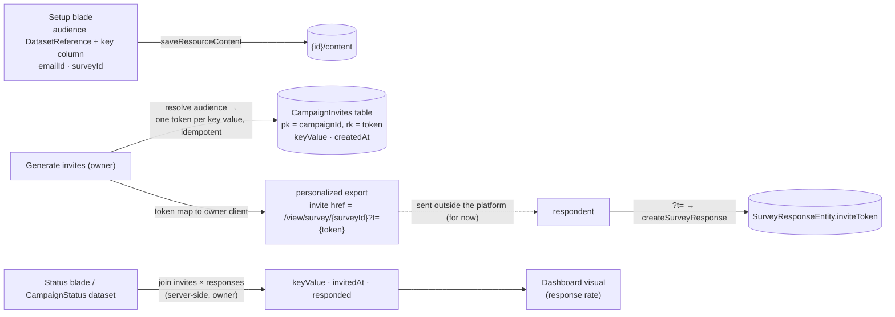

# Campaign Resource

A **Campaign** is the resource that orchestrates the end-to-end distribution loop the other resources deliberately don't know about: it binds an **audience** dataset (a File of recipients), an **Email**, and a **Survey**; issues one opaque invite token per recipient; personalizes the export with tokened links; and joins tokens back to responses into a per-recipient **status** — served through the standard dataset contract so a dashboard can chart the funnel like any other data.

The shape is Logic-Apps-_positioned_ (orchestration is its own resource, the orchestrated resources stay pure), but deliberately not Logic-Apps-_shaped_: no trigger/action graph, no expression language — one domain, three bindings, one background-free run model. Extensibility lives in the content schema, not in a workflow engine.

## Scope

**Today**: the loop works but headless — an email binds a dataset for merge fields and export ([email personalization](/docs/platform/email-personalization)), a survey collects into Azure Table, a dashboard binds the responses dataset. Nothing owns the run: no per-recipient identity ([response modes](/docs/proposals/platform/survey-response-modes) — this proposal's twin), no invited-vs-responded view, and when [email sending](/docs/platform/deferred/email-sending) un-defers there is no unit of execution to hang a send on.

**This proposal adds** one `ResourceType` with token issuance, a Status blade, and a `CampaignStatus` dataset provider. No new Azure services — one new Azure Table for invites.

## How it works

- **Content blob**: `{ audience: DatasetReference; keyColumn: string; emailId: string; surveyId: string }` — bare ids like every cross-resource link (re-resolved on read, fails soft when a binding is deleted, per the explorer's linking standard). `keyColumn` names the audience column that identifies a recipient (email address, customer id — display and dedupe key, never leaves the server/owner client).
- **Invite tokens**: `AzureTable.CampaignInvites` — partitionKey = campaign id, rowKey = token (UUID), storing the recipient's key value and `createdAt`. **Generate invites** resolves the audience dataset and creates one entity per key value, idempotently (re-running after adding rows issues only the missing ones). Tokens are meaningless outside this table; resolution is owner-gated. Respondents present them, never decode them.
- **Personalized export**: the campaign's export action reuses the email export pipeline with one addition — the survey invite block's href becomes `/view/survey/{surveyId}?t={token}`, token matched to the row by key value. The owner client sees its own audience data (it always did); the _URL_ carries only the opaque token.
- **Status**: invited × responded, joined server-side (invites table × `SurveyResponseEntity.inviteToken`). Rendered as the **Status blade** table and declared as a **DatasetProvider** (`DatasetProviderType.CampaignStatus`, columns `keyValue · invitedAt · responded`) — so the funnel is chartable in dashboards through the front door, and the canonical "responses × audience" join lands purpose-built instead of via a generic join engine ([dataset joins](/docs/platform/deferred/dataset-joins) stays deferred).
- **Blades**: Overview (bindings summary + invite/response counts), Setup (the three pickers — reusing `DatasetReferencePicker` and resource selects), Status. No Editor blade; a campaign has no canvas.
- **Lifecycle**: standard resource create/save/delete; `deleteResource` also clears the campaign's invite partition. Deleting the bound survey leaves status readable (invites persist) with responses gone — the same fail-soft posture as every dangling reference.

## Procedures

`campaign` router = `createResourceProcedures(ResourceType.Campaign)` plus:

| Procedure                 | Auth  | Input    | Purpose                                                           |
| ------------------------- | ----- | -------- | ----------------------------------------------------------------- |
| `generateCampaignInvites` | owner | `{ id }` | resolve audience, issue missing tokens, return token map          |
| `readCampaignStatus`      | owner | `{ id }` | joined invited × responded rows (also backs the dataset provider) |

Token _validation_ on response writes lives in the survey router ([response modes](/docs/proposals/platform/survey-response-modes)) — the campaign is the issuer, the survey is the gate.

## Key files

| File                                                              | Role                                     |
| ----------------------------------------------------------------- | ---------------------------------------- |
| `packages/db-schema` `ResourceType.Campaign` + migration          | new type value                           |
| `packages/app/shared/services/resource/ResourceDefinitionMap.ts`  | Campaign entry (`datasetProvider: true`) |
| campaign content schema                                           | audience/key/email/survey bindings       |
| `server/trpc/routers/campaign.ts` (new)                           | factory + invites + status               |
| `server/services/dataset/campaignStatus/` (new)                   | `CampaignStatus` provider                |
| `app/components/Resource/Campaign/Setup.vue` / `Status.vue` (new) | blades                                   |

## Notes

- **Naming.** _Campaign_ is the recommendation: it is the industry term for exactly this artifact (audience + message + outcome tracking) and stays honest about scope. Considered and set aside: **Program** (says nothing about what it does), **Flow** (collides head-on with the Flowchart resource), **Workflow**/**Automation** (promise a trigger/action engine this deliberately isn't — reserve _Workflow_ for a future general orchestrator if a second orchestration domain ever appears), **Journey** (marketing-suite jargon). If campaigns later orchestrate non-email distribution, the name still holds.
- **Deliberately not a workflow engine.** A general trigger/condition/action resource (the actual Logic Apps clone) would need an event bus ([rejected](/docs/platform/rejected/generic-event-bus)), background execution, and retry semantics — for one current domain. The campaign's content schema is the extension seam: reminder emails to non-responders, send scheduling, and the actual send run (when [email sending](/docs/platform/deferred/email-sending) un-defers, the campaign is its unit of execution) all extend this schema without a new platform layer.
- Sending remains outside the platform for now: the campaign produces a correct tokened export; delivery is manual. That keeps the whole proposal cost-free while building the exact foundation sending needs.
- One campaign per send-wave: rerunning against a grown audience extends the same campaign; a genuinely new wave (new email, same audience) is a new campaign — Duplicate covers the setup copy.
