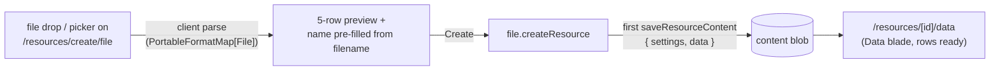

# Create From File

Creating a Sheet resource from an actual file in one step: drop or pick a CSV/JSON/XLSX on `/resources/create/file`, and arrive at a resource whose Data blade already holds the parsed rows.

## Scope

**Today**: creating a Sheet resource is name-only; you then open the Data blade and run Import as a second step. **This proposal** collapses the two — the create form gains an optional file input, reusing the exact client-side parse the Import command already uses (`PortableFormatMap[File]` deserializers). No new procedures: it is `createResource` followed by the first `saveResourceContent`.

## How it works

- **Form**: the Sheet create form adds a drag-and-drop zone / file picker (accept from the format map's `accept` values). Choosing a file parses client-side, pre-fills the name from the filename (extension stripped, through `normalizeString`), and shows the existing 5-row preview. The file input stays optional — name-only create keeps working.
- **Submit**: `createResource` → immediately `saveResourceContent` with the parsed `{ settings, data }` → route to the **Data blade** (not Overview — the user came to see their rows). A parse failure blocks submit with the parser's error; a save failure after create leaves a valid empty Sheet resource and surfaces the error, never a half-written blob (create still writes no blob — the save is the first write, same as today).
- **Entry points**: the Home quick-create tile and gallery tile for File are unchanged — they lead to this same form; the drop zone is simply on it.

## Key files

| File                                         | Role                                       |
| -------------------------------------------- | ------------------------------------------ |
| `app/pages/resources/create/[type].vue`      | file input branch for `ResourceType.Sheet` |
| `app/services/resource/PortableFormatMap.ts` | reused parse (`accept`, `deserialize`)     |

## Notes

- Client-side parse only, same as Import — no upload path; the 1000-row dataset-cap realities are identical to the Import command's.
- Only File opts in; the mechanism is a per-type create-form slot, which is exactly the "type-specific initial settings" affordance the create form already reserves — not a new framework.
- If more types ever want rich create forms, that is the [create wizard tabs](/docs/platform/deferred/create-wizard-tabs) revisit trigger.
