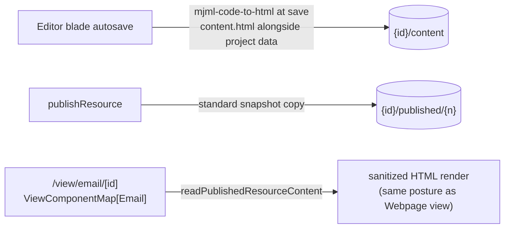

# Email Web View

Email is the only editor-backed type whose output cannot be seen outside its own editor. Opting Email into the **Publishable** capability gives the compiled email a public URL — `/view/email/[id]` — which is the industry-standard "view this email in your browser" artifact, a review link you can hand a colleague before a send, and the natural `{{webVersionUrl}}`-style merge target when [email sending](/docs/platform/deferred/email-sending) un-defers.

## Scope

**Today**: the only way out of the email editor is the personalized-HTML zip export ([email personalization](/docs/platform/email-personalization)). There is no way to show anyone an email without exporting a file and sending it around.

**This proposal adds** the capability opt-in plus a save-time HTML capture — the exact pattern Webpage already proved (its editor captures rendered HTML/CSS at save so the public view page can serve static markup). The published copy is the **unpersonalized template**: merge-field tokens render as-is, which is correct for a review/browser copy.

## How it works

The publish snapshot happens server-side, but MJML compilation lives in the client editor — so compiled HTML must already be in the content blob before publish, captured at save time:

- **Content schema**: the email content gains a compiled `html` string section, written on every editor save next to the GrapesJS project data (the `EmailEditor` class shape extends — its name stays frozen per `JSONClassMap`). Sanitization happens at the Zod boundary per the string-utils standard.
- **Capability**: `publishable: true` on Email in `ResourceDefinitionMap`; the derived union then _requires_ a `ViewComponentMap[Email]` entry (compile error until added) and grants the publish procedures — zero bespoke endpoints, the whole point of the capability model.
- **View component**: renders the snapshot's `html` full-width on a neutral background, like the Webpage view. OG meta tags come with the existing view-page behavior.
- **Command bar**: Publish/Unpublish appear automatically via the existing `PublishToggle` capability gate.

## Key files

| File                                                             | Role                               |
| ---------------------------------------------------------------- | ---------------------------------- |
| `packages/app/shared/services/resource/ResourceDefinitionMap.ts` | `publishable: true` on Email       |
| email content schema (`EmailEditor` shape)                       | compiled `html` section            |
| `app/components/Resource/Email/Editor.vue`                       | save-time HTML capture             |
| `app/components/Resource/Email/View.vue` (new)                   | `ViewComponentMap[Email]` renderer |

## Notes

- Hosted images inside the published copy need publish-time asset cloning — that arrives with [resource file assets](/docs/proposals/platform/resource-file-assets); until then published emails render external-URL images only, same as export does.
- A personalized web version per recipient (resolving merge fields server-side per invite token) is deliberately out — it would make the public view do per-request dataset reads, which publishing exists to avoid. The published copy is one static artifact.
- Cost check: no new services, no schema migration — capability flag + one component + a save-path addition.
