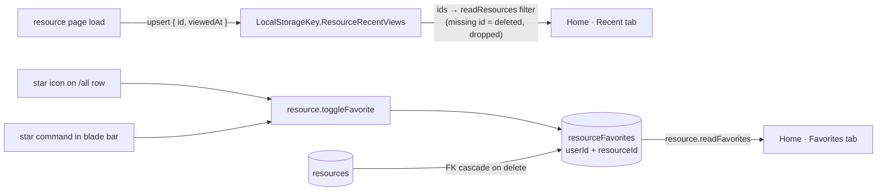

# Favorites & Recents

Azure Home parity: star resources as favorites (server-side), and make "Recent resources" mean recently _viewed_ — what you opened, not what happened to change.

## Scope

**Today**: Home approximates recents with `updatedAt` desc, which is wrong the moment anything autosaves, and has no favorites at all. [Global search](/docs/platform/global-search) already records `LocalStorageKey.ResourceRecentViews` (`{ id, name, type }`, capped at 5, via `useRecordResourceView`) for its empty-query dropdown. **This proposal adds** the portal's Recent (last opened by you) and Favorites (starred) — favorites as a small Postgres table; recents extending the existing localStorage key (per-device) first, with a table upgrade only if cross-device recall matters.

## Data model

- `resourceFavorites` (Drizzle, `packages/db-schema`): `userId` + `resourceId` composite PK, `createdAt`; FK cascade from `resources` so deletes clean up.
- Recents phase 1: extend the existing `LocalStorageKey.ResourceRecentViews` entries with `viewedAt` (today `{ id, name, type }`, upserted on resource-page load by `useRecordResourceView`); Home resolves rows via `readResources` filtered to those ids (missing ids = deleted resources, dropped from the list).
- Recents phase 2 (only if cross-device matters): `resourceViews` table (`userId` + `resourceId` PK, `viewedAt`), upsert fired from `readResource`.

## Flow

## Procedures

| Procedure                 | Auth                  | Input    | Purpose                                           |
| ------------------------- | --------------------- | -------- | ------------------------------------------------- |
| `resource.toggleFavorite` | authed (owner-scoped) | `{ id }` | insert/delete the favorite row, returns new state |
| `resource.readFavorites`  | authed                | —        | favorites joined to `resources`, `createdAt` desc |

(`readResources` optionally gains `ids?: string[]` for the recents hydration.)

## Components

- Home resources card gains `v-tabs`: **Recent | Favorites** (portal parity); Recent rows show "viewed {relative}"
- Star toggle: icon column on `/all` rows (hover-visible, filled when favorited) + a star command in the blade command bar
- Favorites group in the empty-query search dropdown ([global search](/docs/platform/global-search)) — optional follow-up

## Key files

| File                                                 | Role                      |
| ---------------------------------------------------- | ------------------------- |
| `packages/db-schema/src/schema/resourceFavorites.ts` | favorites table           |
| `server/trpc/routers/resource.ts`                    | toggle/read procedures    |
| `app/pages/resources/index.vue`                      | Recent/Favorites tabs     |
| `app/services/shared/LocalStorageKey.ts`             | `ResourceRecentViews` key |

## Notes

- Favorites are server-side from day one (a star that vanishes on another device reads as data loss); recents are tolerably per-device, hence the phased storage.
- The Home "Recent" list keeps `updatedAt` desc as its fallback until the first view is recorded, so the card is never empty for existing users.
