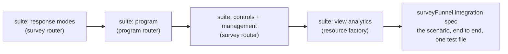

# Funnel Integration Tests

The executable specification for the survey funnel program: every funnel proposal ships with its acceptance cases enumerated **here, first**, and one grand integration spec walks the whole real-world chain — contacts file → email → invited survey → program tokens → responses → status → dashboard → publish. An implementation session picks up a proposal, writes these tests, watches them fail, then builds until they pass — the tests are the contract, the proposals are the design, this page binds them.

Everything runs on the existing server-test stack ([server testing](/docs/architecture/server-testing)): `createMockContext()` (PGlite + azure-mock + mocked auth), `createCallerFactory` per router, `getMockSession()` as the owner, `mockSessionOnce(db)` for non-owner perspectives. No new test infrastructure. Client-only pieces (GrapesJS export zip, SurveyJS rendering, blade UI) are explicitly out of scope here — they get co-located component/unit tests under their own proposals; this plan covers the server truth.

## The scenario

One concrete real-world case anchors everything — **a café owner running a customer feedback drive**:

1. Imports `customers.csv` into a **File** (name + email columns).
2. Authors a feedback **Survey**, sets it **Invited** mode, publishes it.
3. Authors an invite **Email** bound to the customers dataset with a survey invite block.
4. Creates a **Program** binding audience (customers File, key column `email`) + email + survey, generates invites, exports tokened HTML (delivery is manual for now).
5. Customers open `/view/survey/{id}?t={token}` and respond; one token is reused, one is forged, one customer never responds.
6. The owner checks the **Status** — 2 of 3 responded — deletes a test response, then **closes** the survey.
7. A **Dashboard** visual binds the `ProgramStatus` dataset (response rate), and the owner publishes the dashboard; view analytics count the public reads.



## Test home

Per-proposal cases live in the routers' existing co-located test files (`server/trpc/routers/survey.test.ts`, new `program.test.ts`, `dataset.test.ts`). The cross-router scenario spec is a new category — it exercises seven routers in one flow (`file`, `survey`, `email`, `program`, `dashboard`, `dataset`, `resource`) — and lives at `server/trpc/routers/surveyFunnel.integration.test.ts`, node environment, same `createMockContext` lifecycle, with one caller per router bound to the same context. Integration specs use scenario-named `describe` strings (there is no single function to reference — a deliberate, documented deviation from the function-ref describe convention).

## Acceptance cases per proposal

Each list is the TDD checklist an implementation session turns into `it` blocks before writing code.

### [Response modes](/docs/proposals/platform/survey-response-modes) — `survey.test.ts`

- default mode is Anonymous: `createSurveyResponse` without a token succeeds; a supplied token is stored as `""`
- Invited mode rejects a missing token, a forged token, and a token issued for a _different_ survey's program
- Invited mode accepts a valid token and stores it on the entity
- the same valid token on `updateSurveyResponse` (resume) still passes; a token swap mid-resume rejects
- switching Invited → Anonymous takes effect on the next write without re-publish (live settings, not snapshot)
- existing responses are untouched by a mode switch

### [Program resource](/docs/proposals/platform/program-resource) — `program.test.ts`

- `generateProgramInvites` issues one token per distinct audience key value; tokens are UUIDs, never derived from the key
- re-running after the audience grows issues only the missing tokens (idempotent), never rotates existing ones
- a non-owner calling generate/status/token-map gets rejected (`mockSessionOnce`)
- `readProgramStatus` joins invites × responses: invited-not-responded, responded, and never-invited-responder (anonymous-era row) each land correctly
- `ProgramStatus` dataset provider returns `recipient · invitedAt · responded` through `dataset.readDataset`, owner-gated like every provider — and never the audience key column, so a published dashboard bound to it cannot leak the recipient list
- a dangling audience/email/survey binding fails soft (error state, no throw-through)
- `deleteResource` on the program clears its invite partition; deleting the bound survey leaves status readable

### [Response controls](/docs/proposals/platform/survey-response-controls) — `survey.test.ts`

- closed survey rejects `createSurveyResponse` and `updateSurveyResponse` with a conflict error
- the public read of a closed survey carries the live closed flag + message while serving the unchanged published snapshot
- reopening immediately accepts responses again — no re-publish involved

### [Response management](/docs/proposals/platform/survey-response-management) — `survey.test.ts`

- `deleteSurveyResponse` removes exactly one entity; a second delete of the same key errors
- non-owner delete rejected; owner of a _different_ survey cannot delete across surveys
- `countSurveyResponses` matches inserted rows and caps at the page-size ceiling

### [Published view analytics](/docs/proposals/platform/published-view-analytics) — resource factory tests

- each public `readPublishedResourceContent` increments the day bucket; `readResourceViewCount` sums buckets
- an increment failure (mock the table write to throw) never fails the public read
- unpublished/nonexistent resources 404 without counting; `deleteResource` clears the partition

### Publish parity ([email](/docs/proposals/platform/email-web-view), [flowchart](/docs/proposals/platform/flowchart-publish), [note](/docs/proposals/platform/note-resource)) — per-type router tests

- publish → public read round-trips the snapshot; unpublish 404s; edits after publish stay invisible until re-publish (the factory already proves this per type — new types just instantiate the same cases)

## The integration spec — pseudo-code

```ts
describe("survey funnel — café feedback drive", () => {
  // beforeAll: createMockContext(); bind callers: file, survey, email, program, dashboard, dataset, resource

  test("the whole chain", async () => {
    // 1. audience — Sheet resource with name/email columns, 3 rows
    const file = await fileCaller.createResource({ name: "customers" });
    await fileCaller.saveResourceContent({ id: file.id, content: customersCsvAsDataSource, contentVersion: 0 });

    // 2. survey — Invited mode, published
    const survey = await surveyCaller.createResource({ name: "feedback" });
    await surveyCaller.saveResourceContent({
      id: survey.id,
      content: { model, settings: invitedMode },
      contentVersion: 0,
    });
    await surveyCaller.publishResource({ id: survey.id });

    // 3 + 4. email + program — bind audience/email/survey, issue tokens
    const email = await emailCaller.createResource({ name: "invite" });
    const program = await programCaller.createResource({ name: "feedback drive" });
    await programCaller.saveResourceContent({
      id: program.id,
      content: bindings(file, email, survey),
      contentVersion: 0,
    });
    const tokens = await programCaller.generateProgramInvites({ id: program.id }); // 3 tokens
    expect(await programCaller.generateProgramInvites({ id: program.id })).toHaveLength(3); // idempotent

    // 5. respondents — 2 valid tokens answer; forged token rejected
    await surveyCaller.createSurveyResponse({ ...answers1, inviteToken: tokens[0].token });
    await surveyCaller.createSurveyResponse({ ...answers2, inviteToken: tokens[1].token });
    await expect(
      surveyCaller.createSurveyResponse({ ...answersX, inviteToken: crypto.randomUUID() }),
    ).rejects.toThrow();

    // 6. status + moderation + close
    const status = await datasetCaller.readDataset({ type: DatasetProviderType.ProgramStatus, id: program.id });
    expect(respondedCount(status)).toBe(2); // and tokens[2] shows invited-not-responded
    await surveyCaller.deleteSurveyResponse({ id: survey.id, rowKey: answers2.rowKey });
    await surveyCaller.saveResourceContent({ id: survey.id, content: closed, contentVersion: 2 });
    await expect(surveyCaller.createSurveyResponse({ ...answers3, inviteToken: tokens[2].token })).rejects.toThrow();

    // 7. dashboard — bind ProgramStatus, publish, snapshot bakes the funnel; views count
    const dashboard = await dashboardCaller.createResource({ name: "drive results" });
    await dashboardCaller.saveResourceContent({
      id: dashboard.id,
      content: visualBoundTo(program.id),
      contentVersion: 0,
    });
    await dashboardCaller.publishResource({ id: dashboard.id });
    const view = await dashboardCaller.readPublishedResourceContent({ id: dashboard.id }); // public
    expect(bakedSnapshot(view)).toMatchObject(expectedFunnelChartData);
    expect(await resourceCaller.readResourceViewCount({ id: dashboard.id })).toBe(1);
  });
});
```

Canonical values follow the testing conventions (shared constants at describe scope, minimal rows — 3 recipients is the smallest set exhibiting responded/not-responded/rejected).

## Notes

- **Order of implementation = order of the roadmap funnel section**; each proposal's checklist above lands with that proposal's PR (red → green), and the integration spec is the _last_ funnel item — it can only compile once every piece exists, which is exactly the point: it is the definition of "the funnel is done".
- The chain test is one long test on purpose — it verifies the _composition_, not the units (the per-router files own those). Keep exactly one; more scenarios belong in per-router suites.
- Anything the chain reveals as untestable through callers (e.g. client-side export personalization) is a finding to record in the owning proposal, not something to force into this layer.
