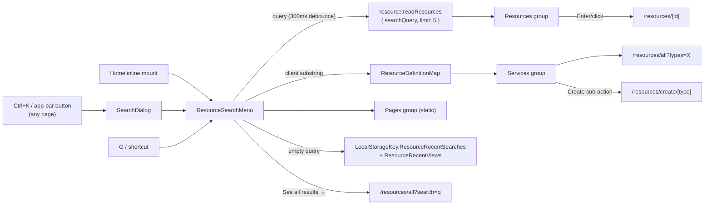

# Global Search

Azure-portal-faithful global search: an as-you-type dropdown panel grouped into Resources / Services / Pages, reachable from every page via `Ctrl+K` and `G /`, replacing today's plain text field that only routes to `/resources/all` on Enter.

## Scope

**Today**: Home has a bare `v-text-field` that forwards its query to `/resources/all`; there is no search anywhere else, no keyboard shortcuts, no recents. **This proposal adds**: one `ResourceSearchMenu` component mounted two ways — inline on Home (portal landing parity) and as a `Ctrl+K` dialog overlay everywhere else (this doubles as the post-consolidation command palette the old roadmap wanted back). No new backend: the Resources group rides `resource.readResources`.

## Dropdown contents

| Group     | Source                                                               | Row                                     | Target                                                        |
| --------- | -------------------------------------------------------------------- | --------------------------------------- | ------------------------------------------------------------- |
| Resources | debounced (300ms) `resource.readResources { searchQuery, limit: 5 }` | type icon · name · type caption         | `RoutePath.Resource(id)`                                      |
| Services  | client-side match over `ResourceDefinitionMap` title/description     | type icon · title · "Create" sub-action | `/resources/all?types=X`; Create → `/resources/create/[type]` |
| Pages     | static list                                                          | page icon · title                       | Home, All resources, Create a resource                        |
| footer    | always when a query is set                                           | "See all results →"                     | `/resources/all?search={q}`                                   |

- **Empty query**: two groups instead — recent searches (`LocalStorageKey.ResourceRecentSearches`, capped at 5, pushed on submit/pick) and recently viewed (see [favorites and recents](/docs/proposals/platform/favorites-and-recents)).
- **Match highlight**: bold the matched substring in row titles (`v-list-item` title slot).
- **No results**: single "No resources found for '{q}'" row + the See-all footer.
- Services matching is plain case-insensitive substring — 7 types don't justify a fuzzy library; if the Pages/actions list ever grows, add `fuse.js`/`minisearch` (tiny, client-only) rather than server work.

## Flow

## Keyboard

- `Ctrl+K` opens the dialog mount anywhere (authed platform pages); `Esc` closes; `↑`/`↓` move through a flat list across groups; `Enter` activates; `Tab` stays trapped in the panel. ARIA: the field is `role="combobox"` with `aria-expanded`/`aria-activedescendant`, the panel `role="listbox"`.
- Azure `G`-chord shortcuts (via `useMagicKeys` or the existing keyboard-shortcut components): `G /` focus search (the Home placeholder already advertises this — currently unimplemented), `G H` → Home, `G A` → `/resources/all`, `G N` → notifications panel ([notifications](/docs/proposals/platform/notifications)).
- `?` opens a shortcuts overlay dialog listing all bindings (Azure has the same panel). Chords are suppressed while focus is in an input/editor.

## Relevance ladder

1. **Now (free)**: rank prefix matches first — `ORDER BY name ILIKE '{q}%' DESC, updatedAt DESC` in `readResources` (keep `createResourcesWhere` as the single filter source).
2. **Postgres migration**: `pg_trgm` extension + GIN index on `resources.name`, rank by `similarity()` — typo tolerance at zero service cost.
3. **Azure AI Search** — [deferred](/docs/platform/deferred/azure-ai-search); nothing at current volumes needs it.

## Key files

| File                                       | Role                                                                                                                       |
| ------------------------------------------ | -------------------------------------------------------------------------------------------------------------------------- |
| `app/components/Resource/SearchMenu.vue`   | grouped dropdown search (single source for both mounts); owns debounce, keyboard nav, highlight, recent-search persistence |
| `app/components/Resource/SearchDialog.vue` | `Ctrl+K` overlay mount (`v-dialog` wrapper)                                                                                |
| `app/components/App/ShortcutsOverlay.vue`  | `?` shortcuts help dialog                                                                                                  |
| `app/pages/resources/index.vue`            | replaces its bare `v-text-field` with the inline mount                                                                     |
| `app/services/shared/LocalStorageKey.ts`   | `ResourceRecentSearches` key                                                                                               |
| `server/trpc/routers/resource.ts`          | prefix-match ranking in `readResources`                                                                                    |

## Notes

- One component, two mounts — never two search implementations (Home vs overlay).
- The Services group answers "search matches type names" client-side ("survey" surfaces the Survey service row) — pushing type-title matching into the server `where` was rejected; the client already knows `ResourceDefinitionMap`.
- Recent searches/views are per-device by design (localStorage); server-side history is not worth a table.
