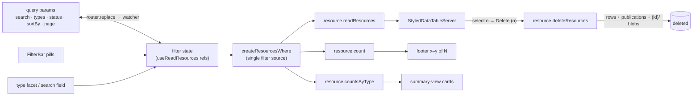

# List Filters & Views

Azure "All resources" parity for `/resources/all`: filter pills, URL-synced state, bulk operations, column management, grouping, CSV export, and real-link rows.

## Scope

**Today**: a bare search field over a server table — and the server's existing `types` filter isn't even wired (`ResourceListView` passes a hard-coded empty ref). **This proposal adds** the portal workbench: a filter-pill row (`Type == all` · `+ Add filter`), checkbox multi-select with bulk commands, a Manage-view column chooser, group-by, CSV export, and a refresh button — all state deep-linkable via query params. Everything is frontend + procedure work on the existing `resource` router — no schema changes.

## Filters

- **Type facet (first, the wiring gap)**: multi-select dropdown (`SelectItemCategoryDefinition` items from `ResourceDefinitionMap` — icon + title) bound to the `types` ref `useReadResources` already accepts.
- **Filter-pill row**: each active filter renders as a `v-chip` pill (`Type == File, Survey`) opening a `v-menu` editor; `+ Add filter` menu offers the remaining filters. Filters:
  - **Type** — the facet above, recast as a pill.
  - **Status** — Published/Draft; server gains `isPublished?: boolean` on `resourceFilterInputSchema`, implemented as an `exists`/left-join on `resource_publications` inside `createResourcesWhere` (the one filter source for both `count` and `readResources`).
  - **Updated** — date-range presets (24h / 7d / 30d / custom), `gte`/`lte` on `updatedAt`.
  - **Tags** — lands with [tags](/docs/proposals/platform/tags).
- **URL state**: `search`, `types`, `status`, `sortBy`, `page` mirror to query params via `router.replace` (watcher both ways); `?search=` from Home stays the entry point. Named saved views are [deferred](/docs/platform/deferred/saved-views).

## Bulk operations

- `show-select` checkbox column on `StyledDataTableServer`; a selection toolbar replaces the filter row while items are selected (`n selected · Delete · Export CSV · Clear`).
- `resource.deleteResources` batch procedure: owner-scoped `inArray` delete returning the deleted rows, plus per-id publication rows and `{id}/` blob directories (same cleanup path as single delete). One confirm dialog listing the names, with the type-the-count/name guard from [resource page parity](/docs/proposals/platform/resource-page-parity).

## Views

- **Column chooser** ("Manage view"): checkbox `v-menu` over `ResourceHeaders`, hidden set persisted to `LocalStorageKey.ResourceListColumns`.
- **Group by type**: toolbar toggle mapping to the data table's `group-by`, section headers = type icon + title + count.
- **Summary view** (portal's List/Summary toggle): per-type count cards (icon, title, count, click → type-filtered list) over a new grouped-count procedure (`select type, count(*) … group by type` behind `createResourcesWhere`).
- **Footer parity**: "Showing x–y of N records" + page-size select (`items-per-page-options`).

## Rows

- **Name cell is a real `:to` link** (middle-click/ctrl-click work); row click keeps `navigateTo` for the rest of the row.
- **Context menu** on right-click (positioned `v-menu`): Open, Open in new tab, Copy link, Rename, Delete — reusing the blade command-bar dialogs.
- **Export CSV**: serialize the current filtered result (re-query with the full count as limit) through the existing File CSV serializer; bulk-selection export uses the selected rows.
- **Refresh** button re-runs `readResources` with current options.
- **Empty states**: filters active → "No resources match your filters" + Clear-filters action; otherwise the existing no-resources `StyledEmptyState`; load failure → error state with Retry.

## Flow

One filter state, three consumers, mirrored to the URL:

## Procedures

| Procedure                                   | Auth                          | Input                                                           | Purpose                                          |
| ------------------------------------------- | ----------------------------- | --------------------------------------------------------------- | ------------------------------------------------ |
| `resource.readResources` / `resource.count` | authed                        | + `isPublished?: boolean`, `updatedAfter?/updatedBefore?: Date` | status + date filters via `createResourcesWhere` |
| `resource.deleteResources`                  | authed (owner-scoped `where`) | `ids: string[]` (bounded)                                       | bulk delete rows + publications + blob dirs      |
| `resource.countsByType`                     | authed                        | filter schema sans `types`                                      | summary-view cards                               |

## Key files

| File                                           | Role                                                                |
| ---------------------------------------------- | ------------------------------------------------------------------- |
| `app/components/Resource/ListView.vue`         | grows the pill row, selection toolbar, column chooser, context menu |
| `app/components/Resource/FilterBar.vue`        | pill row + `+ Add filter` editors                                   |
| `app/composables/resource/useReadResources.ts` | URL-state sync, extra filter refs                                   |
| `server/trpc/routers/resource.ts`              | filter schema, bulk delete, grouped counts                          |

## Notes

- Publish **status stays off the default columns** (the consolidation decision) — it appears only as an opt-in filter/pill, not a column.
- One filter source: every new filter lands in `createResourcesWhere` so `count`, `readResources`, and `countsByType` can never disagree.
- Ship order inside this proposal: type facet + URL state + name link first (pure wiring), pills/bulk/views after.
