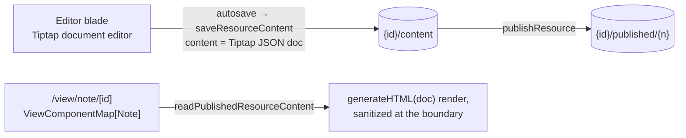

# Note Resource

The suite has a spreadsheet (File), a form (Survey), a site builder (Webpage), a BI canvas (Dashboard), a diagram (Flowchart), and an email — but no plain **document**. A Note resource type fills the most common everyday artifact: meeting notes, a spec, a README-style page — authored in Tiptap (already a dependency, powering the messaging editor), shareable via the standard publish flow.

## Scope

**Today**: there is nowhere on the platform to just write a page of formatted text. The nearest workaround is abusing the webpage editor, which is a site builder, not a writing surface.

**This proposal adds** one `ResourceType` — and is deliberately also a **live test of the platform's extensibility claim**: "new products join by adding one `ResourceType` and one `ResourceDefinitionMap` entry" ([/docs/architecture/platform](/docs/architecture/platform)). If Note needs more than the enum value, the definition entry, an editor component, and a view component, that friction is a platform finding worth fixing.

## How it works

- **Content schema**: `{ doc: <Tiptap JSON document> }` — the JSON document, not HTML, is the source of truth (structured, diffable later, no sanitization ambiguity at rest). Zod-validated as an object per the content-schema standard.
- **Editor blade**: a Tiptap instance with the standard writing kit (headings, lists, bold/italic/code, links, blockquote) — a superset of the messaging editor's marks, sharing extension configuration where it genuinely overlaps and no further (the messaging editor is a one-line composer with mentions; forcing one shared editor would violate same-level abstraction).
- **Capabilities**: `publishable: true`. The view renders `generateHTML` output with app typography, sanitized per the string-utils standard at render. Not a dataset provider (no tabular shape); Portable (Markdown export) is a natural follow-on, not bundled.
- **Registration**: `ResourceType.Note` (pg enum migration), `ResourceDefinitionMap` entry (icon, title, schema, capabilities), `ResourceEditorComponentMap` + `ViewComponentMap` entries. Create form is name-only. Everything else — explorer listing, create tile, blades, command bar, publish, search — arrives from the shell for free.

## Key files

| File                                                             | Role                |
| ---------------------------------------------------------------- | ------------------- |
| `packages/db-schema` `ResourceType` enum + migration             | new type value      |
| `packages/app/shared/services/resource/ResourceDefinitionMap.ts` | Note entry          |
| `app/components/Resource/Note/Editor.vue` (new)                  | Tiptap editor blade |
| `app/components/Resource/Note/View.vue` (new)                    | published render    |

## Notes

- Naming: **Note**, not Document — "document" was the old pre-consolidation umbrella term for all editor resources and would be actively confusing in this codebase. Singular, like every `ResourceType` value — pluralized display titles ("Notes") are a UX-only decision deferred to `ResourceDefinitionMap` title changes across all types at once, never identifier changes.
- Collaboration, comments, and version history remain the platform-wide deferrals they already are ([collaboration](/docs/platform/deferred/document-collaboration), [comments](/docs/platform/deferred/resource-comments), [draft history](/docs/platform/deferred/draft-version-history)) — Note adds no special urgency, it just rides whatever the platform decides.
- Cost: one pg enum migration, zero new dependencies, zero new services.
