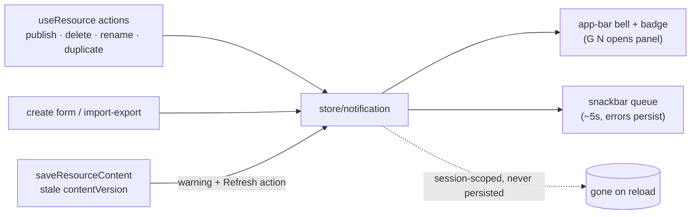

# Notifications Bell

Azure-portal notifications parity: resource operation outcomes (created, published, deleted, imported, save conflicts) land as toasts and accumulate in an app-bar bell panel.

## Scope

**Today**: publishes and deletes succeed silently — there is no feedback channel. **This proposal adds** the portal bell: a toast on completion plus a session history panel. Client-only — a Pinia store, an app-bar bell with badge, and snackbar toasts. No backend, no persistence (the portal's bell is effectively session-scoped too).

## Model

`AppNotification` (client model): `id`, `severity` (`success | info | warning | error`), `title`, `message?`, `action?` (`{ title, to | handler }`), `createdAt`, `isRead`.

Sources (fired from `useResource` / create / import-export flows):

- created → "Resource created" + **Go to resource** action (the create form already routes; the toast covers background paths like Duplicate)
- published v{n} / unpublished → success, with **Copy public link** action on publish
- deleted (single + bulk "n resources deleted")
- import/export completed or failed
- save conflict (stale `contentVersion`) → warning with **Refresh** action ([resource page parity](/docs/proposals/platform/resource-page-parity))
- any factory mutation error → error severity with the message

## Flow

## UI

- **Bell** in the app bar (authed pages): `v-badge` unread count, click opens a `v-menu` panel — newest first, severity icon, relative time, per-item dismiss, "Dismiss all". Empty state: "No notifications".
- **Toasts**: each pushed notification also shows a `v-snackbar` (~5s, dismissible); errors persist until dismissed. One snackbar queue, not stacked ad-hoc snackbars.
- `G N` opens the panel ([global search](/docs/proposals/platform/global-search) shortcuts).

## Key files

| File                                          | Role                                            |
| --------------------------------------------- | ----------------------------------------------- |
| `app/store/notification.ts`                   | session-scoped notification list + unread count |
| `app/components/App/NotificationBell.vue`     | app-bar bell + panel                            |
| `app/components/App/NotificationSnackbar.vue` | single snackbar queue rendering the store head  |
| `app/models/app/AppNotification.ts`           | client model                                    |

## Notes

- Deliberately not persisted (no table, no localStorage) — the value is immediate feedback + a session trail; durable history is the activity log's job ([activity log](/docs/proposals/platform/activity-log)).
- Existing ad-hoc snackbars in resource flows migrate into the store so there is one feedback mechanism.
