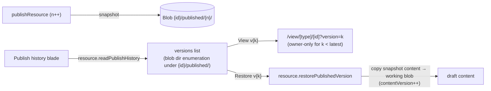

# Publish History

A **Publish history** blade on publishable resources: list every `{id}/published/{n}` snapshot with when it was published, open any version's public render, and restore an old version's content into the current draft.

## Scope

**Today**: publishing writes a snapshot to `{id}/published/{publishVersion}/` and bumps `publishVersion` on the `resource_publications` row; only the latest version is reachable, and nothing lists prior ones. **This proposal adds** the history surface. **Precondition to verify first**: that prior `{id}/published/{n}/` blob directories are actually retained on re-publish (nothing deletes them today, but confirm before building — if they are cleaned up anywhere, retention is part of this work).

## How it works

- **List**: `resource.readPublishHistory { id }` enumerates version directories under `{id}/published/` (blob prefix listing — no new table; the blob layout is already the source of truth). Each row: version number, snapshot timestamp (blob `lastModified`), "current" badge on the latest.
- **View a version**: the public view route gains an optional owner-only `version` query param — the published renderer loads `{id}/published/{k}/` instead of the latest. Anonymous visitors always get the latest (public behavior unchanged).
- **Restore**: `resource.restorePublishedVersion { id, version }` copies the snapshot's content into the **working copy** (through `saveResourceContent` semantics: `contentVersion`++). It never re-points the publication — restoring produces a draft to review and re-publish, mirroring the recycle-bin "restore returns a Draft" principle.

## Procedures

| Procedure                          | Auth                | Input             | Purpose                                         |
| ---------------------------------- | ------------------- | ----------------- | ----------------------------------------------- |
| `resource.readPublishHistory`      | `getOwnerProcedure` | `{ id }`          | list snapshot versions from blob prefix listing |
| `resource.restorePublishedVersion` | `getOwnerProcedure` | `{ id, version }` | copy snapshot content → working copy            |

## Key files

| File                                         | Role                                          |
| -------------------------------------------- | --------------------------------------------- |
| `app/components/Resource/PublishHistory.vue` | blade: versions table + View/Restore commands |
| `server/trpc/routers/resource.ts`            | history + restore procedures                  |
| `app/pages/view/[type]/[id].vue`             | owner-only `version` query param              |

## Notes

- Blade registration: `ResourceBladeType.PublishHistory` rendered only for `PublishableResourceType` (the first capability-conditional built-in blade — `BladeNav` gains the same capability gate the command bar already has).
- Snapshot content that references baked SAS URLs (Survey assets) may have expired signatures on old versions — viewing an old version re-signs through `transformReadContent` where the type defines it.
- Retention policy stays "keep everything" until storage says otherwise; a prune command would be a follow-up decision, not part of this.
