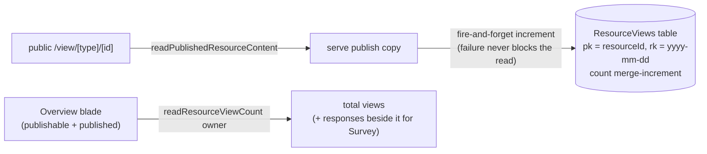

# Published View Analytics

Publishing currently fires links into the void: an owner exports fifty invites, and the only signal back is whichever respondents finish the survey. A best-effort view counter on `readPublishedResourceContent` — surfaced on the Overview blade — makes the middle of the funnel visible for every publishable type: how many opened the dashboard, the webpage, the survey; for surveys, views vs responses is the completion rate.

## Scope

**Today**: no usage signal of any kind on published resources.

**This proposal adds** one Azure Table counter and one Overview row. Explicitly **not** an analytics product: no unique-visitor identification (no cookies, no IP storage), no referrer capture, no time series UI — a total plus a per-day bucket so a future chart is possible without rework. Deliberately approximate.

## How it works

- **Storage**: new `AzureTable.ResourceViews` — partitionKey = resource id, rowKey = UTC date, single `count` property. Daily buckets keep entities small and make "views this week" a partition range scan later.
- **Increment**: optimistic merge with a bounded ETag retry; on conflict exhaustion, drop the count — the read path must never fail or slow because of telemetry. Rate limiting on the public read already bounds write volume.
- **Read**: `readResourceViewCount(id)`, owner-gated, sums the partition (capped scan, magnitudes matter more than precision).
- **Surface**: Overview Essentials gains a **Views** row for published `PublishableResourceType` resources. The Survey Overview places it beside the response count ([response management](/docs/proposals/platform/survey-response-management)) — the funnel in two numbers.
- **Delete/unpublish**: `deleteResource` also clears the partition; unpublish leaves history intact (re-publish continues the same counter — it is the resource's audience, not the version's; per-version stats belong to [publish history](/docs/proposals/platform/publish-history) if ever needed).

## Procedures

| Procedure               | Auth  | Input    | Purpose           |
| ----------------------- | ----- | -------- | ----------------- |
| `readResourceViewCount` | owner | `{ id }` | summed view count |

(The increment is internal to the public read, not a procedure.)

## Key files

| File                                                                      | Role                                           |
| ------------------------------------------------------------------------- | ---------------------------------------------- |
| `packages/db/…` Azure Table constants                                     | `ResourceViews` table                          |
| `packages/app/server/trpc/procedure/resource/createResourceProcedures.ts` | increment in the public read + count procedure |
| `app/components/Resource/Overview.vue`                                    | Views row                                      |

## Notes

- Counts views of the _content read_, so SSR/proxy prefetches and one person refreshing five times all count — stated on the UI as "views", never "visitors". Precision is not the point; direction and magnitude are.
- Riding `createResourceProcedures` makes this automatic for every current and future publishable type — no per-type wiring, consistent with the capability model.
- This is deliberately platform-side counting, not client analytics — no script on the view page, nothing for ad-blockers to eat, works for OG-unfurl bots too (which is fine at this fidelity).
