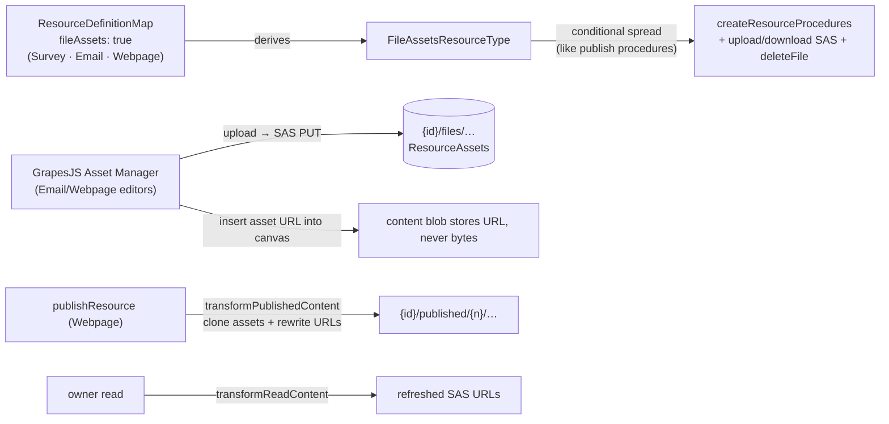

# Resource File Assets

Hosted binary assets for every editor that needs them: promote Survey's existing `{id}/files/…` SAS upload/download/delete procedures into a **FileAssets capability**, and wire the GrapesJS Asset Manager (Email, Webpage) onto it. Three adopters (Survey, Email, Webpage) clears the capability admission rule (≥2 types — [/docs/architecture/resources](/docs/architecture/resources)).

## Scope

**Today**: only Survey can host binary assets — `generateUploadFileSasEntities` / `generateDownloadFileSasUrls` / `deleteFile` are bespoke procedures on the `survey` router, storing under `{id}/files/…` with publish-time cloning (`transformPublishedContent`) and SAS refresh on owner read (`transformReadContent`). The GrapesJS editors have **no asset pipeline at all**: an image in an email or webpage is either an external URL or a base64 data URI inside the content blob. Data URIs bloat every save and are stripped by major email clients, so an exported personalized email with an embedded image is broken on arrival — a hard prerequisite gap for [email sending](/docs/platform/deferred/email-sending) ever un-deferring.

**This proposal adds** the capability generalization plus the GrapesJS wiring. No new Azure services — same `ResourceAssets` container, same SAS machinery, same publish-clone pattern Survey already proved.

## How it works

- **Capability**: `fileAssets: true` in `ResourceDefinitionMap`; `FileAssetsResourceType` derived via the existing `CapabilityResourceType` mapped type. The three procedures move from the `survey` router into `createResourceProcedures`, spread conditionally exactly like the publish procedures — a non-declaring type has no asset endpoints at the type level. The `surveyId` input key generalizes to `id` (the survey router keeps thin aliases only if achievement `triggerPath`s depend on the old paths — verify before renaming).
- **GrapesJS wiring**: `useGrapesJsEditor` gains an optional asset adapter — Asset Manager `uploadFile` handler requests SAS entities, PUTs the file, and registers the resulting URL. Editors without the adapter (none, once Email/Webpage adopt) behave as today.
- **Publish**: Webpage reuses Survey's `transformPublishedContent` clone-and-rewrite so published pages serve immutable snapshot assets. Email is not publishable; its exported HTML references the owner-read SAS URLs — export warns that hosted-image links expire with the SAS window, and long-lived public asset URLs are explicitly the [email web view](/docs/proposals/platform/email-web-view) / email-sending follow-on.
- **Delete**: `deleteResource` already removes the whole `{id}/` directory — assets ride along for free.

## Procedures

| Procedure                       | Auth  | Purpose                              |
| ------------------------------- | ----- | ------------------------------------ |
| `generateUploadFileSasEntities` | owner | SAS PUT targets under `{id}/files/…` |
| `generateDownloadFileSasUrls`   | owner | refreshed read URLs                  |
| `deleteFile`                    | owner | remove one asset blob                |

(Existing signatures, relocated into the factory behind the capability.)

## Key files

| File                                                                      | Role                                    |
| ------------------------------------------------------------------------- | --------------------------------------- |
| `packages/app/shared/services/resource/ResourceDefinitionMap.ts`          | `fileAssets` declarations               |
| `packages/app/server/trpc/procedure/resource/createResourceProcedures.ts` | conditional asset procedures            |
| `app/composables/grapesjs/useGrapesJsEditor.ts`                           | Asset Manager upload adapter            |
| `server/trpc/routers/survey.ts`                                           | bespoke procedures removed (or aliased) |

## Notes

- The capability is **storage + procedures only** — what an editor does with an asset URL stays type-specific (SurveyJS file question, GrapesJS image component). That keeps the capability at the same altitude as Portable (formats declared, semantics per type).
- Rejected alternative: a standalone Asset/Image-library resource type. Assets are meaningless outside their owning resource, die with it, and need no name/list/blades — an identity row per image is pure overhead. Cross-resource asset reuse has no demonstrated need; revisit only with a [brand kit](/docs/platform/deferred/brand-kit-resource).
- Asset uploads count toward no quota today — same posture as Survey uploads ([storage usage surface](/docs/platform/deferred/storage-usage-surface) unchanged).
