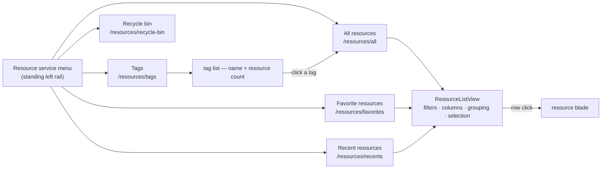

# Resource manager service menu

The portal this explorer follows does not put "everything you own" behind a single page. Resource Manager is a **service** with a standing left menu — All resources, Favorite resources, Recent resources, Resource groups, Tags — and each entry opens the _same_ list surface pointed at a different set. Ours has one list page (`/resources/all`) and surfaces the rest as cards on the hub, which means Recent and Favorites can never grow filters, columns, sorting or bulk selection without re-implementing what `/all` already has.

This proposal adds the menu and makes each entry a view over the existing list, so a capability built once appears everywhere.

## What works today

Nearly all the machinery already exists, which is why this is mostly a routing and shell change rather than a feature build:

- **The list surface** — `ResourceListView` with its filter bar, type/tag/status/updated pills, column chooser, group-header rows, summary cards and selection toolbar ([list filters and views](/docs/platform/list-filters-and-views)).
- **Favorites** — a Postgres table and `resource.readFavorites`, rendered today as a hub tab ([favorites and recents](/docs/platform/favorites-and-recents)).
- **Recents** — per-device `localStorage` ids resolved through `readResources`, capped, rendered as the other hub tab.
- **Tags** — stored per resource, editable from the blade, and already a filter pill on `/all`.
- **The recycle bin** — its own page and list.
- **The shell** — the `resource` layout's header and the two-pane list/blade view ([resource explorer](/docs/platform/resource-explorer)).

What is missing is the **menu**, and the fact that Recent and Favorites are card renderings rather than list views.

## What this adds

1. **A `ResourceServiceMenu` in the resource layout**, rendered beside the page content on desktop and collapsing to the existing pattern on mobile. It is navigation, not state: every entry is a real route, so a menu item is a link and the active one is decided by the router the way the blade nav already decides its own.
2. **`/resources/favorites` and `/resources/recents`** become list routes over `ResourceListView`, replacing the hub cards. Each passes its own source (`readFavorites`, or the resolved recent ids) and its own default sort — starred-desc and viewed-desc — and inherits filters, columns and selection for free.
3. **`/resources/tags`** — a list of tags with a resource count each, linking into `/all` pre-filtered by that tag. This is the one genuinely new read: a grouped count over the tag column.
4. **A `Last accessed` column**, available wherever the row's view time is known. On Recent it is the sort key; elsewhere it is off by default in the column chooser, because the value is per-device and absent for a resource this device never opened.

## What we deliberately do not copy

**Resource groups have no analogue and must not be invented.** A group in the portal is a containment relationship — a resource is _inside_ exactly one — and our resources have no container at all, which is the same fact that keeps the breadcrumb from deriving ancestry ([breadcrumb trail](/docs/platform/breadcrumb-trail)). Tags already carry the many-to-many grouping people actually want, so the menu gets a Tags entry and no Groups entry. Subscriptions, locations and deployments are likewise portal concepts with nothing behind them here; copying the menu's shape must not mean copying its vocabulary.

## Open questions

- **Do recents stay per-device?** As a card, per-device is untidy at worst. As a first-class menu entry with a `Last accessed` column, a list that disagrees between two browsers is harder to defend — but a server-side table means a write on every resource open, which is the cost that kept them in `localStorage`. Decide before the column ships, since the column is what makes the disagreement visible.
- **Does the menu replace the hub, or sit under it?** `/resources` today is a search box plus create and resources cards. With Recent and Favorites promoted to routes, the hub either becomes the menu's landing overview or stops earning a route of its own.

## Key files

Paths relative to `packages/app`.

| File                                             | Role                                                        |
| ------------------------------------------------ | ----------------------------------------------------------- |
| `app/layouts/resource.vue`                       | the shell that would mount the service menu                 |
| `app/components/Resource/List/View.vue`          | the list surface every menu entry points at                 |
| `app/components/Resource/Home/ResourcesCard.vue` | the Recent/Favorites cards this replaces                    |
| `app/components/Resource/Blade/Nav.vue`          | the existing rail whose active-link pattern the menu copies |
| `app/pages/resources/all.vue`                    | the list route the new views mirror                         |
| `server/trpc/routers/resource.ts`                | `readResources` / `readFavorites`, plus the tag count read  |
