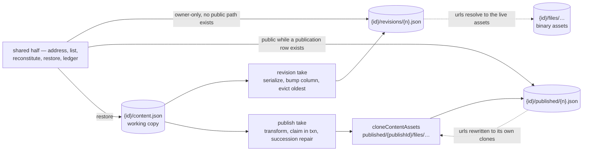

# Resource Snapshots

A resource can already be rolled back — but only to a deliberate publish, and only if it is a publishable type. Everything the rollback needs is built: an addressing scheme for stored copies, a history read that needs no table, a reconstitution of stored content into something a caller can use, and a restore that lands through the ordinary save path. None of that is about publishing, and all of it is reachable only through `publishResource`.

This proposal moves that half out. Snapshots are addressed by **channel**; `published` is one channel; a new `revisions` channel gives every resource type restorable point-in-time versions of the working copy. What stays with publish is the half that is genuinely about publishing — the transform, the version claim, and the repair that a concurrent unpublish forces — and the section below draws that line precisely, because getting it wrong in either direction is the main risk in this work.

Working-copy version history was held back on two open questions — when a revision is taken and how many are kept — and on an assumption that Azure Blob versioning was the alternative if it were ever wanted. This page answers both questions and retires the assumption: the trigger table and the retention rule below settle the first two, and blob versioning turns out not to be able to do the job at all.

## Scope

**Today** the snapshot machinery lives inside `createResourceProcedures`: `publishResource` claims a version on the `resource_publications` row, clones referenced assets into a per-attempt directory, writes `{id}/published/{n}.json`, and repairs itself when a concurrent unpublish breaks the version succession. `readPublishHistory` lists the prefix; `restorePublishedVersion` copies a snapshot back through `saveResourceContent`. A non-publishable type — Blueprint, Program, Sheet, TodoList — has none of this, and its working copy has exactly one recoverable state: the current one.

**This adds** a shared half extracted from that machinery, a second channel, a retention rule, a declared snapshot boundary, one Postgres column for the revision counter and one for publish-time drift, the Overview status row, and a version-history panel that replaces the publish-history blade for every type. It changes no blob layout that exists today.

### Why not Azure Blob versioning

Closing this properly, because it is the option that looks cheapest and is the one that cannot work.

**A resource version is not a blob version.** A version of a resource is `content.json` _plus the assets it references_ under `{id}/files/`. Azure versions each blob on its own timeline with no cross-blob consistency point, so "restore this resource as of Tuesday" resolves to Tuesday's JSON pointing at asset urls whose blobs have since been replaced or deleted. There is no version of the _set_. The publish path solved exactly this problem by cloning assets alongside the content and rewriting the urls to the clones — which is a thing the application does and the storage account cannot.

Three lesser reasons, each independently sufficient:

- Versioning is a **blob-service property**, not a container one. Enabling it for `resource-assets` enables it for `message-assets`, `public-user-assets` and every other container on the account, and scoping retention back down means enumerating the other containers in a lifecycle rule, because `prefixMatch` has no exclusion.
- Non-current versions are **billed but invisible to the ledger**. `chargeAndEmitStorageLedgerEntry` charges the current blob and `reconcileStorageLedgerEntryHandler` reconciles off `BlobCreated`; a version is neither, so every user's quota would understate what they cost ([storage quotas](/docs/platform/storage-quotas)).
- A version is addressed by an opaque version id, which nothing in the app stores, lists, or hands to a restore.

Manual snapshots are the mechanism. Blob versioning stays off.

### The mechanism: channels

A snapshot channel is a directory segment under the resource prefix plus a small definition of how snapshots on it behave:

```text
{id}/content.json                        working copy
{id}/revisions/{n}.json                  revision channel — reference kind, owner-only
{id}/published/{n}.json                  published channel — immutable kind, publicly served
{id}/published/{publishId}/files/…       the immutable channel's asset clones
{id}/files/…                             binary assets, FileAssets types only
```

`SnapshotChannelDefinitionMap` is the one place a channel says what it is: its segment, its kind, its counter source, its retention, and whether the snapshot is publicly servable.

**A channel is an address space, not a workflow**, and the distinction is the whole of what this mechanism may generalize. Count the axes on which the two channels differ — kind, counter, retention, visibility, whether an unpublish sweep takes them, and whether taking one is an outward act with a public url, a view count, a notification and an activity entry. Six axes, two values each, one per channel. A `createSnapshot(id, channel)` that drove all of it from a map would not be an abstraction; it would be a branch with indirection between it and its reader, which is the same over-generalization the [capability admission rule](/docs/architecture/resources) already forbids one level up.

So the shared half is drawn where the operations are genuinely the same one:

| Shared by both channels | Owned by each caller |
| --- | --- |
| the blob address `{id}/{segment}/{n}.json` | **taking** a snapshot |
| counter in Postgres, existence in the listing, and the rule that they may disagree | publish's transform, version claim, succession check and repair |
| the history listing | the revision's ring-buffer eviction |
| **reconstitution** — read, re-apply live state, hand back | publish's activity entry, notification and view counting |
| restore — reconstitute, then `saveResourceContent` | |
| the ledger charge on write and release on evict | |

Reconstitution is the row that matters most, because it is where sharing **fixes a defect rather than saving lines**: the survey settings bug below exists exactly because restore was written separately from the public read, and one shared reconstitution makes writing them apart impossible.

Take is the row where sharing would cost. Publish's take is a transform that may read through `ctx.db`, a version claimed in a transaction, an upload, a succession check and a repair; a revision's is a serialize, a column bump, an upload and an eviction. What they have in common is "upload a blob and charge it". Hiding the succession repair behind a channel-kind flag would move logic that is about publication rows and the unpublish sweep away from the words `publication` and `unpublish`, which is the opposite of what a reader needs. It stays where it is.

The version counter stays in Postgres and is never derived from the listing. That is the rule publish already established and the one thing about it that is subtle: the listing answers _which snapshots exist_, the row answers _what the next version is and which one is live_, and the two are allowed to disagree — an unpublish sweep is best-effort, so retired blobs outlive the row that numbered them. Revisions take a `revisionVersion` column on `resources` rather than a table of their own; there is nothing else to record about a revision that the blob does not already carry — its reason and its owner-typed label ride as blob metadata, which the listing returns, so even the row a named revision looks like it needs turns out not to exist.

### Two snapshot kinds

The clone is the expensive half of a snapshot and publish treats it as unconditional. Making it a declared property of the channel is what makes a second channel affordable:

| Kind          | What is written                                                            | Cost                                                | Survives                                            | Used by       |
| ------------- | -------------------------------------------------------------------------- | --------------------------------------------------- | --------------------------------------------------- | ------------- |
| **Immutable** | content + a clone of every referenced asset, urls rewritten to the clones  | one storage round trip **per referenced asset**     | the working copy deleting or replacing an asset     | `published`   |
| **Reference** | content only, urls untouched, resolving to live `{id}/files/…`             | one blob                                            | nothing — an asset the owner deletes is gone from it | `revisions` |

Revisions take the reference kind, and the trade is honest rather than reluctant: `{id}/files/` is only emptied by purge, which destroys the revisions in the same sweep, so the window in which a revision can rot is exactly "the owner deleted an asset and then rolled back past the deletion". A rolled-back revision with one broken image is strictly better than no rollback, and paying a per-asset clone on every revision would mean no revisions at all.

The reference kind has a second consequence worth stating, because it removes a whole class of risk: **the revision channel holds no assets**, only JSON. `parseResourceAssetPath` therefore needs no new segment, and the rule that `{id}/published/…` assets serve anonymously while a publication row exists cannot accidentally extend to revisions — there is nothing under the revision prefix for it to serve.



### The snapshot boundary — and the defect it fixes

Survey already draws a line through its content blob that no other part of the system knows about. `model` is snapshot state; `settings` is live state, re-read on every public read by `transformPublicReadSurvey` so that closing a survey takes effect without re-publishing every participant link that was already sent.

That line is declared in only one direction. **Restore does not know about it, and gets it wrong today:** `restorePublishedVersion` copies the snapshot's content wholesale into the working copy, and the snapshot's content includes the `settings` frozen at publish time. Restoring an older version of a published survey therefore reverts its collection settings — silently reopening a closed survey, or flipping the response mode between Anonymous and Identified, which is a setting the write boundary makes authorization decisions on ([survey response modes](/docs/platform/survey-response-modes)). Nothing in the restore path or its confirmation dialog says this will happen.

So the boundary is promoted from a read-time hook on one channel into a **two-way declaration the snapshot mechanism owns**: a type states which parts of its content are snapshot state and which are live, and the mechanism applies it on every path that reconstitutes content from a snapshot — the public read, the owner's version view, and the restore. `transformPublicReadContent` stops being "the thing Survey does to public reads" and becomes the read half of that declaration, with restore re-applying live state over the snapshot before it writes.


Note the first step, because it is what makes the whole mechanism **append-only**: a rollback is not a rewind, it is an append whose content happens to equal an earlier state. Nothing is mutated and nothing is destroyed — the draft being replaced becomes a revision first, the restore lands as an ordinary save with its own `contentVersion`, and undoing the restore is simply the next append. A restore is the one operation that destroys draft work on purpose, and today it has no undo — the [publish history](/docs/platform/publish-history) blade warns about it in prose and that is the whole safety net. Taking a revision before overwriting is the cheapest and highest-value trigger in this proposal, and it falls out of the mechanism for free.

Two things sit outside that invariant, and both are named here so nobody has to rediscover them as bugs. The **ring buffer** evicts the oldest revision, so append-only holds over recent history rather than all history. The **unpublish sweep** deletes `{id}/published/` outright, because unpublishing exists to make an artifact unreachable and keeping the bytes would defeat it — the revision channel survives an unpublish untouched, so nothing _recoverable_ is lost with it.

### When a snapshot is taken

**Saving is not one of them.** The instinct to make save and publish the same event is the right instinct about the _mechanism_ and the wrong one about the _cadence_, for five reasons that are all measurable in the code as it stands:

- `saveResourceContent` **is** the autosave path — it fires on every coalesced keystroke batch, not on a deliberate act.
- Sheet and Dashboard put real data in the content blob, so a snapshot's size tracks the artifact, not the edit. A per-save revision of a large sheet copies the whole sheet on every batch.
- Every snapshot charges the ledger, so per-save revisions burn the owner's quota while they type — and the quota is rendered to them in the shell header.
- A history listing that grows per save is unbounded; `readPublishHistory` enumerates a prefix with no limit because publish counts are in the tens.
- Publish's version claim is a transaction plus a succession check, and putting that on the hottest write path in the app buys nothing that a coalesced revision does not.

The triggers instead:

| Trigger                                       | Channel       | Rationale                                                                                   |
| --------------------------------------------- | ------------- | ------------------------------------------------------------------------------------------- |
| Publish command                               | `published`   | unchanged behaviour                                                                         |
| Before restore, import, or blueprint deploy   | `revisions` | the operations that overwrite a draft wholesale, and the only ones with no undo today       |
| **Save version** command                      | `revisions` | the deliberate milestone, taken by the owner                                                |
| First save after an idle window elapses       | `revisions` | at most one per window, so a working session leaves a handful of recovery points            |
| Every autosave                                | —             | never                                                                                        |

The idle-window trigger is what makes this a recovery feature rather than a manual discipline, and coalescing is the whole of its cost control: the window is a constant, and one revision per window per resource is the ceiling.

### Retention

The published channel keeps everything and prunes nothing — that stays, because publishes are deliberate and rare, and a retired public artifact is something an owner may need to point at.

Revisions are a **ring buffer**: a fixed cap in the tens, oldest evicted when a new one lands. Eviction is not a blob delete on its own — it releases the revision's ledger entry in the same step, or the ring buffer becomes a slow quota leak that nothing ever reconciles. This is the bound on the append-only invariant above, and it is taken deliberately: unbounded revisions would be charged and visible like any other content the owner keeps, but a long-lived Sheet accumulates fast and the history listing has no limit, so the cap buys a bounded cost and a bounded list at the price of the oldest recovery points.

### Versions the owner sees

`contentVersion` is **not** a version anyone should be shown, and is not rendered anywhere today. It is an optimistic-concurrency token that increments once per autosave; surfacing it means telling an owner their document is at v437 because they typed 437 times. The number that is meaningful to a person is the revision version, because it is the thing they can roll back to.

The two counters that reach the UI are different axes and must never be collapsed into one: **`publishVersion` is what the public sees**, **`revisionVersion` is what you can return to**. Overview shows each only where it carries information:

| Type            | State                            | Status row                                                              |
| --------------- | -------------------------------- | ----------------------------------------------------------------------- |
| Not publishable | —                                | that a restore point exists, once one does                              |
| Publishable     | never published                  | `Draft` chip, plus that a restore point exists once one does            |
| Publishable     | published, draft unchanged since | `Published` chip, `v{publishVersion}`, up to date                       |
| Publishable     | published, draft moved since     | `Published` chip, `v{publishVersion}`, and that changes are unpublished |

The last row needs one thing that does not exist: **`resource_publications` records the `contentVersion` it published from**. Then "the draft has moved since the publish" is a comparison rather than a guess, and the Azure-portal-shaped answer to _is what I am looking at what the world sees_ stops being something an owner works out from timestamps. It is one column and it removes an entire class of "I thought I had published that".

### The rollback surface

Generalizing the publish-history blade across channels is the cheap answer and the wrong shape. Two things decide it.

**Rollback is wanted where the damage happened, not in a nav item.** Every product that does this well — Docs, Notion, Figma — opens version history from the overflow menu on the thing being edited, as a panel over it, with the selected version rendered read-only in place. Confluence's history-as-a-separate-page is the counterexample, and it is the one people complain about. Today's `View version` navigates to `RoutePath.View(type, id)?version=`, which leaves the owner's place and makes stepping through candidates impossible — so the panel is what replaces it, with a banner over the previewed version carrying `Restore this version` and `Back to current`. Preview-before-commit is what turns restore from a button people fear into browsing.

The panel opens from **`Resource/Blade/Actions`**, not from the editor, because Sheet and TodoList are blade-only types with no Editor blade at all — the blade action bar is the one surface every type has, and it is this repo's equivalent of the overflow menu. It is deep-linkable by route, so the back button and a shared link both work. **Publish history stops being a nav blade** and becomes this panel, which is a change to a shipped surface rather than an addition beside it.

**The owner has one question, so the panel has one list.** Publishes and revisions are separate address spaces in storage and the UI has no reason to mirror that: they go into one time-ordered timeline, a publish marked with its `Published v{n}` chip and its public link, a revision with its time and its reason. A `Published only` filter chip appears on publishable types. `Current` is always the first row, so the list is never empty on a resource that has just been created, and the mental model — current, plus the points behind it — is established from the first visit.

A row has to be **choosable**, which a bare `v37 · 14:02` is not. Each carries a reason (`Saved version`, `Before restore`, `Before deploy`, `Auto`), a relative time with the absolute one on hover, and a one-line per-type summary from a `SnapshotSummaryMap` beside the existing type maps — `12 items`, `3 sheets · 1.2k rows`. A `Save version` may carry an owner-typed label, and both label and reason live in **Azure blob metadata**: the listing already returns it, so the rule that a revision needs no table of its own survives.

Restoring emits a success notification carrying an **Undo** action, which restores the revision the restore had just taken. It costs nothing given that revision already exists, and it is what makes the one destructive operation in the feature safe to try.

Two consequences follow. Version numbers collide across channels in one list, so a row is labelled by kind rather than by number. And `revisionVersion` stops being a number the UI renders at all — an owner picks a version by time and by label, never by ordinal — which is why the status table above reports only that a restore point exists. It remains what the mechanism counts with.

## What this refactors

The point of the proposal is as much what it deletes as what it adds. Every item below is existing code that gets smaller or more honest:

- **`publishResource` keeps its take and loses everything around it.** The addressing, the listing, the reconstitution, the restore and the ledger calls move to the shared half; the transform, the version claim, the succession check and the repair stay, because they are about publication rows and the unpublish sweep and belong beside those words.
- **The restore clone becomes conditional on the channel kind** — the one axis that legitimately parameterizes a shared path. `restorePublishedVersion` clones assets back because a published url lives under a prefix unpublish wipes; a reference snapshot already points at the working copy's own assets, so it clones nothing. One flag, read in two places, symmetric between take and restore.
- **`getPublishedContentBlobName`, `createPublishedAssetsDirectoryName`, `readPublishHistory` and `restorePublishedVersion`** lose their `Published` prefixes and take a channel. `readSnapshotHistory` takes the "which is current" answer as an argument instead of knowing about publication rows.
- **`transformPublicReadContent` becomes the read half of the snapshot boundary** and is applied by restore as well, fixing the survey settings defect above.
- **The ledger touchpoints collapse to two** — charge on take, release on evict — instead of being restated per call site.

Nothing above changes a blob path that exists today, so there is no migration: `{id}/published/{n}.json` keeps its name and its meaning, and the first revision is written under a prefix nothing has ever used.

## Consequences beyond the feature

- **Every resource type gains recovery**, including the ones with no publish path at all. That makes the revision channel core rather than opt-in, which inverts the current dependency: today Publishable owns snapshots, afterwards the shared half is core and Publishable consumes it. The capability admission rule in [resources](/docs/architecture/resources) — a capability exists at two or more adopters — is satisfied trivially by "every type saves", which is the signal that it is not a capability. The shape to copy already exists: `getResourceBladeDefinitions` pushes Overview and Activity unconditionally and gates Publish history behind `hasCapability`, so an unconditional core surface beside a gated one is a pattern already in place rather than a new one. What changes is that this one is a panel over the blade rather than a blade of its own, and `hasCapability` moves from gating the surface to gating one channel's rows within it.
- **Purge and soft delete are unaffected** and need no new step. Purge takes `{id}/` wholesale, which is already every channel.
- **Unpublish keeps sweeping only `{id}/published/`.** A revision is not published state and must survive an unpublish; keeping the channels in separate prefixes is what makes that automatic rather than a condition someone has to remember.
- **Storage grows per owner**, bounded by the ring buffer times the content size. It is charged, metered and visible, so it behaves like any other content the owner keeps rather than like an invisible platform cost — which is precisely what Blob versioning would have been.

## Key files

| File                                                                                  | Role                                                         |
| ------------------------------------------------------------------------------------- | ------------------------------------------------------------ |
| `packages/app/server/trpc/procedure/resource/createResourceProcedures.ts`             | publish procedures — the machinery being extracted           |
| `packages/app/server/services/resource/snapshot/getSnapshotContentBlobName.ts`        | snapshot addressing, becomes channel-aware                   |
| `packages/app/server/services/resource/snapshot/createSnapshotAssetsDirectoryName.ts` | per-attempt asset directory, immutable channels only         |
| `packages/app/server/services/resource/snapshot/readSnapshotHistory.ts`               | prefix listing as history, becomes channel-aware             |
| `packages/app/server/services/resource/cloneContentAssets.ts`                         | the immutable kind's asset clone                             |
| `packages/app/server/services/resource/saveResourceContent.ts`                        | the one content-write path every restore lands through       |
| `packages/app/server/services/survey/reapplySurveyLiveContent.ts`                     | the existing live-state declaration the boundary generalizes |
| `packages/app/server/trpc/routers/resource.ts`                                        | `readSnapshotHistory` and `restoreSnapshotVersion`           |
| `packages/db-schema/src/schema/resources.ts`                                          | `revisionVersion` column                                   |
| `packages/db-schema/src/schema/resourcePublications.ts`                               | published-from `contentVersion` column                       |
| `packages/app/app/components/Resource/PublishHistory/Index.vue`                       | the shipped blade the timeline panel replaces                |
| `packages/app/app/components/Resource/Blade/Actions.vue`                              | where the version history panel opens from                   |
| `packages/app/app/services/resource/getResourceBladeDefinitions.ts`                   | loses the Publish history nav entry                          |
| `packages/app/app/components/Resource/Overview.vue`                                   | the Status row and the two version numbers                   |

## Notes

- [Named checkpoints](/docs/sheet-editor/rejected/named-checkpoints) was rejected for the Sheet editor on the grounds that undo/redo already traverses prior states. That rejection stands and does not conflict: it is about the in-session history stack, and every trigger here is about recovery _across_ sessions, where no undo stack exists. The Save version command is the one place they meet, and it is a resource-level command rather than an editor-level one — so the label it may carry names a point in a resource's history rather than a step in an editor's undo stack, which is the thing that rejection turned down.
- The idle window and the ring-buffer cap are the two numbers this proposal does not fix. Both are constants, both are cheap to change, and neither should be guessed in prose before the first implementation measures a real content blob.
