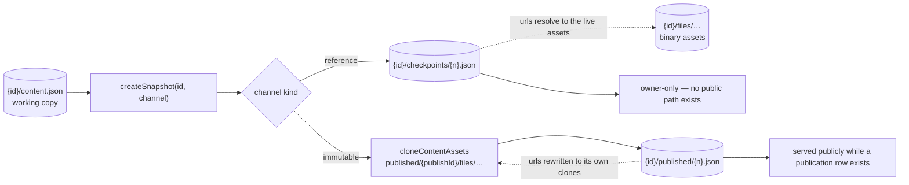
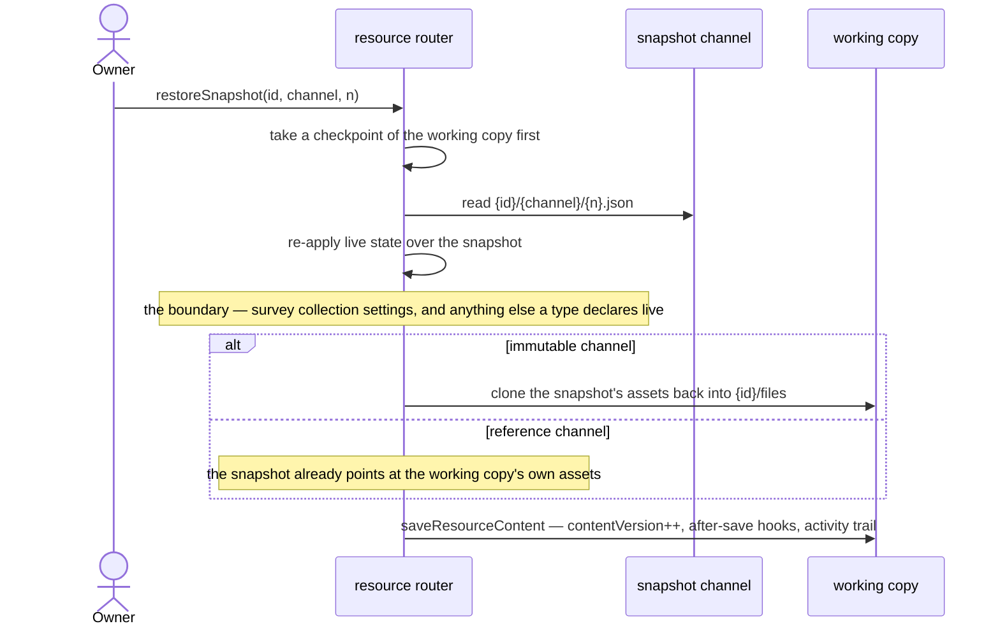

# Resource Snapshots

A resource can already be rolled back — but only to a deliberate publish, and only if it is a publishable type. Everything the rollback needs is built: an immutable content copy, an asset clone that makes the copy self-contained, a version counter that survives concurrency, a history read that needs no table, and a restore that lands through the ordinary save path. All of it is welded to `publishResource`.

This proposal **unwelds it**. Snapshots become a core mechanism addressed by **channel**; `published` is one channel; a new `checkpoints` channel gives every resource type restorable point-in-time versions of the working copy. Publishable stops owning the machinery and becomes its first consumer.

This supersedes the deferred draft-version-history idea, whose revisit trigger was answering its own open question — _periodic checkpoint copies, when and how many_ — and whose stated alternative, Azure Blob versioning, turns out not to be able to do the job at all.

## Scope

**Today** the snapshot machinery lives inside `createResourceProcedures`: `publishResource` claims a version on the `resource_publications` row, clones referenced assets into a per-attempt directory, writes `{id}/published/{n}.json`, and repairs itself when a concurrent unpublish breaks the version succession. `readPublishHistory` lists the prefix; `restorePublishedVersion` copies a snapshot back through `saveResourceContent`. A non-publishable type — Blueprint, Program, Sheet, TodoList — has none of this, and its working copy has exactly one recoverable state: the current one.

**This adds** a channel abstraction over that machinery, a second channel, a retention rule, a declared snapshot boundary, one Postgres column for the checkpoint counter and one for publish-time drift, and the Overview and blade surfaces that show them. It changes no blob layout that exists today.

### Why not Azure Blob versioning

Closing this properly, because it is the option that looks cheapest and is the one that cannot work.

**A resource version is not a blob version.** A version of a resource is `content.json` _plus the assets it references_ under `{id}/files/`. Azure versions each blob on its own timeline with no cross-blob consistency point, so "restore this resource as of Tuesday" resolves to Tuesday's JSON pointing at asset urls whose blobs have since been replaced or deleted. There is no version of the _set_. The publish path solved exactly this problem by cloning assets alongside the content and rewriting the urls to the clones — which is a thing the application does and the storage account cannot.

Three lesser reasons, each independently sufficient:

- Versioning is a **blob-service property**, not a container one. Enabling it for `resource-assets` enables it for `message-assets`, `public-user-assets` and every other container on the account, and scoping retention back down means enumerating the other containers in a lifecycle rule, because `prefixMatch` has no exclusion.
- Non-current versions are **billed but invisible to the ledger**. `chargeAndEmitStorageLedgerEntry` charges the current blob and `reconcileStorageLedgerEntryHandler` reconciles off `BlobCreated`; a version is neither, so every user's quota would understate what they cost ([storage quotas](/docs/platform/storage-quotas)).
- A version is addressed by an opaque version id, which nothing in the app stores, lists, or hands to a restore.

Manual snapshots are the mechanism. Blob versioning stays off.

### The mechanism: channels

A snapshot channel is a directory segment under the resource prefix plus a small definition of how snapshots on it behave:

```text
{id}/content.json                        working copy
{id}/checkpoints/{n}.json                checkpoint channel — reference kind, owner-only
{id}/published/{n}.json                  published channel — immutable kind, publicly served
{id}/published/{publishId}/files/…       the immutable channel's asset clones
{id}/files/…                             binary assets, FileAssets types only
```

`SnapshotChannelDefinitionMap` is the one place a channel says what it is: its kind, its retention, its counter, and whether the snapshot is publicly servable. Every operation — take, list, restore, evict — reads its behaviour from there rather than from a branch at the call site.

The version counter stays in Postgres and is never derived from the listing. That is the rule publish already established and the one thing about it that is subtle: the listing answers _which snapshots exist_, the row answers _what the next version is and which one is live_, and the two are allowed to disagree — an unpublish sweep is best-effort, so retired blobs outlive the row that numbered them. Checkpoints take a `checkpointVersion` column on `resources` rather than a table of their own; there is nothing else to record about a checkpoint that the blob does not already carry.

### Two snapshot kinds

The clone is the expensive half of a snapshot and publish treats it as unconditional. Making it a declared property of the channel is what makes a second channel affordable:

| Kind          | What is written                                                            | Cost                                                | Survives                                            | Used by       |
| ------------- | -------------------------------------------------------------------------- | --------------------------------------------------- | --------------------------------------------------- | ------------- |
| **Immutable** | content + a clone of every referenced asset, urls rewritten to the clones  | one storage round trip **per referenced asset**     | the working copy deleting or replacing an asset     | `published`   |
| **Reference** | content only, urls untouched, resolving to live `{id}/files/…`             | one blob                                            | nothing — an asset the owner deletes is gone from it | `checkpoints` |

Checkpoints take the reference kind, and the trade is honest rather than reluctant: `{id}/files/` is only emptied by purge, which destroys the checkpoints in the same sweep, so the window in which a checkpoint can rot is exactly "the owner deleted an asset and then rolled back past the deletion". A rolled-back checkpoint with one broken image is strictly better than no rollback, and paying a per-asset clone on every checkpoint would mean no checkpoints at all.

The reference kind has a second consequence worth stating, because it removes a whole class of risk: **the checkpoint channel holds no assets**, only JSON. `parseResourceAssetPath` therefore needs no new segment, and the rule that `{id}/published/…` assets serve anonymously while a publication row exists cannot accidentally extend to checkpoints — there is nothing under the checkpoint prefix for it to serve.



### The snapshot boundary — and the defect it fixes

Survey already draws a line through its content blob that no other part of the system knows about. `model` is snapshot state; `settings` is live state, re-read on every public read by `transformPublicReadSurvey` so that closing a survey takes effect without re-publishing every participant link that was already sent.

That line is declared in only one direction. **Restore does not know about it, and gets it wrong today:** `restorePublishedVersion` copies the snapshot's content wholesale into the working copy, and the snapshot's content includes the `settings` frozen at publish time. Restoring an older version of a published survey therefore reverts its collection settings — silently reopening a closed survey, or flipping the response mode between Anonymous and Identified, which is a setting the write boundary makes authorization decisions on ([survey response modes](/docs/platform/survey-response-modes)). Nothing in the restore path or its confirmation dialog says this will happen.

So the boundary is promoted from a read-time hook on one channel into a **two-way declaration the snapshot mechanism owns**: a type states which parts of its content are snapshot state and which are live, and the mechanism applies it on every path that reconstitutes content from a snapshot — the public read, the owner's version view, and the restore. `transformPublicReadContent` stops being "the thing Survey does to public reads" and becomes the read half of that declaration, with restore re-applying live state over the snapshot before it writes.



Note the first step. A restore is the one operation that destroys draft work on purpose, and today it has no undo — the [publish history](/docs/platform/publish-history) blade warns about it in prose and that is the whole safety net. Checkpointing before overwriting is the cheapest and highest-value trigger in this proposal, and it falls out of the mechanism for free.

### When a snapshot is taken

**Saving is not one of them.** The instinct to make save and publish the same event is the right instinct about the _mechanism_ and the wrong one about the _cadence_, for five reasons that are all measurable in the code as it stands:

- `saveResourceContent` **is** the autosave path — it fires on every coalesced keystroke batch, not on a deliberate act.
- Sheet and Dashboard put real data in the content blob, so a snapshot's size tracks the artifact, not the edit. A per-save checkpoint of a large sheet copies the whole sheet on every batch.
- Every snapshot charges the ledger, so per-save checkpoints burn the owner's quota while they type — and the quota is rendered to them in the shell header.
- A history listing that grows per save is unbounded; `readPublishHistory` enumerates a prefix with no limit because publish counts are in the tens.
- Publish's version claim is a transaction plus a succession check, and putting that on the hottest write path in the app buys nothing that a coalesced checkpoint does not.

The triggers instead:

| Trigger                                       | Channel       | Rationale                                                                                   |
| --------------------------------------------- | ------------- | ------------------------------------------------------------------------------------------- |
| Publish command                               | `published`   | unchanged behaviour                                                                         |
| Before restore, import, or blueprint deploy   | `checkpoints` | the operations that overwrite a draft wholesale, and the only ones with no undo today       |
| **Save version** command                      | `checkpoints` | the deliberate milestone, taken by the owner                                                |
| First save after an idle window elapses       | `checkpoints` | at most one per window, so a working session leaves a handful of recovery points            |
| Every autosave                                | —             | never                                                                                        |

The idle-window trigger is what makes this a recovery feature rather than a manual discipline, and coalescing is the whole of its cost control: the window is a constant, and one checkpoint per window per resource is the ceiling.

### Retention

The published channel keeps everything and prunes nothing — that stays, because publishes are deliberate and rare, and a retired public artifact is something an owner may need to point at.

Checkpoints are a **ring buffer**: a fixed cap in the tens, oldest evicted when a new one lands. Eviction is not a blob delete on its own — it releases the checkpoint's ledger entry in the same step, or the ring buffer becomes a slow quota leak that nothing ever reconciles.

### Versions the owner sees

`contentVersion` is **not** a version anyone should be shown, and is not rendered anywhere today. It is an optimistic-concurrency token that increments once per autosave; surfacing it means telling an owner their document is at v437 because they typed 437 times. The number that is meaningful to a person is the checkpoint version, because it is the thing they can roll back to.

The two counters that reach the UI are different axes and must never be collapsed into one: **`publishVersion` is what the public sees**, **`checkpointVersion` is what you can return to**. Overview shows each only where it carries information:

| Type            | State                            | Status row                                                              |
| --------------- | -------------------------------- | ----------------------------------------------------------------------- |
| Not publishable | —                                | version, once at least one checkpoint exists                            |
| Publishable     | never published                  | `Draft` chip, plus version once at least one checkpoint exists          |
| Publishable     | published, draft unchanged since | `Published` chip, `v{publishVersion}`, up to date                       |
| Publishable     | published, draft moved since     | `Published` chip, `v{publishVersion}`, and that changes are unpublished |

The last row needs one thing that does not exist: **`resource_publications` records the `contentVersion` it published from**. Then "the draft has moved since the publish" is a comparison rather than a guess, and the Azure-portal-shaped answer to _is what I am looking at what the world sees_ stops being something an owner works out from timestamps. It is one column and it removes an entire class of "I thought I had published that".

The checkpoint blade is the [publish history](/docs/platform/publish-history) blade generalized — the same table, the same restore dialog, a channel switch — and it appears for every type, not only publishable ones. Publish history's capability gate becomes a gate on the _channel_, not on the blade.

## What this refactors

The point of the proposal is as much what it deletes as what it adds. Every item below is existing code that gets smaller or more honest:

- **`publishResource` shrinks to publication bookkeeping.** The version claim, the upload, the succession check and the repair move into `createSnapshot`; publish becomes "take a snapshot on the published channel, then point the row at it". That body is the largest single block in `createResourceProcedures.ts` today and none of it is about publishing.
- **The succession repair becomes a property of the channel kind.** It exists because an unpublish sweep can land between the clone and the claim. Reference channels have no clone and no sweep, so they carry none of it — the logic stops being something every snapshot pays attention to and becomes something immutable channels declare.
- **The restore clone becomes conditional.** `restorePublishedVersion` clones assets back because a published url lives under a prefix unpublish wipes. A reference snapshot already points at the working copy's own assets, so it clones nothing. Symmetric with the take path, driven by the same channel definition.
- **`getPublishedContentBlobName`, `createPublishedAssetsDirectoryName`, `readPublishHistory` and `restorePublishedVersion`** lose their `Published` prefixes and take a channel. `readSnapshotHistory` takes the "which is current" answer as an argument instead of knowing about publication rows.
- **`transformPublicReadContent` becomes the read half of the snapshot boundary** and is applied by restore as well, fixing the survey settings defect above.
- **The ledger touchpoints collapse to two** — charge on take, release on evict — instead of being restated per call site.

Nothing above changes a blob path that exists today, so there is no migration: `{id}/published/{n}.json` keeps its name and its meaning, and the first checkpoint is written under a prefix nothing has ever used.

## Consequences beyond the feature

- **Every resource type gains recovery**, including the ones with no publish path at all. That is the first cross-cutting mechanism that is _core_ rather than opt-in, which inverts the current dependency: today Publishable owns snapshots, afterwards snapshots are core and Publishable consumes them. The capability admission rule in [resources](/docs/architecture/resources) — a capability exists at two or more adopters — is satisfied trivially by "every type saves", which is the signal that it is not a capability.
- **Purge and soft delete are unaffected** and need no new step. Purge takes `{id}/` wholesale, which is already every channel.
- **Unpublish keeps sweeping only `{id}/published/`.** A checkpoint is not published state and must survive an unpublish; keeping the channels in separate prefixes is what makes that automatic rather than a condition someone has to remember.
- **Storage grows per owner**, bounded by the ring buffer times the content size. It is charged, metered and visible, so it behaves like any other content the owner keeps rather than like an invisible platform cost — which is precisely what Blob versioning would have been.

## Key files

| File                                                                            | Role                                                          |
| -------------------------------------------------------------------------------- | -------------------------------------------------------------- |
| `packages/app/server/trpc/procedure/resource/createResourceProcedures.ts`       | publish procedures — the machinery being extracted            |
| `packages/app/server/services/resource/getPublishedContentBlobName.ts`          | snapshot addressing, becomes channel-aware                    |
| `packages/app/server/services/resource/createPublishedAssetsDirectoryName.ts`   | per-attempt asset directory, immutable channels only          |
| `packages/app/server/services/resource/readPublishHistory.ts`                   | prefix listing as history, becomes channel-aware              |
| `packages/app/server/services/resource/cloneContentAssets.ts`                   | the immutable kind's asset clone                              |
| `packages/app/server/services/resource/saveResourceContent.ts`                  | the one content-write path every restore lands through        |
| `packages/app/server/services/survey/transformPublicReadSurvey.ts`              | the existing live-state declaration the boundary generalizes  |
| `packages/app/server/trpc/routers/resource.ts`                                  | `readPublishHistory` and `restorePublishedVersion`            |
| `packages/db-schema/src/schema/resources.ts`                                    | `checkpointVersion` column                                    |
| `packages/db-schema/src/schema/resourcePublications.ts`                         | published-from `contentVersion` column                        |
| `packages/app/app/components/Resource/PublishHistory/Index.vue`                 | the blade being generalized across channels                   |
| `packages/app/app/components/Resource/Overview.vue`                             | the Status row and the two version numbers                    |

## Notes

- [Named checkpoints](/docs/sheet-editor/rejected/named-checkpoints) was rejected for the Sheet editor on the grounds that undo/redo already traverses prior states. That rejection stands and does not conflict: it is about the in-session history stack, and every trigger here is about recovery _across_ sessions, where no undo stack exists. The Save version command is the one place they meet, and it is a resource-level command rather than an editor-level one.
- The idle window and the ring-buffer cap are the two numbers this proposal does not fix. Both are constants, both are cheap to change, and neither should be guessed in prose before the first implementation measures a real content blob.
