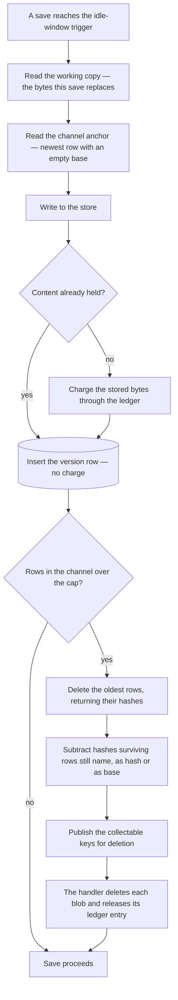

# Integration

Everything the owner sees is unchanged. What changes is that a version's identity moves out of a blob path and into a row, and its bytes move out of a full copy and into a content-addressed object.

## The table

`resourceVersions` replaces both the snapshot blob path and the blob metadata that rode on it. Keyed by the resource, the channel and the version number — the same three things the blob path spelled out — it carries the content address, the base the object decodes against, the two sizes, and the reason and label a version was taken with.

Storing **both** sizes matters. The plaintext size is what the history listing shows the owner, because it is the size of their document. The stored size is what the ledger charges, because it is what the account holds. Deriving either from the other is impossible, and conflating them is how the meter came to say something the owner could not account for.

The base hash is denormalised onto the row purely so garbage collection is a query rather than a walk of every surviving object's header, which is the reasoning [store design](/docs/proposals/platform/resource-version-store/store-design) sets out.

**The anchor is derived, not stored.** A channel's current anchor is the newest row in that channel whose base is empty, which the listing index already orders. A column holding it would be a second source of truth for something a single indexed read answers, and one that could disagree with the rows after a failed write.

## Object keys

An object is stored at a key scoped by owner rather than globally. Deduplication then applies within one account, which is where it fires in practice — successive versions of one owner's document — and it keeps attribution exact: an object has exactly one payer, so the ledger charges and credits it without a reference count spanning accounts, and one owner's deletion can never touch another's storage.

The keys stay in the resource assets container, so the ledger, the blob deletion path and the reconcile handler all keep working on them with no new container and no new Azure resource ([azure services](/docs/architecture/azure-services)).

## Taking a version

Two orderings are load-bearing and both already hold today. The version is taken **before** the write it protects, because what is worth keeping is what the save replaces. The charge happens **after** the resource transaction commits, because it takes the ledger row's lock and then the user's, and a transaction held open across those waits on locks it is itself holding ([storage quotas](/docs/platform/storage-quotas)).

The eviction is the one place the behaviour genuinely improves rather than merely getting cheaper. Today it computes a version number a fixed distance behind the newest one and publishes that blob path for deletion, which names a blob that is simply absent whenever a number was burned by a failed upload. With rows, eviction deletes the rows that fell out of the window and publishes exactly the object keys nothing else references — so the ring buffer sheds precisely what it holds, and a burned number is not a concept that exists.

Deletion still goes through the published event and its handler rather than a direct delete, because that path already deletes and releases as one retried unit and is the only thing that keeps a deleted blob from becoming a permanent ledger charge.

## Reading history and restoring

The history listing becomes a query over the channel ordered by version, which is what removes the blob prefix walk that backs it today. Reason, label and summary become columns; the size shown is the plaintext size.

A restore reads the version by its hash through the store and writes those bytes as the working copy. Everything downstream is untouched: the restore still takes its own version first, still bumps the content version, and still reconstitutes the type's live content on the way out.

Publishing takes a version in the published channel exactly as it takes one in revisions. The published content differs from the working copy — its asset urls are rewritten — so it is simply a different plaintext, anchoring its own lineage in its own channel. Nothing about the immutability of a published version changes.

## The charge

The ledger keeps its shape entirely. A version's object is a blob like any other: the store's write reports the stored bytes, the charge lands against the owner for that key, and the reconcile that follows the blob's own creation event corrects to the size storage actually recorded — which is the same number, because the store wrote exactly those bytes.

A deduplicated write charges nothing, because it stored nothing. That is the case that makes the meter honest about a save that changed nothing.

## What this deletes

Snapshot blob naming and snapshot blob metadata both go: a version is addressed by content and described by columns, so the path builder and the metadata builder have nothing left to build. The history listing loses its prefix walk. The summary keeps its function and changes only where the result is put.

The idle-window guard, the ring-buffer cap, the published channel's no-pruning rule and every trigger stay exactly as they are — this changes the cost of a version, never the policy about when one is taken.

## Key files

| File                                                                     | Role                                                                     |
| ------------------------------------------------------------------------ | ------------------------------------------------------------------------ |
| `packages/app/server/services/resource/snapshot/takeResourceRevision.ts` | the version take — becomes a store write plus a row insert               |
| `packages/app/server/services/resource/snapshot/readSnapshotHistory.ts`  | the prefix walk the listing uses — becomes a query over the version rows |
| `packages/app/server/services/resource/snapshot/getSnapshotSummary.ts`   | the summary, unchanged, stored in a column instead of blob metadata      |
| `packages/app/server/services/azure/eventGrid/publishBlobDeletion.ts`    | the deletion publish an eviction now hands an exact key set              |
| `packages/db/src/services/storage/chargeStorageLedgerEntry.ts`           | the charge, now for the object a version stored                          |
| `packages/db/src/services/storage/releaseStorageLedgerEntriesWhere.ts`   | the credit when a collected object is deleted                            |
| `packages/azure-functions/src/handlers/processBlobDeletionHandler.ts`    | deletes and releases each wave, unchanged                                |
| `packages/db-schema/src/schema/resources.ts`                             | the resource a version row hangs off, and the counter numbering it       |
