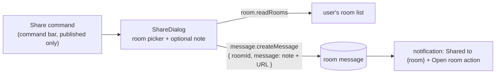

# Share to Esbabbler

A **Share** command on published resources: pick one of your rooms, and the public `/view/[type]/[id]` link lands there as a message — the first real bridge between the platform and the messaging product.

## Scope

**Today**: sharing a published resource means copying the public link from the Overview blade and pasting it into a room by hand. **This proposal adds** a Share command that does it in place. Client-side only — it reuses the existing esbabbler message-create path; no new procedures, no schema. Rich embeds stay [deferred](/docs/platform/deferred/esbabbler-link-unfurl) — the message is a plain URL and the view page's OG meta tags do the unfurling elsewhere.

## How it works

- **Command**: appears in `BladeActions` for `PublishableResourceType` **only while published** (an unpublished resource has no public URL to share).
- **Dialog**: `v-select` of the caller's rooms (existing `room.readRooms`), an optional message field, Share button. The sent message is `{note}\n{origin}{RoutePath.View(type, id)}` — plain text through the standard `message.createMessage` mutation, so RBAC, rate limits, and the message pipeline apply unchanged.
- **Feedback**: success lands in the notifications store ([notifications](/docs/platform/notifications)) with an **Open room** action.

## Key files

| File                                       | Role                                         |
| ------------------------------------------ | -------------------------------------------- |
| `app/components/Resource/ShareDialog.vue`  | room picker + note + send                    |
| `app/components/Resource/BladeActions.vue` | Share command (publishable + published gate) |

## Notes

- Deliberately one direction (platform → room). Surfacing "shared with me" inside the explorer is a different feature and would need read-model thought — not in this cut.
- If the user has no rooms, the dialog shows an empty state linking to esbabbler instead of a bare disabled button.
- The message is the caller's own message in their room — no special message type, no service-to-service write. Deleting the resource later leaves a dead link, same as any pasted URL.
