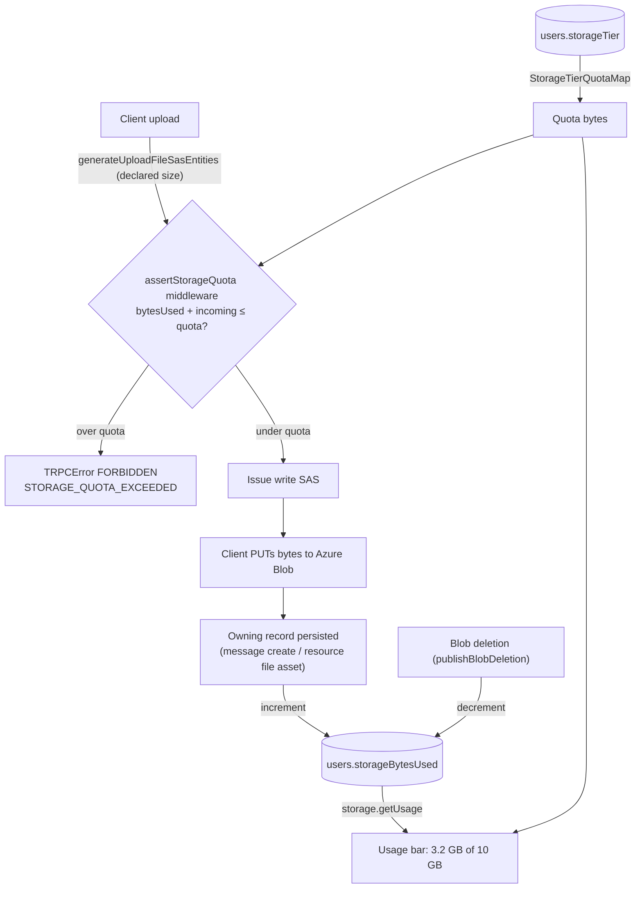

# Storage quotas

Give every user a bounded, tier-derived blob-storage allowance — Free = 10 GiB today — enforced before an upload is issued, and shown back to them as a Gmail-style "X of Y used" bar. This supersedes the previously-deferred storage usage surface: once a quota exists the usage number drives a real decision, so the display and the limit ship together rather than the display alone.

## Scope

**Works today.** Uploads go through a two-step SAS flow (server mints a scoped write SAS, client PUTs bytes straight to Azure). Per-file caps exist — `MAX_FILE_REQUEST_SIZE` (10 MB) and the per-room `maxFileSizeBytes` — enforced at `message.generateUploadFileSasEntities`. File size is persisted in **one** place only: the client-declared `FileEntity.size` embedded in message rows (Azure Table, partitioned by `roomId`). Resource file assets, resource `content.json`, published snapshots, avatars, and room images record **no size at all**. There is no per-user usage counter, no tier, and no per-user blob prefix that spans containers.

**What this adds.**

- A `StorageTier` model and a per-user quota derived from it (Free = 10 GiB).
- A per-user `bytesUsed` counter maintained in Postgres, incremented when an upload's owning record is persisted and decremented when its blobs are deleted.
- A pre-flight **quota-check tRPC middleware** on the two upload chokepoints that rejects an upload which would exceed the quota, before any SAS is issued.
- A `storage.getUsage` query and a Gmail-like usage bar on the account settings page.

**Explicitly out of scope for v1** (later phases / deferred): billing and paid-tier purchase flow; per-resource storage breakdown on the Overview blade (needs resource-asset sizes, added here, then a separate aggregation); hard byte-level enforcement against a client that PUTs more than it declared (see failure semantics).

## How it works

The quota has two independent halves: a **pre-flight check** (fast rejection, uses the client-declared size) at the SAS-issuing chokepoints, and a **counter** (the source of truth for "how much is used") maintained where the owning record is written and deleted. Keeping them separate is deliberate — the check must run before the SAS is minted (there is nothing persisted yet to count), while the counter must only move on a _confirmed_ upload (a persisted message/asset row), never on a SAS that may never be used.

The quota is **resolved from the tier at read time**, never copied onto the user row — so moving a user to a new tier changes their limit instantly, with no backfill. Only the _usage_ (`bytesUsed`) is stored, because it is expensive to recompute (there is no per-user blob prefix or size index — enumerating every `{resourceId}/` directory and message-attachment entity is exactly what got the display deferred).

## Data model

New, in `packages/db-schema`:

- `StorageTier` enum (`src/models/user/StorageTier.ts`) — `Free` only for now; the enum exists so paid tiers are a value add, not a schema change.
- `StorageTierQuotaMap` (`src/services/user/StorageTierQuotaMap.ts`) — `{ [StorageTier.Free]: 10 * GIBIBYTE }` as `const satisfies Record<StorageTier, number>`. Needs a `GIBIBYTE` constant (`MEGABYTE * KIBIBYTE`) added beside `KIBIBYTE`/`MEGABYTE` in `#shared/services/app/constants` (and the node-side `@esposter/configuration` mirror).
- `users` gains two columns: `storageTier` (pg enum, `notNull().default(StorageTier.Free)`) and `storageBytesUsed` (`bigint` mode `"number"`, `notNull().default(0)` — 10 GiB is ~1e10, far under the 2^53 safe-integer ceiling).

This is a Postgres migration: edit the Drizzle schema, then the user runs `pnpm db:gen` and applies it on next app start (never auto-run `db:gen`). Existing users backfill `storageBytesUsed` lazily — it starts at `0` and self-heals on the first Phase-2 reconciliation sweep; until then the pre-flight check simply under-counts historical usage, which is safe (it never over-rejects).

## Enforcement architecture

The enforcement seam is a **targeted tRPC middleware**, not a global plugin. `achievementPlugin`/`moderationLogPlugin` `.concat` onto every authed procedure because they run _after_ every mutation; a quota check is the mirror image — it runs _before_, and only on the two procedures that consume storage, so a global plugin would have to special-case which paths are uploads. Instead:

- A factory `getStorageQuotaMiddleware(getIncomingBytes)` returns a `standardAuthedProcedure`-compatible `.use()` step. It sums the declared incoming bytes from the procedure input, resolves the caller's quota (`StorageTierQuotaMap[user.storageTier]`), reads `storageBytesUsed`, and throws `TRPCError` `FORBIDDEN` with a `STORAGE_QUOTA_EXCEEDED` code when `bytesUsed + incoming > quota`.
- It is applied to **both** upload chokepoints: `message.generateUploadFileSasEntities` (already receives `size` per file) and the resource `generateUploadFileSasEntities` inside `createResourceProcedures` (whose input schema must be **widened to carry `size`**, matching the message path — the single required change to an existing contract).

The **counter** is maintained where the owning record's lifecycle already lives, so it stays transactional with the write:

- **Increment** on successful persistence of the record that owns the blobs — `createMessage` (sum of `files[].size`) and the resource file-asset create — not at SAS issuance (a SAS that is never used must not count).
- **Decrement** on deletion through the existing `publishBlobDeletion` path (message `deleteFile`/`deleteMessage`, resource `unpublishResource`, room-image replace), which already funnels every blob delete.

## Usage surface

`storage.getUsage` (a `standardAuthedProcedure` query) returns `{ bytesUsed, quotaBytes, tier }`. The account/settings page renders a `v-progress-linear` bar with the existing `getFileSize` formatter — "3.2 GB of 10 GB used" — turning red near the cap. This is the deferred usage surface, now with a number that means something. A per-resource breakdown stays deferred until resource-asset sizes (added above) have accumulated enough to aggregate.

## Phasing

- **Phase 1 (this proposal).** Tier + counter + pre-flight middleware + usage bar, all in Postgres, using the client-declared size. Simple, transactional, no new Azure resources.
- **Phase 2 (hardening, separate spec).** Reconcile against reality: an Event Grid `BlobCreated` handler reads the actual `contentLength` and corrects the counter (the estate already runs Event Grid blob plumbing — `publishBlobDeletion`/`processBlobDeletionHandler`), plus a periodic `listBlobsFlat` sweep that recomputes a user's usage to self-heal drift and backfill pre-existing users.

## Failure and retry semantics

- **The write SAS has no size cap**, so a client can PUT more bytes than it declared. Phase 1 therefore under-counts a misbehaving client; the quota is advisory-but-enforced-at-issuance, not byte-hard. Phase 2's reconciliation is what closes this — v1 accepts the gap because the threat is a user overspending their _own_ allowance, not one user exhausting another's.
- **SAS issued but record never persisted** (client abandons the upload): the counter never moves (it increments only on persistence), so an orphaned blob does not consume quota. Existing blob-lifecycle / dangling-asset cleanup sweeps the orphan.
- **Decrement is best-effort**: `publishBlobDeletion` failures leave the counter high; the Phase-2 sweep reconciles. A stale-high counter can only _under_-serve the user (rejects slightly early), never over-serve — the safe direction.

## Key files

| File                                                                      | Role                                                                     |
| ------------------------------------------------------------------------- | ------------------------------------------------------------------------ |
| `packages/db-schema/src/models/user/StorageTier.ts`                       | Tier enum (`Free`)                                                       |
| `packages/db-schema/src/services/user/StorageTierQuotaMap.ts`             | Tier → quota bytes                                                       |
| `packages/db-schema/src/schema/users.ts`                                  | `storageTier` + `storageBytesUsed` columns (migration)                   |
| `packages/app/shared/services/app/constants.ts`                           | Add `GIBIBYTE`                                                           |
| `packages/app/server/trpc/middleware/getStorageQuotaMiddleware.ts`        | Pre-flight quota-check middleware factory                                |
| `packages/app/server/trpc/routers/message/index.ts`                       | Apply middleware to `generateUploadFileSasEntities`; increment on create |
| `packages/app/server/trpc/procedure/resource/createResourceProcedures.ts` | Widen upload input with `size`; apply middleware; increment              |
| `packages/app/server/trpc/routers/storage.ts`                             | `getUsage` query                                                         |
| `packages/app/app/components/.../StorageUsageBar.vue`                     | Gmail-like usage bar on account settings                                 |

## Notes

Cheapest viable infrastructure: Phase 1 adds **no** Azure resources — it is two Postgres columns, one middleware, one query, and a component. Phase 2 reuses the existing Event Grid system topic already wired for blob-deletion cleanup, adding one subscription + handler, no new standing-cost resource.
