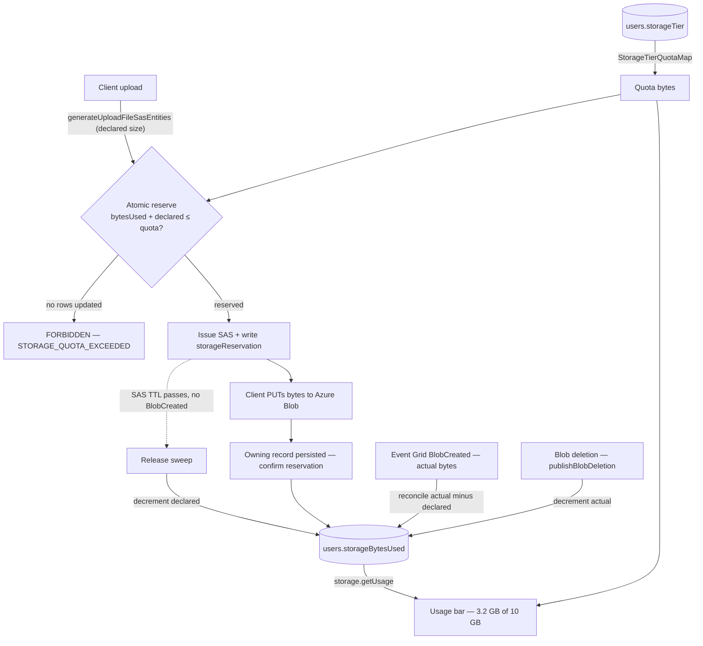

# Storage quotas

Give every user a bounded, tier-derived blob-storage allowance — Free = 10 GiB today — that they genuinely cannot exceed by hammering uploads, shown back to them as a Gmail-style "X of Y used" bar. This supersedes the previously-deferred storage usage surface: once a quota exists the usage number drives a real decision, so the display and the limit ship together rather than the display alone.

## Why a plain pre-flight check is not enough

The obvious design — "read `bytesUsed`, if under quota issue the SAS" — does not stop abuse, for two structural reasons:

1. **It races.** Read-then-check is not atomic. A client firing many upload requests concurrently has them all read the same low `bytesUsed`, all pass, and all upload — blowing past the quota by an unbounded amount.
2. **The SAS carries no byte cap.** Uploads use a two-step flow: the server mints a scoped write SAS, the client PUTs bytes **directly to Azure Blob**. The server is never in the data path, so it cannot stop a client that declares 1 MB and PUTs 1 GB, and it cannot abort a transfer mid-stream.

This is the difference from Gmail/Drive: their uploads flow **through Google's servers** (resumable-upload protocol), so the server reserves quota at session start, counts bytes as they stream, and hard-aborts with `storageQuotaExceeded` the instant you cross the line. We structurally cannot hard-abort a direct-to-blob upload — so instead of one server-side gate we use **reserve-and-reconcile**.

## How it works — reserve, confirm, reconcile, release

The counter (`users.storageBytesUsed`) is a running total that is moved through a small state machine so that concurrency, over-declaring, and abandoned uploads are all handled:

1. **Reserve** (at SAS issuance). The quota middleware does an **atomic conditional increment**: `UPDATE users SET storageBytesUsed = storageBytesUsed + :declared WHERE id = :id AND storageBytesUsed + :declared <= :quota`. Zero rows updated ⇒ over quota ⇒ reject with `FORBIDDEN` before any SAS is minted. The `WHERE` makes it a compare-and-swap, so concurrent requests serialize on the row and cannot collectively overshoot. A `storageReservation` row (`userId`, blob name, `declaredBytes`, `expiresAt`) records the provisional hold so it can later be confirmed or released.
2. **Confirm** (at persistence). When the owning record is written (`createMessage`, resource file-asset create), the reservation is marked confirmed. The counter already holds the declared bytes, so confirmation is bookkeeping, not a second increment.
3. **Reconcile to actual** (Event Grid `BlobCreated`). The real `contentLength` is only knowable after the bytes land. A `BlobCreated` handler adjusts the counter by `actual − declared`, making usage the authoritative sum of stored object sizes — this is what closes the "client under-declared" gap.
4. **Release** (abandoned reservation). If a reservation's `expiresAt` (the SAS TTL) passes with no `BlobCreated`, a sweep decrements the counter by `declaredBytes` and drops the row — the rollback half. Deletion of a stored blob decrements by its actual size through the existing `publishBlobDeletion` path.

The quota itself is **resolved from the tier at read time**, never copied onto the user row — moving a user to a new tier changes their limit instantly, with no backfill. Only the _usage_ is stored, because it is expensive to recompute (there is no per-user blob prefix or size index — enumerating every `{resourceId}/` directory and message-attachment entity is exactly what got the display deferred).

## The residual gap, and why it is acceptable

Because we cannot abort a single in-flight direct-to-blob upload, a client that under-declares overshoots its quota by whatever gap exists between the declared and actual bytes, until the `BlobCreated` reconcile corrects the counter and the next reserve is rejected. This is **not** bounded to one file: many SAS uploads can be in flight at once, each declaring a small size but PUTting up to `MAX_FILE_REQUEST_SIZE` (10 MB) before its `BlobCreated` event arrives, so the worst-case overshoot is the **sum across all concurrently in-flight uploads**. We bound it by capping the number of outstanding unconfirmed reservations per user (`declaredBytes` is held by each, but a tiny declaration would otherwise let a client open arbitrarily many holds), so the overshoot ceiling is `maxConcurrentReservations × MAX_FILE_REQUEST_SIZE`. Even at that ceiling the abuser only ever exhausts **their own** allowance — never another user's, never the account globally (the budget guard still backstops spend). For a free tier that is a fine trade.

True Gmail-style hard enforcement would require **proxying uploads through our own server** so it can count bytes and abort mid-stream. That is rejected: it puts our compute in the data path for every upload (cost, latency, and re-architecting the entire SAS flow) to close a 10 MB, self-inflicted gap.

## Data model

New, in `packages/db-schema`:

- `StorageTier` enum (`src/models/user/StorageTier.ts`) — `Free` only for now; the enum exists so paid tiers are a value add, not a schema change.
- `StorageTierQuotaMap` (`src/services/user/StorageTierQuotaMap.ts`) — `{ [StorageTier.Free]: 10 * GIBIBYTE }` as `const satisfies Record<StorageTier, number>`. Needs a `GIBIBYTE` constant (`MEGABYTE * KIBIBYTE`) added beside `KIBIBYTE`/`MEGABYTE` in `#shared/services/app/constants` (and the node-side `@esposter/configuration` mirror).
- `users` gains `storageTier` (pg enum, `notNull().default(StorageTier.Free)`) and `storageBytesUsed` (`bigint` mode `"number"`, `notNull().default(0)` — 10 GiB is ~1e10, far under the 2^53 safe-integer ceiling).
- `storageReservation` table — `userId`, blob name, `declaredBytes`, `expiresAt`, `confirmed`, with a unique constraint on (`userId`, blob name) so a retried SAS request cannot create a duplicate hold. The pending-hold ledger that makes confirm/release possible; rows are short-lived (dropped on confirm-then-reconcile or on release). A per-user cap on outstanding unconfirmed rows bounds the concurrent-overshoot ceiling described above.

This is a Postgres migration: edit the Drizzle schema, then the user runs `pnpm db:gen` and applies it on next app start (never auto-run `db:gen`). Existing users start at `storageBytesUsed = 0`, so for them the gate is **advisory until the Phase 2 backfill reconciles their real usage** — a user already over 10 GiB can keep uploading until that sweep lands. This is a deliberate rollout gate, not silent over-serving: hard rejection is only meaningful for a user once their counter reflects reality. New users are hard-capped from their first upload (their counter is accurate from zero); pre-existing users become hard-capped the moment the reconciliation sweep backfills them. Under-counting only ever _under_-rejects (leans lenient), so the advisory window never wrongly rejects a legitimate upload.

## Enforcement architecture

The reserve step is a **targeted tRPC middleware**, not a global plugin. `achievementPlugin`/`moderationLogPlugin` `.concat` onto every authed procedure because they run _after_ every mutation; the reserve is the mirror image — it runs _before_, and only on the two procedures that issue upload SASs, so a global plugin would have to special-case which paths are uploads. Instead:

- A factory `getStorageReservationMiddleware(getDeclaredBytes)` returns a `standardAuthedProcedure`-compatible `.use()` step. **Each declared `size` is validated at the input boundary first** — `z.number().int().nonnegative().max(MAX_FILE_REQUEST_SIZE)` per file — so a negative, fractional, non-finite, or oversized value is rejected with `BAD_REQUEST` before it can reach the counter. This is load-bearing: a negative declaration would otherwise _decrement_ `storageBytesUsed` and bypass the quota entirely. It then sums the validated declared bytes, resolves the caller's quota (`StorageTierQuotaMap[user.storageTier]`), and — in a **single database transaction** — runs the atomic conditional `UPDATE` and inserts the `storageReservation` row. Both commit together or both roll back: a crash between them can never leave the counter incremented without a ledger row to release it. On zero rows updated it throws `TRPCError FORBIDDEN` with a `STORAGE_QUOTA_EXCEEDED` code. The SAS is minted **only after the transaction commits**.
- **Idempotent retry.** The reservation's unique `(userId, blob name)` key makes the reserve idempotent, not merely conflict-rejecting — otherwise a client retrying after a lost response would hit the constraint and never obtain a SAS. On a collision with an existing row: an _unconfirmed_ row whose `declaredBytes` matches skips the increment and re-mints a fresh SAS against the same hold; a _mismatched_ declared size is rejected with `CONFLICT` rather than silently re-reserving; an _expired_ row is treated as released and a new reservation is taken; a _confirmed_ row means the upload already persisted, so it short-circuits without a second increment. The counter therefore moves exactly once per logical upload however many times the client retries.
- Applied to **both** upload chokepoints: `message.generateUploadFileSasEntities` (already receives `size` per file) and the resource `generateUploadFileSasEntities` inside `createResourceProcedures` (whose input schema must be **widened to carry `size`**, matching the message path — the single required change to an existing contract).

Confirm/reconcile/release live where each signal already arrives: confirmation at the persistence procedures, reconciliation in a `BlobCreated` Event Grid handler, release in a scheduled sweep of expired reservations (Service Bus timer, the same mechanism scheduled-message jobs use), and the decrement in the existing `publishBlobDeletion` path.

## Usage surface

`storage.getUsage` (a `standardAuthedProcedure` query) returns `{ bytesUsed, quotaBytes, tier }`. The account/settings page renders a `v-progress-linear` bar with the existing `getFileSize` formatter — "3.2 GB of 10 GB used" — turning red near the cap. This is the deferred usage surface, now with a number that means something. A per-resource breakdown stays deferred until resource-asset sizes have accumulated enough to aggregate.

## Phasing

- **Phase 1 — the gate.** Tier + `storageBytesUsed` + `storageReservation`, the atomic reserve middleware, confirm-at-persistence, the release sweep, decrement-on-delete, and the usage bar. Uses the client-declared size; the reserve is what actually caps abuse. No new Azure resources. Hard rejection is live for new users immediately and becomes live for pre-existing users once Phase 2 backfills them; the over-declare gap is open but bounded (concurrent in-flight uploads × per-file cap).
- **Phase 2 — the truth.** The Event Grid `BlobCreated` reconciliation (declared → actual) plus a periodic `listBlobsFlat` sweep that recomputes a user's usage from real object sizes to correct drift and backfill pre-existing users — the backfill is the gate that flips those users from advisory to hard-capped. Reuses the existing Event Grid blob plumbing (`publishBlobDeletion` / `processBlobDeletionHandler`), no new standing-cost resource.

## Failure and retry semantics

- **Client under-declares / PUTs more than reserved:** counter is low until `BlobCreated` reconciles it up; the next reserve then rejects. Bounded to (concurrent in-flight uploads × per-file cap) by the outstanding-reservation cap, self-inflicted.
- **SAS issued, upload abandoned (no persistence, no `BlobCreated`):** the reservation expires and the sweep releases the declared bytes; any orphan blob is swept by existing dangling-asset cleanup. The counter self-heals rather than leaking the hold forever.
- **Persistence fails after a successful PUT:** the reservation is never confirmed → released on expiry; the blob is an orphan, swept. No permanent quota consumed.
- **Decrement / release best-effort:** a missed `publishBlobDeletion` or sweep leaves the counter high, which only _under_-serves the user (rejects slightly early) — the safe direction — and the Phase-2 recompute sweep corrects it.

## Key files

| File                                                                      | Role                                                          |
| ------------------------------------------------------------------------- | ------------------------------------------------------------- |
| `packages/db-schema/src/models/user/StorageTier.ts`                       | Tier enum (`Free`)                                            |
| `packages/db-schema/src/services/user/StorageTierQuotaMap.ts`             | Tier → quota bytes                                            |
| `packages/db-schema/src/schema/users.ts`                                  | `storageTier` + `storageBytesUsed` columns (migration)        |
| `packages/db-schema/src/schema/storageReservation.ts`                     | Pending-hold ledger for confirm/release (migration)           |
| `packages/app/shared/services/app/constants.ts`                           | Add `GIBIBYTE`                                                |
| `packages/app/server/trpc/middleware/getStorageReservationMiddleware.ts`  | Atomic reserve + write reservation at SAS issuance            |
| `packages/app/server/trpc/routers/message/index.ts`                       | Reserve on `generateUploadFileSasEntities`; confirm on create |
| `packages/app/server/trpc/procedure/resource/createResourceProcedures.ts` | Widen upload input with `size`; reserve; confirm              |
| `packages/azure-functions/src/handlers/reconcileStorageUsageHandler.ts`   | Phase 2: `BlobCreated` declared→actual reconcile              |
| `packages/app/server/trpc/routers/storage.ts`                             | `getUsage` query                                              |
| `packages/app/app/components/.../StorageUsageBar.vue`                     | Gmail-like usage bar on account settings                      |

## Notes

Cheapest viable infrastructure: Phase 1 adds **no** Azure resources — Postgres columns + a table, one middleware, a confirm/release path on existing procedures, one query, and a component. Phase 2 reuses the existing Event Grid system topic already wired for blob-deletion cleanup, adding one subscription + handler.
