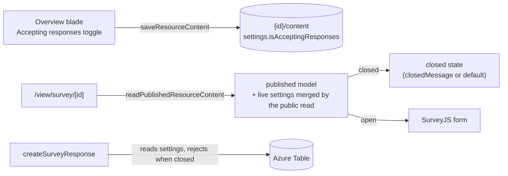

# Survey Response Controls

A published survey needs a way to **stop collecting** that isn't tearing the page down. Today the only lever is unpublish, which 404s the public URL — every already-sent invite link turns into a dead page. This adds an **Accepting responses** toggle (Google Forms parity) enforced server-side, with the respondent page rendering a closed message instead of the form.

## Scope

**Today**: publish/unpublish is the only lifecycle. Anyone with the link can answer any published survey forever; closing = 404ing your own invites.

**This proposal adds** a boolean toggle plus an optional closed message. Deliberately **not** included: close-at-date scheduling (that is [publish scheduling](/docs/platform/deferred/publish-scheduling)'s shape — one timer subsystem, not two), response caps, and one-response-per-person (an identity question owned by [response modes](/docs/proposals/platform/survey-response-modes), not a control). The `settings` section this introduces is the same object response modes extends.

## How it works

The flag must be **live state, not snapshot state** — closing must take effect without re-publishing, so it cannot live in the published content blob. It also must not require a blob read per anonymous submission.

Chosen home: a nullable-free `isAcceptingResponses` boolean column on `resource_publications` **is rejected** (survey-only attribute on a generic table). Instead: a survey-specific `surveyPublicationSettings` value in the **working** content blob (`surveySchema` gains `settings: { isAcceptingResponses: boolean; closedMessage: string }`, defaults open/`""`), read live at the two enforcement points:

- **Public read**: `readPublishedResourceContent` for Survey merges the live flag into its response via the existing per-type hook seam (a survey-specific wrapper procedure, mirroring how `transformPublishedContent` is survey-specific) — the published model snapshot itself stays immutable.
- **Server enforcement**: `createSurveyResponse` / `updateSurveyResponse` load the survey's working settings and reject with a conflict error when closed — the client state can never bypass it. This adds one blob read per submission; submissions are rate-limited and low-volume, so no caching until measured.
- **Owner UX**: the toggle lives on the Survey Overview summary slot next to publish status; the closed message is an inline text field (`normalizeString`, `MAX_*` cap).
- **Respondent UX**: closed renders a `StyledEmptyState`-style card with the message — the URL stays alive, unlike unpublish.

## Key files

| File                                        | Role                                                   |
| ------------------------------------------- | ------------------------------------------------------ |
| `app/shared/models/…/survey` content schema | `settings` section                                     |
| `server/trpc/routers/survey.ts`             | enforcement in response mutations + merged public read |
| `app/components/Resource/Survey/View.vue`   | closed state                                           |
| Survey Overview summary component           | toggle + closed message field                          |

## Notes

- Settings live in the content blob per the standard — one artifact, one write path, one `contentVersion` ([/docs/architecture/resources](/docs/architecture/resources)). The Overview toggle saves through the same `saveResourceContent` as the editor; optimistic-concurrency conflicts surface through the existing stale-version path.
- In-flight respondents (form open when the survey closes) get the server rejection on submit; the client maps it to the closed state rather than a raw error.
- Un-deferring close-at-date later is additive: the timer flips the same flag.
