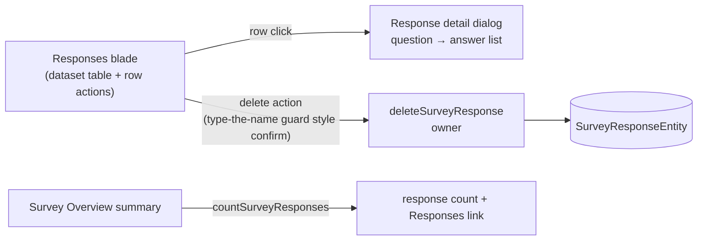

# Survey Response Management

The Responses blade is currently a read-only flat table. Real collection runs accumulate test submissions before launch and junk after — and there is no way to remove a single response, inspect one respondent's full answers, or even see how many responses exist without opening the blade. This adds the minimum owner-side operations: a detail view, per-response delete, and a count on the Overview summary.

## Scope

**Today**: `Resource/Survey/Responses.vue` renders `dataset.readDataset` rows in a bare `v-data-table`; the only owner-side response procedure is `readSurveyResponse` (used for respondent resume, not owner tooling). Deleting anything means deleting the whole survey.

**This proposal adds** three small pieces over the existing Azure Table data — no new services, no schema change:

- **Detail dialog** — a per-row action opening the response as a question → answer list (the dataset row rendered vertically, singleton dialog per the dialog conventions). Answers already arrive flattened through the dataset; no new read path.
- **Delete** — `deleteSurveyResponse({ id, rowKey })` — the survey id is the partition key, derived server-side, never accepted from the caller — owner-gated via `getOwnerProcedure(ResourceType.Survey, …)`, deleting the Azure Table entity. Destructive confirm follows [resource page parity](/docs/platform/resource-page-parity) guard patterns.
- **Count** — `countSurveyResponses(id)`, owner-gated, surfaced on the Survey Overview summary slot ("N responses" linking to the Responses blade). Azure Table has no cheap server-side count, so this counts keys-only pages up to `AZURE_MAX_PAGE_SIZE + 1` and returns the count plus an `isCapped` flag — the extra key is what distinguishes exactly-cap from beyond-cap, and only `isCapped` renders `1000+` — consistent with the dataset row cap ([warning](/docs/platform/dataset-row-cap-warning)).

## Procedures

| Procedure              | Auth  | Input            | Purpose                    |
| ---------------------- | ----- | ---------------- | -------------------------- |
| `deleteSurveyResponse` | owner | `{ id, rowKey }` | remove one response entity |
| `countSurveyResponses` | owner | `{ id }`         | capped response count      |

## Key files

| File                                           | Role                        |
| ---------------------------------------------- | --------------------------- |
| `server/trpc/routers/survey.ts`                | the two procedures          |
| `app/components/Resource/Survey/Responses.vue` | row actions + detail dialog |
| Survey Overview summary component              | count + blade link          |

## Notes

- The dataset contract stays untouched — delete/count are survey-specific owner tooling, not dataset capabilities (single consumer; admission rule in [/docs/architecture/resources](/docs/architecture/resources)).
- Deleting a response needs its `rowKey`, which the dataset rows don't carry today — the Responses blade threads row keys alongside the dataset rows (a blade-local read concern, not a `Dataset` shape change).
- Bulk delete-all ("reset before launch") is one confirmation away from the same procedure in a loop; add it only if single delete proves insufficient.
- Editing a respondent's answers is deliberately out — owners moderate, they don't rewrite answers.
