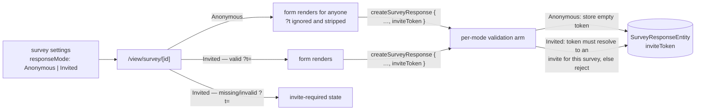

# Survey Response Modes

Make response identity an explicit, server-enforced survey setting instead of an implicit "everything is anonymous". A survey declares its **response mode**: **Anonymous** (today's behavior — anyone with the link, no identity carried) or **Invited** (responses must present an opaque invite token issued by a [Campaign](/docs/proposals/platform/campaign-resource), so every answer joins back to a recipient server-side). The mode is an enum, the enforcement is one validation arm per mode — that is the whole extensibility mechanism, and it is deliberately boring.

## Scope

**Today**: every survey is anonymous-by-accident. There is no way to run a closed-audience survey, and no way to correlate a response with the invite that produced it — "who hasn't answered yet" is unanswerable.

**This proposal adds** the mode enum, the token field on the response entity, and the per-mode validation at the public write boundary. Token _issuance and resolution_ belong to the Campaign resource — this page is only the survey-side foundation. **No identifying value ever appears client-side**: the URL carries an opaque UUID token or nothing; what a token means is resolvable only by the owner, server-side.

## How it works

- **Setting**: `responseMode` joins the survey content `settings` section (alongside the [response controls](/docs/proposals/platform/survey-response-controls) toggle) — one settings object, one write path, one `contentVersion`. Default `Anonymous`; the enum ref defaults per the TypeScript conventions.
- **Entity**: `surveyResponseEntitySchema` gains `inviteToken` (opaque UUID string, default `""`). It is deliberately **not** surfaced as a SurveyResponses dataset column — raw tokens mean nothing to a human, and the joined view is the Campaign's status dataset. Client code never interprets tokens.
- **Respondent page**: reads `?t=` once on load and threads it through create/update. In Invited mode with no valid token it renders an invite-required state (the survey model is not even fetched — the gate runs in the public read, which knows the mode from the merged live settings, same seam as response controls).
- **Validation matrix** (server, in `createSurveyResponse`/`updateSurveyResponse`): Anonymous → token stripped to `""` (a stale invite link into a now-anonymous survey still works, it just carries nothing); Invited → the token must exist in the campaign invite table for a campaign bound to this survey, else reject. Mode changes take effect live — they live in working settings, not the publish snapshot.

**Extending later is one enum value + one validation arm** — e.g. an `Authenticated` mode (logged-in Esposter users, one response per user) would add a session check and store the user id in the same identity slot. The foundation is the explicit mode + the per-mode boundary check, not any particular mode.

## Key files

| File                                           | Role                                      |
| ---------------------------------------------- | ----------------------------------------- |
| survey content schema (`settings` section)     | `responseMode` enum                       |
| `packages/db-schema` `SurveyResponseMode` enum | mode values                               |
| `SurveyResponseEntity`                         | `inviteToken` field                       |
| `server/trpc/routers/survey.ts`                | per-mode validation in response writes    |
| `app/components/Resource/Survey/View.vue`      | `?t=` passthrough + invite-required state |

## Notes

- Anonymous and Invited are collection-time postures, not privacy promises about the answers — an Invited survey's owner sees who said what (that is its purpose); an Anonymous survey's owner structurally cannot. The survey editor should say this where the mode is picked.
- Rejected shape: attributing via a raw `?ref={{column}}` value substituted from the audience dataset. It puts recipient data (potentially an email address) into a shareable URL and trusts the client with identity — opaque server-issued tokens keep identity resolution owner-side only.
- Switching a survey with existing responses between modes never mutates stored responses; the mode governs the write boundary from now on. The Responses blade is unaffected either way.
