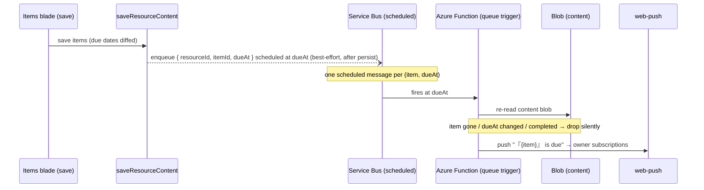

# TodoList Due Reminders

A TodoList item with a due date pushes a reminder to its owner when it comes due — the first platform feature to use the notification infrastructure esbabbler already runs, and the thing that turns the TodoList type from a table into an actual todo product.

## Scope

**Today**: due dates render in the Items and Calendar blades and nothing else happens. **This proposal adds** delivery only — no new Azure services: the Service Bus scheduled-message pattern (already used for scheduled message jobs) carries the timer, and the existing web-push pipeline (`ProcessPushNotification` + push subscriptions) carries the notification.

## How it works

- **Scheduling**: after a TodoList `saveResourceContent` persists, the server diffs due dates and enqueues one scheduled Service Bus message per new/changed `(itemId, dueAt)` — best-effort per the error conventions (a failed enqueue logs, never fails the save).
- **Verification at fire time is the consistency model**: the function re-reads the content blob and drops the reminder if the item was deleted, completed, or re-dated (a re-dated item enqueued a fresh message at save time). This makes stale messages harmless, so saves never have to cancel previously enqueued ones.
- **Delivery**: the existing push path — same subscription rows, same `ProcessPushNotification`-style function shape; clicking the notification opens `/resources/{id}/items`.

## Data model

None in Postgres. TodoList item shape gains nothing new if `dueAt` already exists (the Calendar blade implies it); the reminder is stateless — the scheduled message is the state, and the blob re-read is the truth check.

## Key files

| File                                                         | Role                                |
| ------------------------------------------------------------ | ----------------------------------- |
| `packages/azure-functions/src/functions/sendTodoReminder.ts` | queue-triggered verify + push       |
| `server/trpc/routers/todoList.ts`                            | post-save due-date diff + enqueue   |
| `app/components/Resource/TodoList/Items.vue`                 | due-date affordance already present |

## Notes

- At-least-once delivery: a duplicate fire re-verifies against the blob and pushes twice in the worst case — acceptable for reminders; dedup state is not worth a table.
- Reminder timing is exactly `dueAt` in the first cut; lead-time offsets ("remind me 1h before") are a follow-up field, not a reason to build preference UI now.
- Owner-only: TodoLists are single-owner resources, so the recipient set is the owner's push subscriptions — no fan-out logic.
