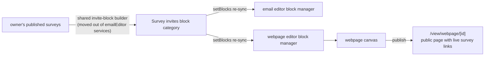

# Webpage Survey Invite Blocks

The email editor already offers the owner's published surveys as drag-in invite-button blocks ([email personalization](/docs/platform/email-personalization)). The webpage editor — the other GrapesJS surface — doesn't, even though a published webpage is the most natural place to put "take our survey": a landing page collecting responses from anyone who finds it, with zero send infrastructure.

## Scope

**Today**: putting a survey link on a webpage means publishing the survey, copying its URL from the Overview blade, and hand-authoring a link in the webpage canvas.

**This proposal adds** the same invite-block category to the webpage editor. The block source (owner's published surveys → styled button linking `RoutePath.View(ResourceType.Survey, id)`) and the `setBlocks` re-sync mechanism already exist for email — this is a relocation of that block-building code to a shared home plus a second consumer, per the twin-functions rule.

## How it works

- The email variant renders MJML button markup; the webpage variant renders plain HTML button markup — the shared core produces the survey list + URLs, thin per-editor wrappers own the markup (shared-core-and-thin-wrappers, not a copy).
- No per-participant identity on webpages (there is no audience row behind an anonymous page visitor), so the webpage block is always the plain published URL — a webpage-distributed survey is the Anonymous [response mode](/docs/platform/survey-response-modes); participant tokens belong to [programs](/docs/platform/program-resource).

## Key files

| File                                                                  | Role                                              |
| --------------------------------------------------------------------- | ------------------------------------------------- |
| shared invite-block builder (new home under `app/services/grapesjs/`) | survey list → block definitions per editor flavor |
| `app/components/Resource/Email/Editor.vue`                            | consumes the email flavor (existing behavior)     |
| `app/components/Resource/Webpage/Editor.vue`                          | consumes the webpage flavor (new)                 |

## Notes

- Embedding the survey _inline_ (iframe of the respondent page) is deliberately out: iframes inside GrapesJS canvases and published pages bring sizing/sandboxing complexity for marginal gain over a button — the respondent page is already mobile-friendly. Revisit only on real demand.
- Blocks list **published, Anonymous-mode** surveys only. Published is the same rule as email — a draft survey has no public URL to link. Anonymous-mode is webpage-specific: an Identified survey linked from a public page would gate every visitor behind a token-required screen, which reads as a broken link, so those surveys are excluded from the webpage block list rather than offered and then rejected at the door. Email keeps listing both modes — it is the surface that _can_ carry a token.
